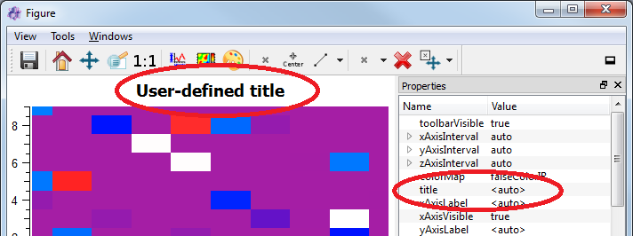
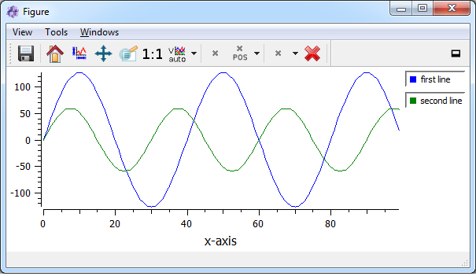

.. include:: ../include/global.inc

.. _itomDataObject:

Array class DataObject 
=======================

Introduction
------------

In |itom|, the class :py:class:`~itom.dataObject` is the main array object. Arrays in |itom| can have the following properties:

* unlimited number of dimensions (a 1-dim object is always mapped to a [1xN] 2-dim object)
* each dimension can have an arbitrary size
* possible data types:
    .. code-block:: python
        
        "uint8"      # unsigned integer, 8 bit [0,255]
        "int8"       # signed integer, 8 bit [-128,127]
        "uint16"     # unsigned integer, 16 bit [0,65536]
        "int16"      # signed integer, 16 bit [-32768,32767]
        "uint32"     # unsigned integer, 32 bit
        "int32"      # signed integer, 32 bit
        "float32"    # floating point, 32 bit single precision
        "float64"    # floating point, 64 bit double precision
        "complex64"  # complex number with two float32 components
        "complex128" # complex number with two float64 components
        "rgba32"     # color format, 4x uint8 values (alpha,r,g,b)
        "datetime"   # :py:class:`datetime.datetime` values with an optional time zone delta from UTC (resolution: microseconds)
        "timedelta"  # :py:class:`datetime.timedelta` values with a microseconds resolution

Before giving a short tutorial about how to use the class :py:class:`~itom.dataObject`, the base idea and concept of
the array structure should be explained. If you already now the huge |python| module **Numpy** with its base array 
class :py:class:`numpy.ndarray`, one will ask why another similar array class is provided by |itom|. The reasons for this 
are as follows:

* The python class :py:class:`~itom.dataObject` is just a wrapper for the |itom| internal class **DataObject**, written in C++. 
  This array structure is used all over |itom| and also passed to any plugin instances of |itom|. Internally, the C++ class 
  **DataObject** is based on OpenCV matrices (cv::Mat), such that functionalities provided by the open-source 
  Computer-Vision Library (OpenCV) can be used by |itom|, too.
* The class :py:class:`~itom.dataObject` should also be used to store real measurement data. Therefore it is possible to 
  add tags and other meta information to every dataObject (like axis descriptions, scale and offset values, protocol entries...).
* Usually, array classes (like the class :py:class:`numpy.ndarray`) store the whole matrix in one continuous block in memory. 
  Due to the working principle of every operating system, it is sometimes difficult to allocate a huge block in memory. 
  Therefore, **dataObject** only stores the sub-matrices of the last two-dimensions in single blocks in memory, while the 
  first ``N - 2`` dimensions of the array are represented by one vector in memory, where every item points to its corresponding 
  sub-matrix (called plane). Using this concept, huger arrays can be allocated without causing a memory error.

The class :py:class:`~itom.dataObject` is compatible to a :py:class:`numpy.ndarray`, however the dataObject does not support
all data types of numpy. A ``dataObject`` supports the ``array-like`` interface of ``Numpy``, such that it can be passed
to methods, that expect an ``array-like`` object. In general a ``dataObject`` can be converted to a :py:class:`numpy.ndarray`
by passing it to the constructor and vice-versa to convert a Numpy array to a dataObject. In the first case, data is deeply
copied as default (set the argument ``copy`` to False to avoid this). In the latter case, a shallow copy is used as default
(as long as the data types are compatible). For more information see :ref:`itomDataObjectVsNumpyArray`.

For more information about the ``datetime`` and ``timedelta`` data types, see :ref:`itomDataObjectDatetime`.

.. note::
    In order to realize a compatible version with respect to *numpy*, *matlab*... data in a **DataObject** can also be stored *continuously*. The basic structure for
    the data object is the same than in the *non-continuous* (default) version, but the data of each 2dim-matrix is continuously aligned in memory and each data-pointer
    of each matrix just points to the first element of the corresponding matrix in this big data block in memory. 

    The non-continuous representation has advantages especially in the case of huge data sets, since it is more difficult to allocate a free, big continuous block in memory without
    reorganizing it compared to multiple smaller blocks of memory, which can be distributed randomly in memory.

    Matrices with only one or two dimension are automatically stored continuously.

Creating a dataObject
---------------------

In general, a :py:class:`~itom.dataObject` is created like any other class instance in |python|, hence the constructor of class :py:class:`~itom.dataObject` is called. For a full reference of the constructor of class **dataObject**, type

.. code-block:: python
    
    help(dataObject)

In the following example, some dataObjects of different size and types are created. Using these constructors, the content of the created array is arbitrary at initialization:

.. code-block:: python
    :linenos:
    
    #1. empty dataObject, dimensions: 0, size: []
    a = dataObject()
    
    #2. one dimensional dataObject
    #  a one dimensional dataObject already is
    #  allocated as an array of size [1 x n]
    b = dataObject([5], "float32") #size [1x5]
    
    #3. 5 x 3 array, type: int8
    c = dataObject([5,3], "int8")
    
    #4. 2 x 5 x 10 array, type: complex128
    #  here two planes of size [5x10] are created and a vector with two items points to them
    d = dataObject([2,5,10], "complex128")
    
    #5. 2 x 5 x 10 array, type: complex128, continuous
    #  This matrix has the same size and type than matrix
    #  'd' above. However, the continuous keyword indicates,
    #  that python should already allocate all planes in
    #  one block. Then the data object can be converted in
    #  a numpy.array without the need of copying the data block
    #  in memory. It is useful to use this keyword, if you
    #  often want to switch between dataObject and numpy.arrays.
    #  However consider that this is not recommended for huge
    #  matrices.
    e = dataObject([2,5,10], "complex128", continuous = True)
    
    #6. create a 2x3, uint16 dataObject filled with [[1,2,3],[4,5,6]]
    f = dataObject([2,3], "uint16", data = (1,2,3,4,5,6))

You can also use the copy constructor of class **dataObject** in order to create
a dataObject from another array-like object or a sequence of numbers (tuple, list...).
In |python| it is usual, that different objects share their memory (for arrays the memory
is mainly the data block(s)) as long as possible, such that memory and execution time is saved. This is also the case when using the copy constructor. See the **Numpy** documentation for more information about this. The main thing you should know is, that if you change the value of any cell of an array, the corresponding value is also changed in all arrays, that share their memory with the dataObject.

.. code-block:: python
    :linenos:
    
    #1. create dataObject from any array-like object (e.g. Numpy array)
    import numpy as np
    a = np.ndarray([5,7])
    b = dataObject(a) #b has the continuous flag set
    
    #2. create dataObject from a tuple of values
    #  any object, that python can interpret as sequence can be used
    #  in order to initialize the data object. The dataObject can have
    #  an arbitrary size or number of dimensions, if the total number
    #  of elements fits to the length of the given input sequence.
    #  In this case, the sequence is totally copied into the data object.
    #  The values are filled row-by-row into the array, also called as
    #  c-continuous creation.
    c = (2,7,4,3,8,9,6,2) #8 values
    d = dataObject([2,4], data = c)
    
    #3. create a dataObject as shallow copy of another dataObject
    e = dataObject(d)
    
Static constructors for dataObjects
------------------------------------

If a **dataObject** is created using one of the default constructors (without keyword *data*), the matrix is allocated to the right 
side but the values usually have no defined content. The values are even not randomly distributed. In order to generate a pre-filled
**dataObject**, there exist some special static methods. These are:

* Use :py:meth:`~itom.dataObject.eye` to create a 2D, square, eye matrix.
* :py:meth:`~itom.dataObject.ones` is used to created a n-dimensional dataObject filled with ones.
* :py:meth:`~itom.dataObject.zeros` is used to created a n-dimensional dataObject filled with zeros.
* :py:meth:`~itom.dataObject.rand` is used to created a n-dimensional dataObject filled with uniformly distributed random values: range [0,1) for floating point values, else the values are taken from the entire value range of the data type.
* :py:meth:`~itom.dataObject.randN` is used to created a n-dimensional dataObject filled with gaussian distributed random values.

.. code-block:: python
    
    a = dataObject.ones([3,4], 'uint8')
    a.data()
    #returns:
    #dataObject(size=[3x4], dtype='uint8'
    #    [[  1,   1,   1,   1],
    #     [  1,   1,   1,   1],
    #     [  1,   1,   1,   1]])

Print content of dataObject
-----------------------------

If you type the variable name of a **dataObject** into the command line of |itom| and press return, the short string representation with all important
facts of the dataObject are printed in one line. This is the same result than using the :py:meth:`print` command of Python. If you want to obtain
the full content of a **dataObject** in the command line, use the method :py:meth:`~itom.dataObject.data`:

.. code-block:: python
    
    a = dataObject.ones([3,4], 'uint8')
    print(a)
    #returns:
    #dataObject('uint8', [3 x 4], continuous: 1, owndata: 1)
    
    a.data()
    #returns:
    #dataObject(size=[3x4], dtype='uint8'
    #    [[  1,   1,   1,   1],
    #     [  1,   1,   1,   1],
    #     [  1,   1,   1,   1]])
    
.. note::
    
    The string representation (using the :py:meth:`print` method) of a numpy array will print the full or cropped content of the numpy array
    to the command line (cropped if it is too big). For **dataObjects**, the content is only print using the :py:meth:`~itom.dataObject.data` method.
    
Accessing values in a dataObject
-------------------------------------

In order to read or write single values of a dataObject, use the indexing operator:

.. code-block:: python
    
    a = dataObject.ones([2,3], 'uint8')
    print("first element", a[0,0])
    print("last line:", a[1,0], a[2,0], a[3,0])
    #write 5 to the first value:
    a[0,0] = 5

The index operator obtains *n* comma separated arguments, one for each axis. Each index starts with *0*, the order of axes is *y,x*, *z,y,x*, ...

A dataObject is an iteratible object in Python, like lists, tuples, numpy.arrays, ... Therefore, it is possible to iterate through all values of
a dataObject, whereas the iterator at first goes along the last axis (x), then along the second axis (y) and so on:

.. code-block:: python 
    
    a = dataObject([2,3,2], 'uint8', data=(1,2,3,4,5,6,7,8,9,10,11,12))
    a.data()
    
    '''returns:
    dataObject(size=[2x3x2], dtype='uint8'
    [0,:,:]->([[  1,   2],
           [  3,   4],
           [  5,   6]])
    [1,:,:]->([[  7,   8],
           [  9,  10],
           [ 11,  12]])
    '''
    
    for val in a:
        print(a)
    
    '''returns:
    1,2,3,4,5,6,7,8,9,10,11,12
    '''
    
All fixed-point data types are represented by the python type *int*, all real floating point data types by *float*, the complex data types by *complex* and
the color type by :py:class:`~itom.rgba`.

It is not only possible to address single values within a dataObject, but the index (or mapping) operator also allows the usage of slices. Then, sub-regions
of dataObjects can be returned in terms of another dataObject instance. However, it is very important to mention, that a slice or sub-region shares its data memory
with the original object. Once you change one value in the original or sliced object, the corresponding value is also changed in all related objects. This is the
main philosophy of Python and also holds for numpy.arrays. 

Considering slices, the index of any axis in the indexing or mapping operator can then have the following forms:

* single, zero-based integer value: Only the one value in the corresponding axis is addressed
* start:end: A range of values in the corresponding axis is addressed, where start is the first, zero-based index that is included in the range and end is the last value that is NOT part of the range (excluded).
* colon operator (:): All values in this axis are addressed.

.. code-block:: python
    
    a = dataObject.ones([10,20,15])
    
    #get subpart
    b = a[5:10, :, 0]
    #b then has the size [5,20,1]
    
    #set all values in b to 0:
    b[:,:,:] = 0
    print(a[4,0,0]) #-> 1
    print(a[5,0,0]) #-> 0
    print(b[0,0,0]) #-> 0

Basic attributes of a dataObject
-------------------------------------

Any created **dataObject** provides some basic attributes that describe the corresponding array:

* The attribute :py:attr:`~itom.dataObject.ndim` or :py:attr:`~itom.dataObject.dims` return the number of dimensions of the  **dataObject**.
* The attribute :py:attr:`~itom.dataObject.shape` returns a tuple with the size for every axis. The size of the tuple corresponds to the number of dimensions. Remember, that the order is always (y,x), (z,y,x)...
* The attribute :py:attr:`~itom.dataObject.dtype` returns a string with the type of the **dataObject** (e.g. uint8, float32 or complex64).
* The attribute :py:attr:`~itom.dataObject.continuous` returns True if the data block lies continuously in memory or not (False). False is only possible for 3 or higher dimensional dataObjects. Then, the memory of the single planes lies distributed at different locations in the memory allowing to save bigger matrices in the available memory. While a continuous dataObject can share its memory with a numpy array, a non-continuous dataObject has to be converted in the continuous version before being transmitted to a numpy array (this is implicitely done).

Examples:

.. code-block:: python
    
    a = dataObject.ones([5,4,3,2], 'uint16')
    print("dims:", a.ndim, "shape:", a.shape, "type:", a.dtype)
    #returns:
    #dims: 4 shape: (5, 4, 3, 2) type: uint16

Value and axes descriptions, units, scaling and offset
-------------------------------------------------------

Usually, **dataObjects** and numpy arrays are quite similar and very compatible to each other. They can even share memory (if continuous) and dataObjects can usually be
used whenever a function requires an **array-like** input type (the class :py:class:`~itom.dataObject` implements the **array-like** interface definitions). However, the
**dataObject** has been made in order to also save protocol information, meta information as well as the physical meaning of the matrix. As one powerful feature, it is possible
to set an arbitrary description, unit, scaling and offset to all axes as well as a description and unit to the values. If a **dataObject** is plot (e.g. by :py:meth:`itom.plot`), 
these properties are read and considered in the plot. 

In detail:

* Every axis as well as the value axis can have a description (e.g. 'length')
* Every axis as well as the value axis can have a unit (e.g. 'mm', 'm', 'nm'...). Some algorithms consider these units for special calculations.
* Every axis (but not the value axis) can have a scaling (default: 1.0)
* Every axis (but not the value axis) can have an offset (default: 0.0)

Scaling and offset transform the pixel coordinate in the matrix (beginning with 0 in all axes) into a physical coordinate. While the values in a matrix are always addressed
by their pixel coordinate (in integer values), the physical units are displayed in the plots (e.g. designer widget type *itom1dqwtplot* or *itom2dqwtplot*). The following
example should explain the advantage of the scaling and offset values:

Lets assume that a white-light interferometer records a 2.5D topography of an object. The distance between two adjacent pixels in 2.5 µm in both directions. Additionally, the
start position of the x-y-stage is (20.5 mm and 47.7 mm in x and y direction, respectively). These values can then be considered in the obtained **dataObject** by the following code:

.. code-block:: python
    
    # coding=iso-8859-15
    # the coding is important due to the micron sign below
    
    record = dataObject.randN([768, 1024], 'float32')
    #record is assumed to be a dataObject
    record.axisScales = (0.0025, 0.0025)
    record.axisOffsets = (-47.7 / 0.0025, -20.5 / 0.0025) #offset is given in pixel
    record.axisUnits = ('mm', 'mm')
    record.axisDescriptions = ('y', 'x')
    record.valueUnit = ('µm')
    record.valueDescription = 'height'
    plot(record)
    
The output is then:

.. figure:: images/plotDataObjectScaleOffset.png
    :scale: 100%
    :align: center
    
The relation between pixel coordinates and the physical coordinates is:

phys = (pix - offset) * scaling

pix = phys / scaling + offset

These transformations can be done using the methods :py:meth:`~itom.dataObject.physToPix` and :py:meth:`~itom.dataObject.pixToPhys`.
    
    
Meta tags and protocol
----------------------------------

It is often required to store further meta information together with a dataObject. For this purpose, the dataObject provides arbitrary meta tags (either string or double values) or a
string based protocol list. While the first can be used to store timestamps, system configurations, calibration states, ... the latter can be used to document filter chains that have
already be executed.

Tags are always a mapping between a string-keyword and either a double or string value. The class :py:class:`itom.dataObject` provides several functions and attributes in order
to set or read tags:

.. code-block:: python
    :linenos:
    
    obj = dataObject([10,10], 'float32')
    #add new tags:
    obj.setTag("sensor", "confocal sensor v1.0")
    obj.setTag("aperture", 0.6)
    
    #get tags:
    print("aperture:", obj.tags["aperture"])
    print("sensor:", obj.tags["sensor"])
    print("num tags:", len(obj.tags))
    
    if obj.existTag("manufacturer"):
        print("The tag 'manufacturer' exists")
    else:
        print("The tag 'manufacturer' does not exist")
    
    #delete tag
    success = obj.deleteTag("aperture")
    print("success:", success)
    
The output will be:

.. code-block:: python
    
    aperture: 0.6
    sensor: confocal sensor v1.0
    num tags: 2
    success: True
    
One special tag is the 'title'-tag. If you plot a dataObject with a string-based 'title'-tag (e.g. with *itom1dqwtplot* or *itom2dqwtplot*), the title tag
will be used as title for the plot (if the property *title* of the plot is set to **<auto>**):

.. code-block:: python
    :linenos:
    
    obj.setTag("title", "User-defined title")
    plot(obj, "2D")
    
This code will lead to the following plot (under the assumption, that the designer plugin **itom2dqwtplot** is set as default 2D plot in the :ref:`properties dialog <gui-default-plots>`
of |itom|):

    

Another special tag is only important for 1D-plots (using the designer plugin **itom1dqwtplot**). You can then set the legend titles for every single curve.
This is done by the tag **legendTitleX** where X is a continuous line index starting with 0. The following example shows how to create a 2D dataObject
with two rows and 100 columns. In the first line (row 0), a sine with an amplitude of 127 is created, in the second line (row 1), a sine with an amplitude of 60.
Then, the dataObject is plot as 1D plot (indicated by "1D") and the property **legendPosition** is set to **Right** (per default, no legend is shown):

.. code-block:: python
    
    import math
    a = dataObject.zeros([2,100],'int8')
    a[0,:] = [127 * math.sin(x * math.pi / 20) for x in range(0,100)]
    a[1,:] = [60 * math.sin(x * math.pi / 15) for x in range(0,100)]
    a.setTag("legendTitle0", "first line")
    a.setTag("legendTitle1", "second line")
    plot(a, "1D", properties = {"legendPosition":"Right"})
    
The result looks like this:

The attribute :py:attr:`~itom.dataObject.tags` returns a mapping object to a dictionary. This has to be considered to be a read-only dictionary, where no item can be deleted, appended
or changed. However, it is possible to assign a new dictionary to this attribute. Then, all current tags are deleted and the new dictionary items are considered to be the new tags.

The protocol of a dataObject is a list of strings. Use the method :py:meth:`~itom.dataObject.addToProtocol` in order to add a new entry to the protocol. If the dataObject is
a slice of another object, the string **ROI[...]** with the current slice parameters is prepended to each new protocol entry. Finally, the protocol is stored as tag **protocol**
and can be requested and deleted using the methods described above.    

.. note::
    
    It is not possible to set tags or protocol entries for empty dataObjects. Tags and the protocol is shared between two shallow copies, hence, if two dataObjects share the same
    data, they also share their tags and protocol.
    
.. _itomDataObjectVsNumpyArray:

DataObject vs. numpy.array
--------------------------------

The most common Python package that is used for numeric calculations is **Numpy**. **Numpy** is one of the most famous and used Python packages and is the basis
for other packages, like Scipy, Matplotlib, Scikit-image, ... Numpy is directly included in |itom| and also connected to some features of the GUI. Nevertheless,
the main array structure of |itom| is the class :py:class:`~itom.dataObject` and not :py:class:`numpy.ndarray`. The main reason for this is, that the basis of **dataObject**
is a C++ class with the same name that can be used in all plugins. Further points for the class :py:class:`~itom.dataObject` are:

* Numpy arrays are always stored in one continuous block in memory. This is a compact and fast structure, however huge matrices can easily run into memory errors, since the computer may have free memory, however probably not in one single block in memory. Therefore, a dataObject usually stores every plane (this is every 2d array of the last two dimensions (x-y-plane)) in one block, whereas all planes lie at arbitrary positions in memory. This is only the case, if the dataObject is created as non-continuous object (see constructor of :py:class:`~itom.dataObject`). 2D dataObjects are always continuous.
* DataObjects are also created with respect to measurement data. Therefore, dataObjects have further meta information, like stated in the sections above.
* Internally, every plane in a DataObject is based on OpenCV matrices (in the C++ code). Therefore, it is directly possible to apply OpenCV methods to DataObjects. Furthermore, a direct
  use of dataObjects, created in Python, in algorithms or hardware plugins is possible.

Despite the stated differences, the good is, that the classes ``dataObject`` and ``numpy.array`` are compatible to each other. This is especially the case for continuous dataObjects.
They can directly be converted to and from ``numpy.arrays`` even as shallow copy, such that both objects share the same matrix memory. If a 3- or higher dimensional dataObject is converted to a numpy-array, it is implicitly converted to a continuous form (such that all planes lie in adjacent blocks in the memory).

Examples for these conversions are:

.. code-block:: python
    
    import numpy as np
    
    dobj2d = dataObject([10,5], 'uint8')
    np2d = np.array(dobj2d) #deep copy
    np2d_v2 = np.array(dobj2d, copy = False) #shallow copy
    dobj2d_v2 = dataObject(np2d) #shallow copy
    
    dobj3d = dataObject([10,20,30], 'uint8') #non-continuous
    np3d = np.array(dobj3d, copy = False) #deep copy, since implicit continuous conversion
    dobj3d_v2 = dataObject(np3d) #shallow copy of np3d
    
    dobj3d2 = dataObject([10,20,30], 'uint8', continuous = True)
    np3d2 = np.array(dobj3d2, copy = False) #shallow copy
    dobj3d2_v2 = dataObject(np3d2)
    
In order to understand these examples, the following things have to be mentioned or repeated: Per default, a *dataObject* with more than two dimensions is created as non-continuous
dataObject, hence various planes (the 2d matrix spanned by the last two axes) are distributed at different locations in memory. If passing a dataObject to the constructor of a numpy.array
a deep copy is created per default. Deep copy means, that the array data is entirely copied to another location in memory, such that both arrays are completely de-coupled. This is
not the case if the optional parameter *copy* of the *np.array* constructor is set to *False*. If possible, a so called shallow copy is then created such that as little as
memory has to be copied. This is the default for most python operations! If both objects are a shallow copy of each other, a change of one value in the one object also changes the other object. However, only values are changed, never types or sizes. A shallow copy is therefore only possible if no change in type or memory structure is required. If a sub-region of an object
is copied, a shallow copy is possible. However, this is not the case if the type is changed or if a non-continuous dataObject has to be converted to a numpy.array.

While the copy constructor of a *np.array* usually creates a deep copy (default setting), the copy constructor of a dataObject always tries to make a shallow copy if possible.

Usually, all methods of Numpy not only work with *np.arrays* but also with **array-like** objects. These are python objects that provide a specific interface such that Numpy
can implicitely obtain a Numpy array out of them. This is also what *dataObject* provides. Therefore you can pass every dataObject to a numpy function without a previous conversion to
a numpy array.

On the other side, |itom| often supports numpy arrays without conversion to dataObject. This is for instance the case for the method :py:meth:`itom.plot`. Only, when passing arrays
to algorithm or hardware plugins (classes :py:class:`~itom.dataIO` or :py:class:`~itom.actuator`, method :py:meth:`~itom.filter`), usually numpy.arrays have to be converted to 
dataObjects:

.. code-block:: python
    
    import numpy a np
    import itom
    
    a = np.array([[1,2,3],[4,5,6]])
    itom.plot(a) #works
    itom.filter("minValue", a) #raises an error
    itom.filter("minValue", itom.dataObject(a)) #works

.. _itomDataObjectDatetime:

Datetime and timedelta types
---------------------------------

A ``dataObject`` can also contain values, that represent either a certain date and time (``datetime``)
or a time span, denoted as ``timedelta``. Both the Python core implementation and Numpy have their own 
data types to represent datetimes and time spans and both representations are slightly different. The
data types used in ``dataObject`` are fully compatible to the Python core types and compatible as close
as possible to the Numpy data types:

**datetime**

The Python core type :py:class:`datetime.datetime` allows indicating any date and times with a minimum
resolution of microseconds. This is equal to the itom internal type used as value for dataObjects. Additionally,
it is possible to define a timezone. The itom data type allows indicating a timezone as a delta in seconds
to the UTC time. The default is ``0`` if not otherwise stated. The numpy data type :py:class:`numpy.datetime64`
has a variable resolution, that can also be in the attoseconds range. However, the allowed value range depend
on the chosen resolution. If such values are converted to the itom datetime values, they will always be rounded
to the next microsecond value. The Numpy values do not support any timezone information.

Internally, itom stores a ``datetime`` value as 64bit value, where 0 is equal to the date ``1970-01-01 00:00:00.0000`` (epoch).

A time zone support (different than the UTC default timezone) is only supported from Python 3.7 on.

**timedelta**

Similar to ``datetime``. The itom internal value has a microseconds resolution, too, equal to the Python core
class :py:class:`datetime.timedelta`. The Numpy class :py:class:`numpy.timedelta64` can have different resolutions,
directly connected to the minimum relative and absolute time spans.

.. note::
    
    A numpy ``NaT`` (not a time) value is not supported by the itom date and time data types.

Examples for constructing such ``dataObjects`` are:

.. code-block:: python
    
    from datetime import datetime, timedelta, timezone
    
    # constructs an arbitrarily filled 2x3 datetime dataObject
    dt1 = dataObject([2,3], 'datetime')
    
    # constructs a 2x3 datetime dataObject, where 
    # are values are set to 1970-01-01 00:00 (epoch)
    td2 = dataObject.zeros([2,3], 'datetime')
    
    # constructs a 1x2 datetime dataObject with two dates
    # one value is in UTC time, the other one +1h from UTC
    tz = timezone(timedelta(0, 3600))
    values = (
        datetime(2022, 4, 1),
        datetime(1999,12,31,23,59, tzinfo = tz)
    )
    td3 = dataObject([1,2], 'datetime', data=values)
    
    # constructs an arbitrarily filled 2x3 timedelta dataObject
    td1 = dataObject([2,3], 'timedelta')
    
    # constructs a 2x3 timedelta dataObject, where 
    # are values are set to a 0 time span.
    td2 = dataObject.zeros([2,3], 'timedelta')
    
    # constructs a 1x2 timedelta dataObject with two time spans
    values = (
        timedelta(days=0, seconds=20, microseconds=44000),
        timedelta(days=3, hours=5)
    )
    td3 = dataObject([1,2], 'timedelta', data=values)

Many mathematical operators are defined for ``datetime`` and ``timedelta`` objects, however only, if possible.
For instance it is possible to add or subtract a ``timedelta`` dataObject to or from a ``datetime`` dataObject,
as long as their shapes are equal. The result is a ``datetime`` dataObject. The difference of two ``datetime``
objects is a ``timedelta`` dataObject. However, it is not possible to multiply such objects or to add two
``datetime`` objects.

For scalar operations (e.g. add, subtract or setting a value), it is possible to use both the
Python class :py:class:`datetime.datetime` or :py:class:`datetime.timedelta` as well as the Numpy
classes :py:class:`numpy.datetime64` or :py:class:`numpy.timedelta64` (as long as the operations is
valid at all):

.. code-block:: python
    
    from datetime import datetime, timedelta, timezone
    import numpy as np
    
    td1 = dataObject.zeros([2,3], 'datetime')
    td1 += timedelta(days=2)
    print(td1[1,1])
    # >> 1970-01-03 00:00:00
    
    td1[:,:] = datetime(2023, 4, 5, 23, 4, 5)
    print(td1[1,1])
    # >> 2023-04-05 23:04:05
    
    td1[0,0] = np.datetime64('2005-02-25T03:30')
    print(td1[0,0])
    # >> 2005-02-25 03:30:00

A ``datetime`` dataObject can be used as x-axis for a line plot. See :ref:`itom1dqwtplotdatetime` for more details.
If you want to create a linearly distributed datetime x-axis, the numpy method ``arange`` can help, e.g.:

.. code-block:: python
    
    import numpy as np
    
    # pass this numpy ndarray as xData property to a 1d plot
    # here, a range with a step size of 1 day is created
    dateScale = np.arange('2005-02', '2005-03', dtype='datetime64[D]')
    
    # or convert it to a dataObject
    dateScale2 = dataObject(dateScale)

Main operations on numpy.arrays and itom.dataObjects
----------------------------------------------------------

The following list in an extract of the itom cheatsheet (http://itom.bitbucket.io/media.html) and shows major operations on numpy.arrays and itom.dataObjects:

======================================= ============================================= ===========================================================================================
np.array (import numpy as np)           itom.dataObject (import itom)
======================================= ============================================= ===========================================================================================
arr=np.ndarray([2,3],'uint8')           dObj = dataObject([2,3],'uint8')              create a randomly filled 2x3 array with type uint8
arr=np.array([[1,2,3],[4,5,6]])         dObj =dataObject([2,3],data=(1,2,3,4,5,6))    create the 2x3 array [1,2,3 ; 4,5,6]
arr=np.array(dObj, copy = False)        dObj =dataObject(arr)                         convert np.array <-> dataObject (shallow copy if possible)
arr.ndim                                dObj.ndim                                     Returns number of dimensions (here: 2)
arr.shape                               dObj.shape                                    Returns size tuple (here: [2,3])
arr.shape[0]                            dObj.shape[0]                                 Returns size of first dimensions (here: y-axis)
c=arr[0,1]; arr[0,1]=7                  dObj[0,1]; b[0,1]=7                           Gets or sets the element in the 1st row, 2nd col
c=arr[:,1:3] or                         c=dObj[:,1:3] or                              Returns shallow copy of array containing the 2nd and 3rd columns
c=arr[0:2,1:3]                          c= dObj [0:2,1:3]                             
arr[:,:]=7                              dObj[:,:]=7                                   sets all values of array to value 7
arr.transpose() (shallow copy)          dObj.trans() (deep copy)                      transpose of array
np.dot(arr1,arr2)                       dObj1 * dObj2 (float only)                    matrix multiplication
arr1 * arr2                             dObj1.mul(dObj2)                              element-wise multiply
arr1 / arr2                             dObj1.div(dObj2)                              element-wise divide
arr1 +,- arr2                           dObj1 +,- dObj2                               sum/difference of elements
arr1 +,- scalar                         dObj1 +,- scalar                              adds/subtracts scalar from every element in array
arr1 &,| arr2                           dObj1 &,| dObj2                               element-wise, bitwise AND/OR operator
arr2 = arr1                             dObj2 = dObj1                                 referencing (both still point to the same array)
arr2 = arr1.copy()                      dObj2 = dObj1.copy()                          deep copy (entire data is copied)
arr2 = arr1.astype(newtype)             dObj2 = dObj1.astype('newtypestring')         type conversion
arr = np.zeros([3,4],'float32')         dObj = dataObject.zeros([3,4], 'float32')     3x4 array filled with zeros of type float32
arr = np.ones([3,4],'float32')          dObj = dataObject.ones([3,4], 'float32')      3x4 array filled with ones of type float32
arr = np.eye(3,dtype='float32')         dObj = dataObject.eye(3, 'float32')           3x3 identity matrix (type: float32)
arr2 = arr1.squeeze()                   dObj2 = dObj1.squeeze()                       converts array to an array where dims of size 1 are eliminated (deep copy if necessary)
np.linspace(1,3,4)                      -                                             4 equally spaced samples between 1 and 3, inclusive
[x,y] = np.meshgrid(0:2,1:5)            -                                             two 2D arrays: one of x values, the other of y values
np.linalg.inv(a)                        -                                             inverse of square matrix a
x=np.linalg.solve(a,b)                  -                                             solution of ax=b (using pseudo inverse)
[U,S,V] = np.linalg.svd(a)              -                                             singular value decomposition of a (V is transposed!)
np.fft.fft2(a), np.fft.ifft2(a)                                                       filter available (Inverse) 2D fourier transform of a
a[a>0]=5                                a[a>0] = 5                                    sets all elements > 0 of a to 5
a[np.isnan(a)]=0                        a[np.isnan(a)]=5                              sets all NaN values of a to 5
arr2 = arr1.reshape([3,2])              dObj2 = dObj1.reshape([3,2])                  reshapes arr1 to new size (equal number of items)
======================================= ============================================= ===========================================================================================
    

For a detailed methods-summery of the *dataObject* see :ref:`ITOM-Script-Reference`.