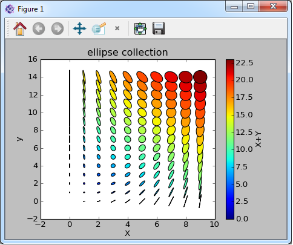

.. include:: ../include/global.inc

.. _pymod-matplotlib:

Python-Module matplotlib
**************************

The module **matplotlib** can be used in order to create two or three dimensional plots like in these examples:

Since the internal plotting methods of |itom| mainly provide display widgets for plotting matrix contents and images, **matplotlib** can be
used for plotting other types of graphics like graphs, line plots, bars... A huge list of examples can be found under http://matplotlib.org/gallery.html.

Set Matplotlib backend to itom
=============================================

**Matplotlib 1.4.x or lower**

In order to render the output of **matplotlib** into an |itom| window or a user interface generated by |itom| (see :ref:`qtdesigner`), you need to write the following
command before importing any module of the package **matplotlib**:

.. code-block:: python
    
    import matplotlib
    matplotlib.use('module://mpl_itom.backend_itomagg',False)
    
Alternatively, you can always configure **matplotlib** to render its output in **itom** windows. Therefore, **itom** internally has an environment variable **MPLCONFIGDIR** that
points to the directory::
    
    itom-packages/mpl_itom

of your **itom** installation (or build-folder if self-compiled). Place a copy of the matplotlib config file **matplotlibrc** into
this directory and modify the variable **backend** to **module://mpl_itom.backend_itomagg**.

A template for the configuration file can be either found in the Python subfolder **[PythonDir]/Lib/site-packages/matplotlib/mpl-data** or under http://matplotlib.org/_static/matplotlibrc.

This is the part you need to change::
    
    # the default backend; one of GTK GTKAgg GTKCairo GTK3Agg GTK3Cairo
    # CocoaAgg MacOSX Qt4Agg TkAgg WX WXAgg Agg Cairo GDK PS PDF SVG
    # Template
    # You can also deploy your own backend outside of matplotlib by
    # referring to the module name (which must be in the PYTHONPATH) as
    # 'module://my_backend'
    backend      : module://mpl_itom.backend_itomagg
    
.. note::
    
    Once you placed the config file, you don't need to use the **use** command in any of your scripts.
    
    If you are not sure, whether your user defined config file is loaded, you can obtain the path to the loaded config file with:
        
    .. code-block:: python
        
        >>> import matplotlib
        >>> matplotlib.matplotlib_fname()
        
    For more information about this, see http://matplotlib.org/users/customizing.html
    
**Matplotlib 1.5 or higher**

|itom| automatically sets the environment variable **MPLBACKEND** to *module://mpl_itom.backend_itomagg*. Then, matplotlib outputs
are directly rendered in the itom backend without further modifications of the code. The **matplotlib.use** command is not necessary
any more, however it can be used to set another backend.

Simple Matplotlib example
=============================================

This example shows you that is possible to use any arbitrary matplotlib python script and execute it in |itom|. Therefore, the example **hist2d_log_demo.py** from the pylab examples
on http://matplotlib.org is taken.

Its source code is:

.. code-block:: python
    
    import matplotlib
    matplotlib.use('module://mpl_itom.backend_itomagg',False)
    import matplotlib.pyplot as plt
    import numpy as np
    from matplotlib.collections import EllipseCollection

    x = np.arange(10)
    y = np.arange(15)
    X, Y = np.meshgrid(x, y)

    XY = np.hstack((X.ravel()[:,np.newaxis], Y.ravel()[:,np.newaxis]))

    ww = X/10.0
    hh = Y/15.0
    aa = X*9

    ax = plt.subplot(1,1,1)

    ec = EllipseCollection(
                            ww,
                            hh,
                            aa,
                            units='x',
                            offsets=XY,
                            transOffset=ax.transData)
    ec.set_array((X+Y).ravel())
    ax.add_collection(ec)
    ax.autoscale_view()
    ax.set_xlabel('X')
    ax.set_ylabel('y')
    cbar = plt.colorbar(ec)
    cbar.set_label('X+Y')
    title("ellipse collection")
    plt.show()

Please consider that the original source code has been changed such that the first two lines are prepended. After executing this script, the following figure is displayed in |itom|:

.. note::
    
    If the figure does not appear, the matplotlib designer widget for |itom| is not available. This means, the library **matplotlibPlot** in the **designer** folder of |itom| is missing.
    
Further examples from the official matplotlib gallery are contained in the itom subfolder **demo/matplotlib**.
    
Embedding a matplotlib figure in your own user interface
==========================================================================================

.. figure:: images/matplotlib_gui.png
    :scale: 100%
    :align: center

|itom| not only provides stand-alone windows for showing the result of the *matplotlib*, but it is also possible to integrate a *matplotlib* canvas into own user interfaces created by the
QtDesigner and scripted with |python|. For more information how to do this, see :ref:`qtdesigner`.

In the widget library of QtDesigner there is the widget **MatplotlibPlot** in the section **itom Plugins** (under the consumption that the corresponding designer plugin library is contained in the folder *designer* of the root directory of |itom|). Drag&Drop an instance of this widget onto your user interface. 

In the following example, a new main window is created where a *MatplotlibPlot* widget (name: *plot*) is placed on the left side while two buttons (name: *btnDroppedSpines* and *btnSine*) are placed on the right side:

When any of the both buttons are pressed, the following example should be displayed in the figure **plot** on the left side.

.. code-block:: python
    
    import matplotlib
    matplotlib.use('module://mpl_itom.backend_itomagg',False)
    import numpy as np
    import matplotlib.pyplot as plt
    from mpl_toolkits.mplot3d import Axes3D

    def plotDroppedSpines():
        '''
        plot taken from matplotlib example 'spines_demo_dropped.py'
        '''
        canvas = gui.plot #reference to matplotlibPlot widget
        fig = plt.figure(num = 3, canvas=canvas)
        ax = fig.add_subplot(111)
        ax.clear()
        
        image = np.random.uniform(size=(10, 10))
        ax.imshow(image, cmap=plt.cm.gray, interpolation='nearest')
        ax.set_title('dropped spines')

        # Move left and bottom spines outward by 10 points
        ax.spines['left'].set_position(('outward', 10))
        ax.spines['bottom'].set_position(('outward', 10))
        # Hide the right and top spines
        ax.spines['right'].set_visible(False)
        ax.spines['top'].set_visible(False)
        # Only show ticks on the left and bottom spines
        ax.yaxis.set_ticks_position('left')
        ax.xaxis.set_ticks_position('bottom')
        
        plt.show()
        

    def plotSine():
        '''
        plots sine, taken from matplotlib gallery examples
        '''
        t = np.arange(0.0, 1.0, 0.01)
        s = np.sin(2*np.pi*t)
        
        canvas = gui.plot #reference to matplotlibPlot widget
        fig = plt.figure(num = 3, canvas=canvas)
        ax = fig.add_subplot(111)
        ax.clear()
        ax.plot(t,s)
        
        plt.show()

    gui = ui("matplotlibGui.ui", type = ui.TYPEWINDOW)
    gui.btnSine.connect("clicked()", plotSine)
    gui.btnDroppedSpines.connect("clicked()", plotDroppedSpines)
    gui.show()

    # if you call this script for the second time, the given figure-num (3)
    # is already in used for the lastly closed figure. Therefore also tell
    # matplotlib to close this figure handle.
    plt.close(3)
    
The result is:

**What happens here?**

* At the end of the script, the user interface *matplotlibGui.ui* is loaded and referenced by the variable *gui*.
* The click-events of both buttons is connected to the methods *plotSine* and *plotDroppedSpines* respectively.
* The gui is shown

For both button clicks the following things have to be done:

Once you added the |itom|-backend command as first, mandatory line to your script, the *figure*-class of *matplotlib*
has got one further keyword-based parameter *canvas*. This needs to be used in order to tell the figure where the
widget is to plot the content to. If you omit this parameter, a new window is opened with the corresponding output.
If you set this parameter to the reference of the widget of type *MatplotlibPlot* (here: called canvas), the output is
print there.

The you have the reference to the figure-instance of *matplotlib* and can go one like usual.

.. note::
    
    Once you created one figure that maps to a given widget using the canvas-keyword, this figure is not deleted when
    a new figure is created using the same keyword. Therefore it will happen that lots of invisible figures need to be handled.
    Therefore, the *num* keyword argument is used in the methods in the example in order to always tell *matplotlib* that a defined
    figure with the handle *3* should be instantiated. If this handle already exists, this existing figure is used. Therefore it is
    also necessary to clear the axes using **ax.clear()**.
    
    Furthermore, if you created a figure with a given *num* and *canvas*, deletes the user interface and creates a new one, a new figure
    with the handle of the old one is not able to plot in the new user interface since it still is connected with the old, deleted
    widget. Therefore, the command::
        
        plt.close(3)
    
    is used to firstly delete the matplotlib-figure with handle *3* once the script is re-executed.

.. note::
    
    Usually, *matplotlib* is allowed changing the size of the output window. The window is then forced to have a new size that can afterwards
    be manually resized. If your output widget is embedded in an user interface, this behaviour might be undesired. Then disable it by setting
    the property **forceWindowResize** to **False**. In the example above this can be done by::
        
        gui.plot["forceWindowResize"] = False
    
    or by directlly setting the corresponding property when designing the user interface in QtDesigner.

This example is contained in the **demo/ui/embeddedMatplotlib** folder.

Size control over Matplotlib canvas
===================================================

Usually, it is possible to control the size and dpi of the matplotlib canvas using the commands

.. code-block:: python
    
    myfig.set_dpi(120)
    myfig.set_size_inches(5,5,forward = True)
    
However, if the matplotlib canvas is embedded in an itom user interface or in general in the itom backend (hence window management of itom),
the size of the canvas is usually given by the outer size of the parent window and the layout of the user interface. Only, if the size
of the canvas is increased, the size of the window may also increase. In order to provide a better size control of the canvas, the matplotlib
widget has the property **keepSizeFixed**. If this property is true (default: false), the canvas will always have the indicated size. If one
enlarges the outer window, the canvas will be unchanged in size and still be centered in the available area. Vice-versa, it is not possible to make
the window smaller than the allowed canvas area.

In order to axes the property **keepSizeFixed** it is necessary, to obtain the corresponding instance of class :py:class:`~itom.uiItem` from the given
matplotlib figure handle. If the figure handle can be obtained by the current figure, the access might look like this:

.. code-block:: python
    
    #get current figure
    current_figure = plt.gcf()

    #set the keepSizeFixed property of the plot to true:
    current_figure.canvas.manager.itomUI["keepSizeFixed"] = True
    #alternative:
    #plt.get_current_fig_manager().itomUI["keepSizeFixed"]

As an example see the script **hist2d_size_control.py** in the **demo/matplotlib** folder.

Creating an animation via Matplotlib
=====================================

Matplotlib can be used to create animation and save it as a *mp4* file. The **ffmpeg codec** is required for this feature and needs to be installed on your computer. A detailed description for the installation of the ffmpeg codec can be found `here <http://www.adaptivesamples.com/how-to-install-ffmpeg-on-windows>`_. The build version of the ffmpeg codec can be downloaded `here 
<http://www.ffmpeg.zeranoe.com/builds>`_. Download and unzip the build files to your harddrive. 

Typically the folder is like:: 

    C:\Program files\ffmpeg

The bin folder of ffmpeg must be added to the path variables of your system:: 

    C:\Program files\ffmpeg\bin 

Finally start the command prompt and run the command::

    C:\Proram files\ffmpeg\bin\ffmpeg.exe -codecs

or easier:: 

    ffmpeg -codecs
    
============================================== ==============================================
.. figure:: ./images/matplotlibAnimation1d.gif .. figure:: ./images/matplotlibAnimation2d.gif

                1d animation                                   2d animation                  
============================================== ==============================================
    
In the **demo/matplotlib** folder are two demo scripts (**matplotlibAnimation1d.py, matplotlibAnimation2d.py**), which show how to create animations. 

Designer plugin MatplotlibPlot
===============================

If the itom backend is chosen for the Matplotlib, all matplotlib outputs are displayed in the itom designer plugin **MatplotlibPlot**.
This widget plugin has the following properties, slots and signals that can be used to control and adjust the settings of the rendered image.
Many of these features are also used in the documentations above:

.. BEGIN The following part is obtained by the script plot_help_to_rst_format.py from the designer plugin matplotlibPlot

Properties
-------------------------

.. py:attribute:: keepSizeFixed : bool 
    :noindex:
    
    If you want to control the size of the canvas by python / matplotlib (e.g. set_size_inches), set this to true. The canvas will then have a fixed size, that is not affected by the window size.

.. py:attribute:: renderLegend : bool 
    :noindex:
    
    If this property is true, the legend are included in pixelmaps renderings.

.. py:attribute:: forceWindowResize : bool 
    :noindex:
    
    If set, the plot widget / area is resized to the desired sizes given by matplotlib. Uncheck this option, if you want to keep the canvas unchanged e.g. in an user-defined GUI

.. py:attribute:: toolbarVisible : bool 
    :noindex:
    
    Toggles the visibility of the toolbar of the plot.

.. py:attribute:: contextMenuEnabled : bool 
    :noindex:
    
    Defines whether the context menu of the plot should be enabled or not.

Slots
-------------------------

.. py:function:: getPlotID() [slot]
    :noindex:
    
    
    Return window ID of this plot {int}.
    
    .. index:: 

.. py:function:: replot() [slot]
    :noindex:
    
    
    forces a replot of the plot
    
    .. index:: 

.. py:function:: refreshPlot() [slot]
    :noindex:
    
    
    Triggers an update of the current plot window.
    
    .. index:: 

.. py:function:: showSubplotConfig(left, top, right, bottom, wSpace, hSpace) [slot]
    :noindex:
    
    
    displays the subplot configuration dialog.
    
    This slot must usually not be used, since the dialog can be opened by the toolbar.
    
    :param left: left border of the current subplot configuration.
    :type left: float
    :param top: top border of the current subplot configuration.
    :type top: float
    :param right: right border of the current subplot configuration.
    :type right: float
    :param bottom: bottom border of the current subplot configuration.
    :type bottom: float
    :param wSpace: horizontal space between every subplot of the current configuration.
    :type wSpace: float
    :param hSpace: vertical space between every subplot of the current configuration.
    :type hSpace: float
    
    .. index:: 

.. py:function:: setLabelText(text) [slot]
    :noindex:
    
    
    displays a text in the toolbar
    
    The text is displayed in the label that is usually used for coordinates of the mouse cursor....
    
    :param text: text to display
    :type text: str
    
    .. index:: 

Signals
-------------------------

.. py:function:: subplotConfigSliderChanged(type, value) [signal]
    :noindex:
    
    
    interal use between MatplotlibPlot and the subplot configuration dialog.
    
    .. note::
    
        To connect to this signal use the following signature::
        
            yourItem.connect('subplotConfigSliderChanged(int,int)', yourMethod)
    
    .. index:: 

.. END plot_help_to_rst_format.py: matplotlibPlot

