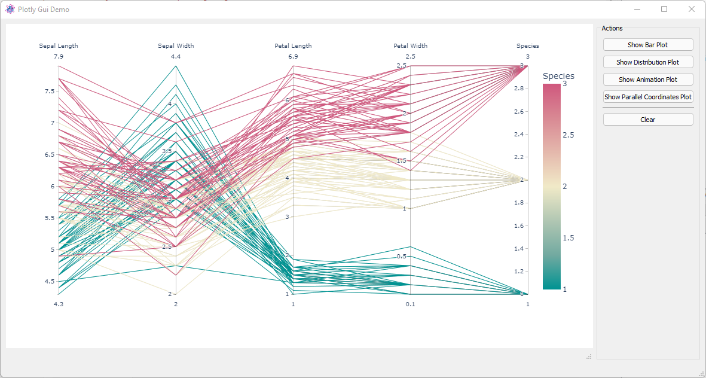

.. include:: ../include/global.inc

.. _pymod-plotly:

Python package plotly
**************************

The package **plotly** can be used in order to create two or three dimensional plots like in these examples:

For more examples see the plotly gallery under https://plotly.com/python/.

itom provides a renderer for plotly, such that plotly figures are displayed in an itom plot window, 
that has the same window managements functions than any other plot window (dockable, integrated in main window...).
Additionally, the used itom plotly widget can be added to custom user interfaces and plotly figures
can directly be displayed there.

In order to realize this, the itom plotly renderer has to be loaded and activated first.
This is done by importing the module **itomPlotlyRenderer** (located in the itom-packages subdirectory
of itom, that is already part of the Python **sys.path**).

In order to open a plotly figure in itom, make sure that you have the **plotly** package (requires **pandas**)
installed. Then see the following example:

.. code-block:: python
    
    import itomPlotlyRenderer
    
    # x and y given as array_like objects
    import plotly.express as px

    fig = px.scatter(x=[0, 1, 2, 3, 4], y=[0, 1, 4, 9, 16])
    fig.show()

    import plotly.graph_objects as go

    fig = go.Figure(data=go.Bar(x=[1, 2, 3], y=[1, 3, 2]))

    # it is also possible to pass a renderer name to the ``show`` command.
    # Passing ``itom`` is not necessary since it is set as default, however
    # it would also be possible to for instance pass ``browser`` such that
    # this figure is opened in a new browser tab.
    fig.show(renderer="itom")

This example is part of the official plotly examples. The only difference is the import of the
**itomPlotlyRenderer**. The renderer, called **itom** is then set as default. Therefore, it is 
not required to pass it as keyword argument **renderer** to the **fig.show** command, however this
shows how to set another renderer, e.g. **browser** if you would like to see the output in a browser tab.

In order to display a plotly output in any custom user interface, place the designer widget 
**PlotlyPlot** from the **itom Plugins** section in your custom user interface and set a suitable 
object name. In order to display the plotly output in this given widget, you have to pass
the handle to this widget (the :py:class:`~itom.plotItem` instance) to the keyword argument
**plotHandle** of the **fig.show** command. The following example code is taken from the **plotlyGuiDemo.py**
demo script:

.. code-block:: python
    
    class PlotlyGuiDemo(ItomUi):
    def __init__(self):
        """Constructor."""
        ItomUi.__init__(self, "plotlyGuiDemo.ui", ui.TYPEWINDOW, deleteOnClose=True)
        self.plotlyPlot = self.gui.plotlyPlot

    @ItomUi.autoslot("")
    def on_btnClear_clicked(self):
        """Clear the canvas."""
        self.plotlyPlot.call("setHtml", "")

    @ItomUi.autoslot("")
    def on_btnPlot1_clicked(self):
        """From the bar plot demo of plotly.

        https://plotly.com/python/bar-charts/
        """
        with self.disableGui(disableItems=[self.gui.groupActions]):
            long_df = px.data.medals_long()
    
            fig = px.bar(long_df, x="nation", y="count", color="medal", title="Long-Form Input")
            fig.show(plotHandle=self.plotlyPlot)

Examples about the plotly integration into itom can also be seen in demo scripts, located in the
**demo/ploty** subfolder of itom.