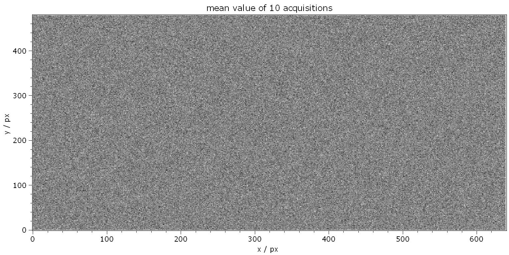
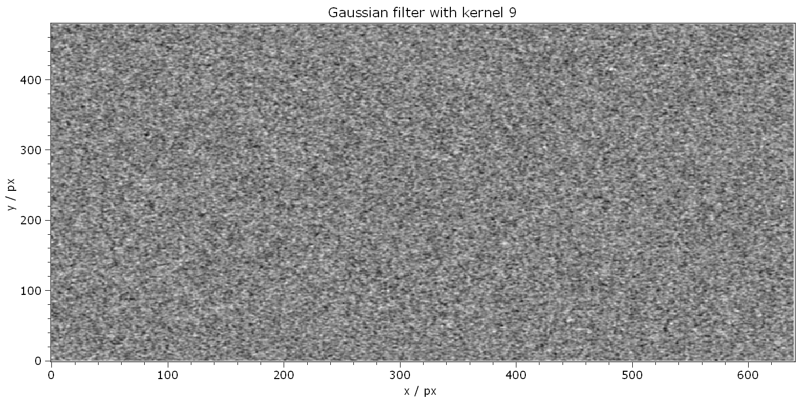

.. DO NOT EDIT.
.. THIS FILE WAS AUTOMATICALLY GENERATED BY SPHINX-GALLERY.
.. TO MAKE CHANGES, EDIT THE SOURCE PYTHON FILE:
.. "11_demos\basics\demo_CameraAndImages.py"
.. LINE NUMBERS ARE GIVEN BELOW.

.. only:: html

    .. note::
        :class: sphx-glr-download-link-note

        Click :ref:`here <sphx_glr_download_11_demos_basics_demo_CameraAndImages.py>`
        to download the full example code

.. rst-class:: sphx-glr-example-title

.. _sphx_glr_11_demos_basics_demo_CameraAndImages.py:

Cameras and images
=================

This demo shows with the example of the ``DummyGrabber``
how you acquire an image and apply some filters.

.. GENERATED FROM PYTHON SOURCE LINES 6-15

.. code-block:: default

    from itom import dataIO
    from itom import dataObject
    from itom import algorithms
    from itom import liveImage
    from itom import saveIDC
    from itom import loadIDC
    from itom import plot

.. GENERATED FROM PYTHON SOURCE LINES 17-18

Initialize a ``DummyGrabber`` camera

.. GENERATED FROM PYTHON SOURCE LINES 18-27

.. code-block:: default

    cam = dataIO("DummyGrabber")
    cam.setParam("bpp", 8)
    # start camera (only once)
    cam.startDevice()

    # show live image of camera
    liveImage(cam)

.. rst-class:: sphx-glr-script-out

 Out:

 .. code-block:: none

    (102, PlotItem(UiItem(class: Itom2dQwtPlot, name: plot0x0)))

.. GENERATED FROM PYTHON SOURCE LINES 28-32

.. hint:: The live images tries to acquire and get up to 50 images per second
    from the camera. If you want to acquire images by yourself in a script, you need
    to stop the timer of the live images for a certain amount of time. After you are
    done with your manual acquisition, you can restart the timer again.

.. GENERATED FROM PYTHON SOURCE LINES 32-38

.. code-block:: default

    currentStatus = cam.getAutoGrabbing()
    print("Current value of auto grabbing property of the camera:", currentStatus)

    cam.setAutoGrabbing(False)

.. rst-class:: sphx-glr-script-out

 Out:

 .. code-block:: none

    Current value of auto grabbing property of the camera: True

.. GENERATED FROM PYTHON SOURCE LINES 39-40

Acquire 10 images in a list of dataObjects

.. GENERATED FROM PYTHON SOURCE LINES 40-49

.. code-block:: default

    result = []
    d = dataObject()  # empty data object where the image should be put in

    for i in range(0, 10):
        cam.acquire()
        cam.getVal(d)  # d is a shallow copy of the camera image
        result.append(d.copy())

.. GENERATED FROM PYTHON SOURCE LINES 50-51

Save the list of images to the **image1.idc** file (idc is a file format for the python pickle module)

.. GENERATED FROM PYTHON SOURCE LINES 51-53

.. code-block:: default

    saveIDC("image1.idc", {"result": result, "description": "sample 1"})

.. GENERATED FROM PYTHON SOURCE LINES 54-55

Load the list of images

.. GENERATED FROM PYTHON SOURCE LINES 55-61

.. code-block:: default

    loaded_objects = loadIDC("image1.idc")
    result2 = loaded_objects["result"]

    # plot the 3rd image from the list
    plot(result2[2])

.. rst-class:: sphx-glr-script-out

 Out:

 .. code-block:: none

    (103, PlotItem(UiItem(class: Itom2dQwtPlot, name: plot0x0)))

.. GENERATED FROM PYTHON SOURCE LINES 62-63

Acquire 10 images in an image stack

.. GENERATED FROM PYTHON SOURCE LINES 63-79

.. code-block:: default

    num = 10
    sizex = cam.getParam("sizex")
    sizey = cam.getParam("sizey")
    bpp = cam.getParam("bpp")

    if bpp == 8:
        d = dataObject([num, sizey, sizex], "uint8")
    else:
        d = dataObject([num, sizey, sizex], "uint16")

    for idx in range(num):
        cam.acquire()
        cam.copyVal(d[idx, :, :])  # partial deep copy into one part of the 3d object d

    plot(d)

.. rst-class:: sphx-glr-script-out

 Out:

 .. code-block:: none

    (104, PlotItem(UiItem(class: Itom2dQwtPlot, name: plot0x0)))

.. GENERATED FROM PYTHON SOURCE LINES 80-81

Calculate mean value of image stack in z-direction.

.. GENERATED FROM PYTHON SOURCE LINES 81-92

.. code-block:: default

    result_mean = dataObject()

    algorithms.calcMeanZ(d, result_mean, ignoreInf=0, calcStd=0)
    # result_mean is a 3d Object with [1 x sizey x sizex] dimensions.
    # We squeeze it to get a 2D Object
    result_mean = result_mean.squeeze()

    result_mean.setTag("title", "mean value of {} acquisitions".format(num))
    result_mean.axisUnits = ("px", "px")
    result_mean.axisDescriptions = ("y", "x")
    plot(result_mean)

.. rst-class:: sphx-glr-script-out

 Out:

 .. code-block:: none

    (105, PlotItem(UiItem(class: Itom2dQwtPlot, name: plot0x0)))

.. GENERATED FROM PYTHON SOURCE LINES 93-95

.. GENERATED FROM PYTHON SOURCE LINES 97-98

Apply Gaussian filter onto the mean image.

.. GENERATED FROM PYTHON SOURCE LINES 98-102

.. code-block:: default

    result_filter = dataObject()
    kernelVal = 9
    algorithms.gaussianFilter(result_mean, result_filter, kernelx=kernelVal, kernely=kernelVal)

.. GENERATED FROM PYTHON SOURCE LINES 103-104

Copy meta information from source ``dataObject``.

.. GENERATED FROM PYTHON SOURCE LINES 104-107

.. code-block:: default

    result_filter.copyMetaInfo(result_mean)
    result_filter.setTag("title", "Gaussian filter with kernel {}".format(kernelVal))
    plot(result_filter)

.. rst-class:: sphx-glr-script-out

 Out:

 .. code-block:: none

    (106, PlotItem(UiItem(class: Itom2dQwtPlot, name: plot0x0)))

.. GENERATED FROM PYTHON SOURCE LINES 108-110

.. GENERATED FROM PYTHON SOURCE LINES 110-116

.. code-block:: default

    # reset the auto grabbing functionality of possibly connected live images
    cam.setAutoGrabbing(currentStatus)

    # end camera
    cam.stopDevice()

.. rst-class:: sphx-glr-timing

   **Total running time of the script:** ( 0 minutes  0.305 seconds)

.. _sphx_glr_download_11_demos_basics_demo_CameraAndImages.py:

.. only:: html

  .. container:: sphx-glr-footer sphx-glr-footer-example

    .. container:: sphx-glr-download sphx-glr-download-python

      :download:`Download Python source code: demo_CameraAndImages.py <demo_CameraAndImages.py>`

    .. container:: sphx-glr-download sphx-glr-download-jupyter

      :download:`Download Jupyter notebook: demo_CameraAndImages.ipynb <demo_CameraAndImages.ipynb>`

.. only:: html

 .. rst-class:: sphx-glr-signature

    `Gallery generated by Sphinx-Gallery <https://sphinx-gallery.github.io>`_
