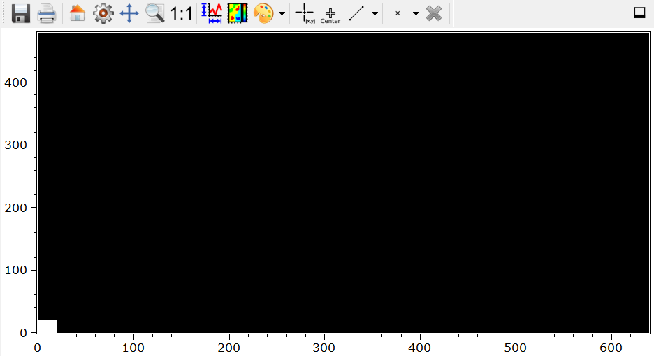
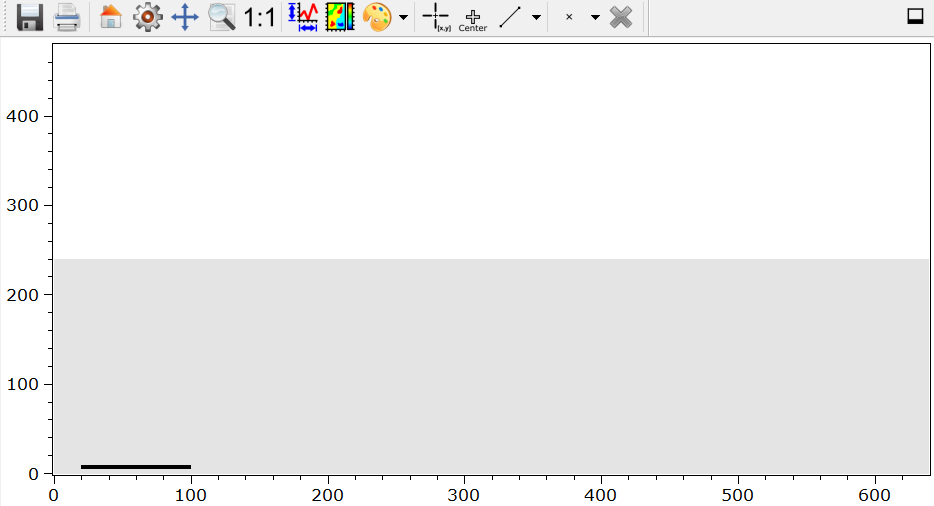
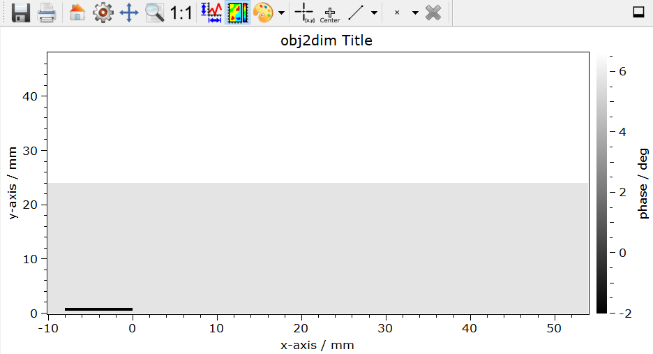
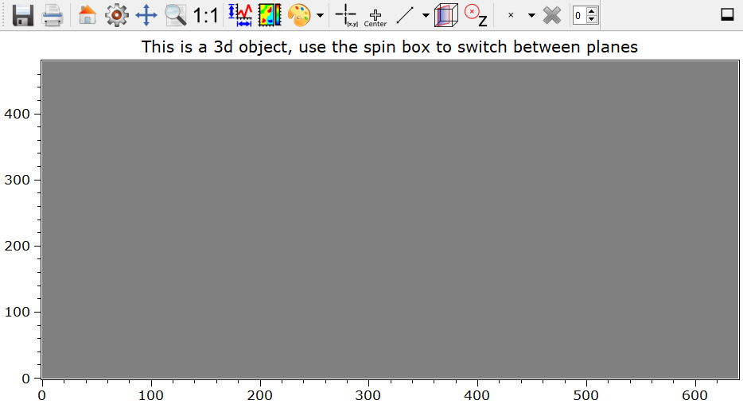

.. DO NOT EDIT.
.. THIS FILE WAS AUTOMATICALLY GENERATED BY SPHINX-GALLERY.
.. TO MAKE CHANGES, EDIT THE SOURCE PYTHON FILE:
.. "11_demos\basics\demo_DataObject.py"
.. LINE NUMBERS ARE GIVEN BELOW.

.. only:: html

    .. note::
        :class: sphx-glr-download-link-note

        Click :ref:`here <sphx_glr_download_11_demos_basics_demo_DataObject.py>`
        to download the full example code

.. rst-class:: sphx-glr-example-title

.. _sphx_glr_11_demos_basics_demo_DataObject.py:

DataObject
===========

This demo shows some basic features of the ``itom`` dataObject.

.. GENERATED FROM PYTHON SOURCE LINES 7-16

.. code-block:: default

    from itom import dataObject
    from itom import plot

    # some constants
    yDim = 480
    xDim = 640
    zDim = 10

.. GENERATED FROM PYTHON SOURCE LINES 18-19

Creation of several data objects

.. GENERATED FROM PYTHON SOURCE LINES 19-34

.. code-block:: default

    # empty dataObject
    objEmpty = dataObject()

    # a one-dimensional dataObject does not exist, always create a 1xM or Mx1 instead
    obj2dim = dataObject([yDim, xDim], "float64")
    obj3dim = dataObject([zDim, yDim, xDim], "uint16")

    # Special constructors for zero, ones, eye and randomly filled objects
    objZero = dataObject.zeros([yDim, xDim], "float64")  # 2D object filled with zeros
    objOnes = dataObject.ones([yDim, xDim], "float64")  # 2D object filled with ones
    objEye = dataObject.eye(4, "uint8")  # 4x4 matrix
    objRand = dataObject.rand([yDim, xDim], "uint8")  # 2D object filled with uniformly distributed random values
    objRandN = dataObject.randN([yDim, xDim], "uint8")  # 2D object filled with Gaussian distributed random values

.. GENERATED FROM PYTHON SOURCE LINES 35-37

.. hint:: the methods rand and randN create values in the full data range for integer based data types
   whereas the randomly distributed values are in the range [0,1) for floating point data types.

.. GENERATED FROM PYTHON SOURCE LINES 39-40

Type conversion

.. GENERATED FROM PYTHON SOURCE LINES 40-42

.. code-block:: default

    objRandFloat = objRand.astype("float64")

.. GENERATED FROM PYTHON SOURCE LINES 43-44

Assign values to data objects

.. GENERATED FROM PYTHON SOURCE LINES 44-59

.. code-block:: default

    # fill the upper half of the object with 5.7 (the operator // makes an integer division)
    obj2dim[0: yDim // 2, :] = 5.7

    # fill the bottom half of the object with 6.6 (the operator // makes an integer division)
    obj2dim[yDim // 2:, :] = 6.6

    # fill a selected rectangle with -2.0
    obj2dim[5:10, 20:100] = -2.0

    # fill the entire 3d object with zero
    obj3dim[:, :, :] = 0
    # replace the 2nd plane of the 3d object by the random values of the casted object
    obj3dim[1, :, :] = objRand.astype(obj3dim.dtype)  

.. GENERATED FROM PYTHON SOURCE LINES 60-61

Delete objects

.. GENERATED FROM PYTHON SOURCE LINES 61-63

.. code-block:: default

    del objRandFloat

.. GENERATED FROM PYTHON SOURCE LINES 64-72

Shallow copies

Python has the concept to share as much memory as possible between different objects.
This also holds for dataObjects. In some cases, e.g. a change of type, shared memories can not
be kept, such that an implicit separation of both objects is done.
If two objects are shallow copies to each other, the memory as well as tags and other meta information is shared.
However, one object can be a sub-slice, so called region of interest (ROI), of the other one, such that the
size of the object is individual for each object.

.. GENERATED FROM PYTHON SOURCE LINES 72-87

.. code-block:: default

    # both variables point to exactly the same dataObject in memory (everything shared)
    objZero2 = objZero

    # objZero3 is a shallow copy of objZero with the same matrix size
    objZero3 = objZero[:, :]

    # objZero4 is a shallow copy including a region of interest to the first 20 rows and columns
    objZero4 = objZero[0:20, 0:20]

    # change the values in the first 20 rows and columns of objZero4 to 5
    objZero4[:, :] = 5

    # (hence, objZero, objZero2 and objZero4 are changed, too). Proof:
    plot(objZero)  # opens a 2d plot of objZero

.. rst-class:: sphx-glr-script-out

 Out:

 .. code-block:: none

    (108, PlotItem(UiItem(class: Itom2dQwtPlot, name: plot0x0)))

.. GENERATED FROM PYTHON SOURCE LINES 88-90

.. GENERATED FROM PYTHON SOURCE LINES 92-94

Deep copy
If you want to have a deep copy, with separated memory and meta information of a dataObject, use the copy-operator'''

.. GENERATED FROM PYTHON SOURCE LINES 94-96

.. code-block:: default

    obj2dimCopy = obj2dim.copy()
    plot(obj2dimCopy)

.. rst-class:: sphx-glr-script-out

 Out:

 .. code-block:: none

    (109, PlotItem(UiItem(class: Itom2dQwtPlot, name: plot0x0)))

.. GENERATED FROM PYTHON SOURCE LINES 97-99

.. GENERATED FROM PYTHON SOURCE LINES 101-102

Accessing values

.. GENERATED FROM PYTHON SOURCE LINES 102-110

.. code-block:: default

    print("objZero at index 0,5 (row, column):", objZero[0, 5])

    # get the first five values of the first row of objZero:
    vals = objZero[0, 0:5]  # the last value of a slice is always EXCLUDED from the slice

    # vals is now a dataObject, however it can be converted to a tuple:
    print("first five values of objZero:", vals.value)

.. rst-class:: sphx-glr-script-out

 Out:

 .. code-block:: none

    objZero at index 0,5 (row, column): 5.0
    first five values of objZero: (5.0, 5.0, 5.0, 5.0, 5.0)

.. GENERATED FROM PYTHON SOURCE LINES 111-118

Axis scaling, offset, description and unit

every dataObject can have meta information for each axis.
The scaling represents unit/px and gives the physical representation of the axis
The offset is the offset of the first value in this axis, given in pixel
The transformation between pixel and physical coordinates is then:
phys_coord = (px_coord - offset) * scaling

.. GENERATED FROM PYTHON SOURCE LINES 118-128

.. code-block:: default

    obj2dim.axisScales = (0.1, 0.1)  # 0.1 mm / px
    obj2dim.axisOffsets = (0, 100)  # the x-axis starts now at -10mm (100 * 0.1)
    obj2dim.axisUnits = ("mm", "mm")
    obj2dim.axisDescriptions = ("y-axis", "x-axis")
    obj2dim.setTag("title", "obj2dim Title")

    obj2dim.valueUnit = u"\xb0"  # this is a special character. To allow this, the first line of this script is relevant (right click -> insert codec)
    obj2dim.valueDescription = "phase"

    plot(obj2dim, properties={"colorBarVisible": True})

.. rst-class:: sphx-glr-script-out

 Out:

 .. code-block:: none

    (110, PlotItem(UiItem(class: Itom2dQwtPlot, name: plot0x0)))

.. GENERATED FROM PYTHON SOURCE LINES 129-131

.. GENERATED FROM PYTHON SOURCE LINES 133-137

Tags

It is possible to add string or double valued tags to each dataObject. There are some special tags,
that can directly be interpreted by plots (e.g. the 'title' tag). All other tags can be used for any purpose.

.. GENERATED FROM PYTHON SOURCE LINES 137-142

.. code-block:: default

    obj3dim.setTag(
        "title",
        "This is a 3d object, use the spin box to switch between planes",
    )
    plot(obj3dim)

.. rst-class:: sphx-glr-script-out

 Out:

 .. code-block:: none

    (111, PlotItem(UiItem(class: Itom2dQwtPlot, name: plot0x0)))

.. GENERATED FROM PYTHON SOURCE LINES 143-145

.. GENERATED FROM PYTHON SOURCE LINES 145-182

.. code-block:: default

    # Set additional informations (meta data) as tags
    # Use set tag "key", "value". Key / value are user defined.
    obj2dim.setTag("Creator", "Lyda")
    obj2dim.setTag("Type", "Measurement")
    obj2dim.setTag("DummyTag", "Delete Me")

    # Retrieve tags by their key and print them
    print(obj2dim.tags["Creator"])
    print(obj2dim.tags["Type"])

    # Get the complete tag space as a python dictionary
    tagdic = obj2dim.tags

    # Get the size of the tagspace
    print(obj2dim.getTagListSize())
    # or
    print(len(tagdic))

    # List up all tags in the tagspace
    print("\nMy Taglist")
    for key in tagdic.keys():
        print(key + " -> " + obj2dim.tags[key])

    # Delete a tag
    obj2dim.deleteTag("DummyTag")

    # List up all tags in the tagspace
    print("\nMy Taglist")
    for key in obj2dim.tags.keys():
        print(key + " -> " + obj2dim.tags[key])

    # The dataObject has a protocol function. It is a tag and many filters in c++ add their properties after computation to this string by using addToProtocol
    # Add a protocol to the Object, if object is a ROI-ShallowCopy the ROI is automatically added to the protocol-String
    print("\nProtocol function:")
    obj2dim.addToProtocol("Created today for test reasons")
    # Read protocol string
    print(obj2dim.tags["protocol"])

.. rst-class:: sphx-glr-script-out

 Out:

 .. code-block:: none

    Lyda
    Measurement
    4
    4

    My Taglist
    Creator -> Lyda
    DummyTag -> Delete Me
    Type -> Measurement
    title -> obj2dim Title

    My Taglist
    Creator -> Lyda
    Type -> Measurement
    title -> obj2dim Title

    Protocol function:
    Created today for test reasons

.. rst-class:: sphx-glr-timing

   **Total running time of the script:** ( 0 minutes  0.276 seconds)

.. _sphx_glr_download_11_demos_basics_demo_DataObject.py:

.. only:: html

  .. container:: sphx-glr-footer sphx-glr-footer-example

    .. container:: sphx-glr-download sphx-glr-download-python

      :download:`Download Python source code: demo_DataObject.py <demo_DataObject.py>`

    .. container:: sphx-glr-download sphx-glr-download-jupyter

      :download:`Download Jupyter notebook: demo_DataObject.ipynb <demo_DataObject.ipynb>`

.. only:: html

 .. rst-class:: sphx-glr-signature

    `Gallery generated by Sphinx-Gallery <https://sphinx-gallery.github.io>`_
