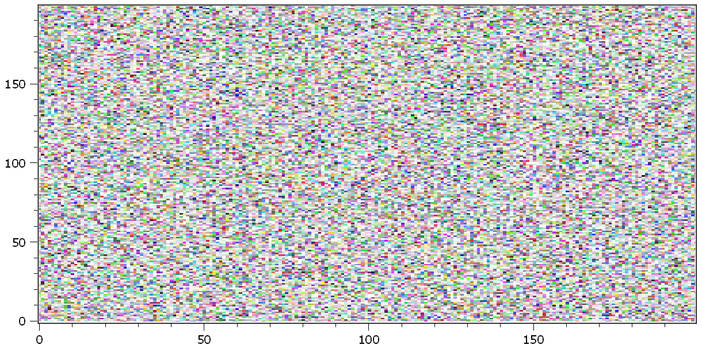
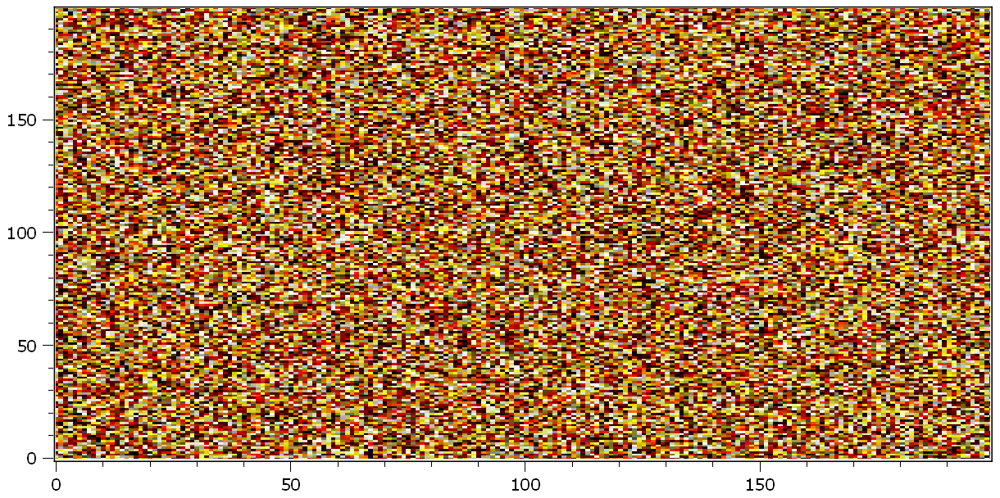

.. DO NOT EDIT.
.. THIS FILE WAS AUTOMATICALLY GENERATED BY SPHINX-GALLERY.
.. TO MAKE CHANGES, EDIT THE SOURCE PYTHON FILE:
.. "11_demos\basics\demo_convertFalseColor.py"
.. LINE NUMBERS ARE GIVEN BELOW.

.. only:: html

    .. note::
        :class: sphx-glr-download-link-note

        Click :ref:`here <sphx_glr_download_11_demos_basics_demo_convertFalseColor.py>`
        to download the full example code

.. rst-class:: sphx-glr-example-title

.. _sphx_glr_11_demos_basics_demo_convertFalseColor.py:

Convert falseColor
===========

This demo shows how colored images are converted into other color spaces..

``img1`` contains an rgba-image with false color encoded color information and gray values
the gray values stay like they are, the false color values are decoded in ``HSV`` color space
and gray values with respect to their hue are determined. The resulting image is called ``img2``.

.. GENERATED FROM PYTHON SOURCE LINES 9-21

.. code-block:: default

    import colorsys
    import itom
    from itom import dataObject
    from itom import plot

    img1 = dataObject.rand([200, 200], "rgba32")
    [height, width] = img1.shape
    img2 = img1.copy()

    plot(img1)

.. rst-class:: sphx-glr-script-out

 Out:

 .. code-block:: none

    (100, PlotItem(UiItem(class: Itom2dQwtPlot, name: plot0x0)))

.. GENERATED FROM PYTHON SOURCE LINES 23-25

.. GENERATED FROM PYTHON SOURCE LINES 25-34

.. code-block:: default

    for m in range(height):
        for n in range(width):
            px = img1[m, n]
            [h, s, v] = colorsys.rgb_to_hsv(px.r / 255.0, px.g / 255.0, px.b / 255.0)
            if s > 0.3:
                h_ = int(v * h * 255)
                img2[m, n] = itom.rgba(h_, h_, h_)

.. GENERATED FROM PYTHON SOURCE LINES 35-38

img1 contains an rgba-image with false color encoded color information and gray values
the gray values stay like they are, the false color values are decoded in HSV color space
and gray values with respect to their hue are determined. The resulting image is called img2

.. GENERATED FROM PYTHON SOURCE LINES 38-69

.. code-block:: default

    [height, width] = img1.shape
    img2 = img1.copy()

    result_map = "hotIron"  # 'gray' or 'hotIron'

    if result_map == "hotIron":
        map = []
        for i in range(0, 256):
            map.append(itom.rgba(i, 0, 0))
        for i in range(0, 256):
            map.append(itom.rgba(255, i, 0))
        for i in range(0, 256):
            map.append(itom.rgba(255, 255, i))
        map_len = len(map)

    for m in range(height):
        for n in range(width):
            px = img1[m, n]
            [h, s, v] = colorsys.rgb_to_hsv(px.r / 255.0, px.g / 255.0, px.b / 255.0)
            if s > 0.3:
                if result_map == "gray":
                    h_ = int(v * h * 255)
                    img2[m, n] = itom.rgba(h_, h_, h_)
                elif result_map == "hotIron":
                    s_ = int(v * 255)
                    img2[m, n] = map[int(h * map_len)] * itom.rgba(s_, s_, s_)
                else:
                    raise RuntimeError("map must be gray or hotIron")

    plot(img2)

.. rst-class:: sphx-glr-script-out

 Out:

 .. code-block:: none

    (101, PlotItem(UiItem(class: Itom2dQwtPlot, name: plot0x0)))

.. GENERATED FROM PYTHON SOURCE LINES 70-71

.. rst-class:: sphx-glr-timing

   **Total running time of the script:** ( 0 minutes  0.217 seconds)

.. _sphx_glr_download_11_demos_basics_demo_convertFalseColor.py:

.. only:: html

  .. container:: sphx-glr-footer sphx-glr-footer-example

    .. container:: sphx-glr-download sphx-glr-download-python

      :download:`Download Python source code: demo_convertFalseColor.py <demo_convertFalseColor.py>`

    .. container:: sphx-glr-download sphx-glr-download-jupyter

      :download:`Download Jupyter notebook: demo_convertFalseColor.ipynb <demo_convertFalseColor.ipynb>`

.. only:: html

 .. rst-class:: sphx-glr-signature

    `Gallery generated by Sphinx-Gallery <https://sphinx-gallery.github.io>`_
