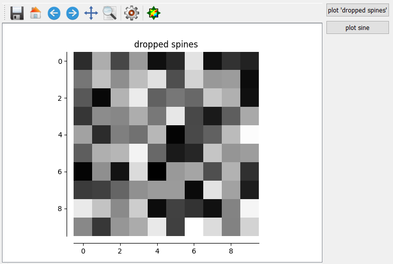
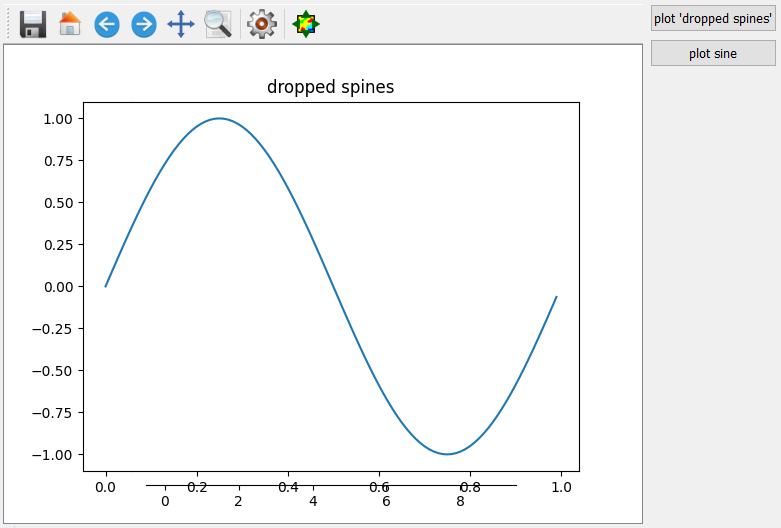

.. DO NOT EDIT.
.. THIS FILE WAS AUTOMATICALLY GENERATED BY SPHINX-GALLERY.
.. TO MAKE CHANGES, EDIT THE SOURCE PYTHON FILE:
.. "11_demos\embeddedMatplotlib\demo_matplotlibGui.py"
.. LINE NUMBERS ARE GIVEN BELOW.

.. only:: html

    .. note::
        :class: sphx-glr-download-link-note

        Click :ref:`here <sphx_glr_download_11_demos_embeddedMatplotlib_demo_matplotlibGui.py>`
        to download the full example code

.. rst-class:: sphx-glr-example-title

.. _sphx_glr_11_demos_embeddedMatplotlib_demo_matplotlibGui.py:

Matplotlib embedded in GUI
======================

This examples shows how the ``matplotlib`` can be integrated
into a ``GUI`` based on the ``MatplotlibPlot`` Qt Designer plugin. 

.. GENERATED FROM PYTHON SOURCE LINES 7-13

.. code-block:: default

    import matplotlib
    import numpy as np
    import matplotlib.pyplot as plt

    matplotlib.use("module://mpl_itom.backend_itomagg")

.. GENERATED FROM PYTHON SOURCE LINES 15-16

Plots spines into the ``MatplotlibPlot`` Qt Designer plugin.

.. GENERATED FROM PYTHON SOURCE LINES 16-42

.. code-block:: default

    def plotDroppedSpines():
        """
        plot taken from matplotlib example 'spines_demo_dropped.py'
        """
        canvas = gui.plot  # reference to matplotlibPlot widget
        fig = plt.figure(num=3, canvas=canvas)
        ax = fig.add_subplot(111)
        ax.clear()

        image = np.random.uniform(size=(10, 10))
        ax.imshow(image, cmap=plt.cm.gray, interpolation="nearest")
        ax.set_title("dropped spines")

        # Move left and bottom spines outward by 10 points
        ax.spines["left"].set_position(("outward", 10))
        ax.spines["bottom"].set_position(("outward", 10))
        # Hide the right and top spines
        ax.spines["right"].set_visible(False)
        ax.spines["top"].set_visible(False)
        # Only show ticks on the left and bottom spines
        ax.yaxis.set_ticks_position("left")
        ax.xaxis.set_ticks_position("bottom")

        plt.show()

.. GENERATED FROM PYTHON SOURCE LINES 43-45

.. GENERATED FROM PYTHON SOURCE LINES 47-48

Plots a sine curve into the ``MatplotlibPlot`` Qt Designer plugin.

.. GENERATED FROM PYTHON SOURCE LINES 48-74

.. code-block:: default

    def plotSine():
        """
        plots sine, taken from matplotlib gallery examples
        """
        t = np.arange(0.0, 1.0, 0.01)
        s = np.sin(2 * np.pi * t)

        canvas = gui.plot  # reference to matplotlibPlot widget
        fig = plt.figure(num=3, canvas=canvas)
        ax = fig.add_subplot(111)
        ax.clear()
        ax.plot(t, s)

        plt.show()

    gui = ui("matplotlibGui.ui", type=ui.TYPEWINDOW)
    gui.btnSine.connect("clicked()", plotSine)
    gui.btnDroppedSpines.connect("clicked()", plotDroppedSpines)
    gui.show()

    # if you call this script for the second time, the given figure-num (3)
    # is already in used for the lastly closed figure. Therefore also tell
    # matplotlib to close this figure handle.
    plt.close(3)

.. rst-class:: sphx-glr-script-out

.. code-block:: pytb

    Traceback (most recent call last):
      File "C:\itom\3rdParty\Python\lib\site-packages\sphinx_gallery\gen_rst.py", line 720, in execute_code_block
        is_last_expr, mem_max = _exec_and_get_memory(
    NameError: name 'ui' is not defined

.. GENERATED FROM PYTHON SOURCE LINES 75-77

.. rst-class:: sphx-glr-timing

   **Total running time of the script:** ( 0 minutes  0.009 seconds)

.. _sphx_glr_download_11_demos_embeddedMatplotlib_demo_matplotlibGui.py:

.. only:: html

  .. container:: sphx-glr-footer sphx-glr-footer-example

    .. container:: sphx-glr-download sphx-glr-download-python

      :download:`Download Python source code: demo_matplotlibGui.py <demo_matplotlibGui.py>`

    .. container:: sphx-glr-download sphx-glr-download-jupyter

      :download:`Download Jupyter notebook: demo_matplotlibGui.ipynb <demo_matplotlibGui.ipynb>`

.. only:: html

 .. rst-class:: sphx-glr-signature

    `Gallery generated by Sphinx-Gallery <https://sphinx-gallery.github.io>`_
