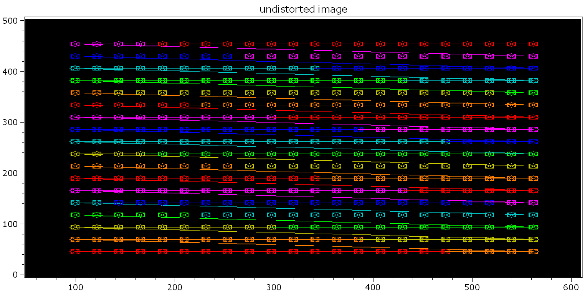
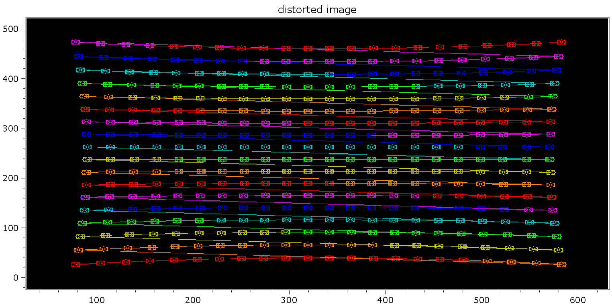
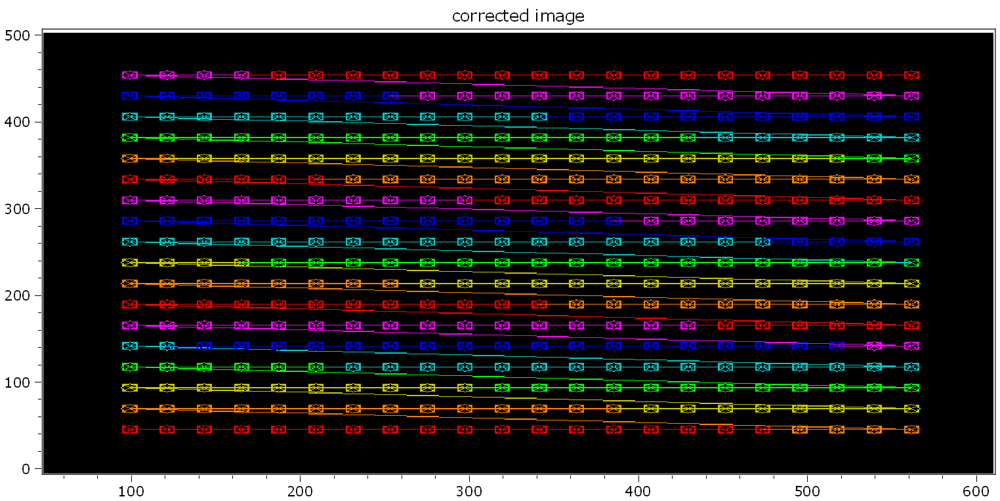
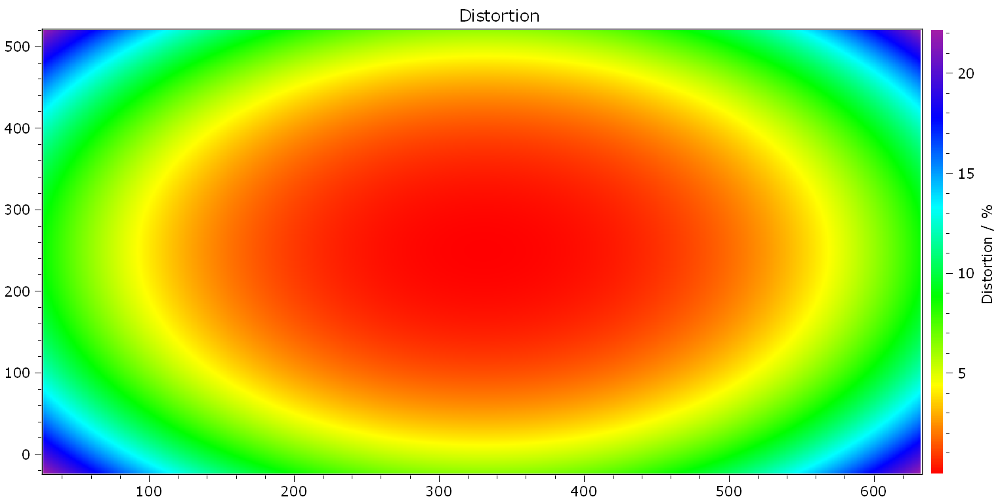

.. DO NOT EDIT.
.. THIS FILE WAS AUTOMATICALLY GENERATED BY SPHINX-GALLERY.
.. TO MAKE CHANGES, EDIT THE SOURCE PYTHON FILE:
.. "11_demos\itom_packages\demo_ImageDistortion.py"
.. LINE NUMBERS ARE GIVEN BELOW.

.. only:: html

    .. note::
        :class: sphx-glr-download-link-note

        Click :ref:`here <sphx_glr_download_11_demos_itom_packages_demo_ImageDistortion.py>`
        to download the full example code

.. rst-class:: sphx-glr-example-title

.. _sphx_glr_11_demos_itom_packages_demo_ImageDistortion.py:

cameraToolbox
===========

In the folder ``itom_packages``, there is a package ``cameraToolbox``.
This mainly contains methods to simulate distorted images
and calculate the distortion of acquired grids.

To simplify the access to this script, this demo is added.
For more information, see the module ``distortion_test.py``.

.. GENERATED FROM PYTHON SOURCE LINES 10-15

.. code-block:: default

    from cameraToolbox import distortion_test

    distortion_test.distortionTest()

.. rst-class:: sphx-glr-script-out

 Out:

 .. code-block:: none

    coefficients (design): 24.00 22.00 330.00 250.00 0.000 0.5000e-6 5.0000e-12 0.0000e-18
    coefficients (coarse): 24.71 22.69 330.00 250.00 0.000 0.0000e-6 0.0000e-12 0.0000e-18
    coefficients (optim1): 24.00 22.00 330.00 250.00 0.000 0.4999e-6 5.0009e-12 -0.0025e-18
    coefficients (optim2): 24.00 22.00 330.00 250.00 0.000 0.5000e-6 5.0001e-12 -0.0025e-18

.. GENERATED FROM PYTHON SOURCE LINES 17-19

.. GENERATED FROM PYTHON SOURCE LINES 21-23

.. GENERATED FROM PYTHON SOURCE LINES 25-27

.. GENERATED FROM PYTHON SOURCE LINES 29-30

.. rst-class:: sphx-glr-timing

   **Total running time of the script:** ( 0 minutes  2.812 seconds)

.. _sphx_glr_download_11_demos_itom_packages_demo_ImageDistortion.py:

.. only:: html

  .. container:: sphx-glr-footer sphx-glr-footer-example

    .. container:: sphx-glr-download sphx-glr-download-python

      :download:`Download Python source code: demo_ImageDistortion.py <demo_ImageDistortion.py>`

    .. container:: sphx-glr-download sphx-glr-download-jupyter

      :download:`Download Jupyter notebook: demo_ImageDistortion.ipynb <demo_ImageDistortion.ipynb>`

.. only:: html

 .. rst-class:: sphx-glr-signature

    `Gallery generated by Sphinx-Gallery <https://sphinx-gallery.github.io>`_
