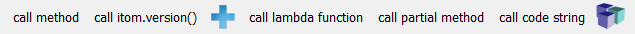

.. DO NOT EDIT.
.. THIS FILE WAS AUTOMATICALLY GENERATED BY SPHINX-GALLERY.
.. TO MAKE CHANGES, EDIT THE SOURCE PYTHON FILE:
.. "11_demos\itom_packages\demo_ToolBar.py"
.. LINE NUMBERS ARE GIVEN BELOW.

.. only:: html

    .. note::
        :class: sphx-glr-download-link-note

        Click :ref:`here <sphx_glr_download_11_demos_itom_packages_demo_ToolBar.py>`
        to download the full example code

.. rst-class:: sphx-glr-example-title

.. _sphx_glr_11_demos_itom_packages_demo_ToolBar.py:

Toolbar
===========

This demo shows how buttons are added and removed from the ``itom`` toolbar.
Frequently used methods are thus easier to access.
By clicking the button, these are executed. 

.. GENERATED FROM PYTHON SOURCE LINES 7-33

.. code-block:: default

    from functools import partial
    from itom import addButton
    from itom import removeButton
    from itom import version as itomVersion

    def method():
        """Sample callback method 1."""
        print("The method 'method' has been clicked")

    def methodArgs(arg1, arg2):
        """Sample callback method 2."""
        print("The method 'methodArgs' has been clicked. Args:", arg1, arg2)

    class Test:
        """Sample class."""

        def doit(self):
            """Sample member method of this class."""
            print("The member 'doit' of class 'Test' has been clicked.")

.. GENERATED FROM PYTHON SOURCE LINES 35-38

If this demo is executed multiple times, try to remove all
existing toolbars ``demobar`` and ``otherbar``. This command is
used and explained later.

.. GENERATED FROM PYTHON SOURCE LINES 38-48

.. code-block:: default

    try:
        removeButton("demobar")
    except RuntimeError:
        pass

    try:
        removeButton("otherbar")
    except RuntimeError:
        pass

.. GENERATED FROM PYTHON SOURCE LINES 49-51

Add a single button without icon to a new toolbar with the name ``demobar``.
The callback function is the unbounded method ``method`` without arguments.

.. GENERATED FROM PYTHON SOURCE LINES 51-53

.. code-block:: default

    addButton("demobar", "call method", method)

.. rst-class:: sphx-glr-script-out

 Out:

 .. code-block:: none

    54

.. GENERATED FROM PYTHON SOURCE LINES 54-57

This is quite similar than the addButton above, however internally it
makes a difference if a Python-scripted method is used as callback or
a method from the itom module, implemented in C.

.. GENERATED FROM PYTHON SOURCE LINES 57-59

.. code-block:: default

    addButton("demobar", "call itom.version()", itomVersion)

.. rst-class:: sphx-glr-script-out

 Out:

 .. code-block:: none

    55

.. GENERATED FROM PYTHON SOURCE LINES 60-63

Add another button with an icon to the same toolbar. This time,
the unbounded method ``methodArgs`` should be triggered if the button is clicked.
the name of the button is shown in the tooltip text of the button.

.. GENERATED FROM PYTHON SOURCE LINES 63-67

.. code-block:: default

    addButton("demobar", "call methodArgs", methodArgs, icon=":/arrows/icons/plus.png", argtuple=("arg1", 23))
    # add another button to 'demobar' and use a lambda function as callback
    addButton("demobar", "call lambda function", lambda: print("lambda func call"))

.. rst-class:: sphx-glr-script-out

 Out:

 .. code-block:: none

    57

.. GENERATED FROM PYTHON SOURCE LINES 68-70

Call a partial method. This is a method, that wraps a base method with
more arguments, but selected arguments are already preset.

.. GENERATED FROM PYTHON SOURCE LINES 70-74

.. code-block:: default

    addButton(
        "demobar", "call partial method", partial(lambda num, base: print(int(num, base)), base=2), argtuple=("10010",)
    )

.. rst-class:: sphx-glr-script-out

 Out:

 .. code-block:: none

    58

.. GENERATED FROM PYTHON SOURCE LINES 75-76

Add a button to the 'demobar' toolbar, that evaluates a Python code string.

.. GENERATED FROM PYTHON SOURCE LINES 76-78

.. code-block:: default

    addButton("demobar", "call code string", "print('code string')")

.. rst-class:: sphx-glr-script-out

 Out:

 .. code-block:: none

    59

.. GENERATED FROM PYTHON SOURCE LINES 79-84

Add a button that triggers a member method of the object ``myTest``.
.. hint:: If a button triggers such a member method, the button does not
    explicitly keep a reference to the object, such that this object must
    be kept by any other variable. Else, a RuntimeError is raised when the
    button is triggered.

.. GENERATED FROM PYTHON SOURCE LINES 84-88

.. code-block:: default

    myTest = Test()
    addButton("demobar", "call bounded method", code=myTest.doit, icon=":/classNavigator/icons/class.png")

.. rst-class:: sphx-glr-script-out

 Out:

 .. code-block:: none

    60

.. GENERATED FROM PYTHON SOURCE LINES 89-90

Create a new button and get its handle

.. GENERATED FROM PYTHON SOURCE LINES 90-92

.. code-block:: default

    handle = addButton("demobar", "temp", method)

.. GENERATED FROM PYTHON SOURCE LINES 93-94

And remove the button again

.. GENERATED FROM PYTHON SOURCE LINES 94-96

.. code-block:: default

    removeButton(handle)

.. GENERATED FROM PYTHON SOURCE LINES 97-99

Next step: create some buttons in another toolbar ``otherbar`` and
then remove the entire toolbar ``otherbar``:

.. GENERATED FROM PYTHON SOURCE LINES 99-102

.. code-block:: default

    for i in range(0, 5):
        addButton("otherbar", "btn%i" % i, method)

.. GENERATED FROM PYTHON SOURCE LINES 103-104

At first remove one button

.. GENERATED FROM PYTHON SOURCE LINES 104-106

.. code-block:: default

    removeButton("otherbar", "btn3")

.. GENERATED FROM PYTHON SOURCE LINES 107-108

Then remove all remaining buttons including the toolbar 'otherbar'.

.. GENERATED FROM PYTHON SOURCE LINES 108-110

.. code-block:: default

    removeButton("otherbar")

.. GENERATED FROM PYTHON SOURCE LINES 111-113

Following buttons/bar will be added to the ``itom`` toolbar. 

.. rst-class:: sphx-glr-timing

   **Total running time of the script:** ( 0 minutes  0.307 seconds)

.. _sphx_glr_download_11_demos_itom_packages_demo_ToolBar.py:

.. only:: html

  .. container:: sphx-glr-footer sphx-glr-footer-example

    .. container:: sphx-glr-download sphx-glr-download-python

      :download:`Download Python source code: demo_ToolBar.py <demo_ToolBar.py>`

    .. container:: sphx-glr-download sphx-glr-download-jupyter

      :download:`Download Jupyter notebook: demo_ToolBar.ipynb <demo_ToolBar.ipynb>`

.. only:: html

 .. rst-class:: sphx-glr-signature

    `Gallery generated by Sphinx-Gallery <https://sphinx-gallery.github.io>`_
