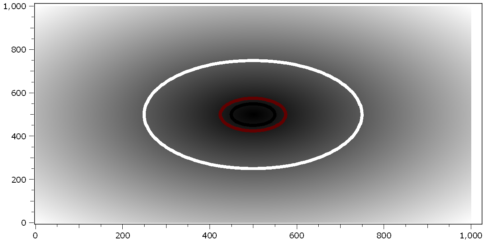

.. DO NOT EDIT.
.. THIS FILE WAS AUTOMATICALLY GENERATED BY SPHINX-GALLERY.
.. TO MAKE CHANGES, EDIT THE SOURCE PYTHON FILE:
.. "11_demos\plots\demo_ContourLines2dPlot.py"
.. LINE NUMBERS ARE GIVEN BELOW.

.. only:: html

    .. note::
        :class: sphx-glr-download-link-note

        Click :ref:`here <sphx_glr_download_11_demos_plots_demo_ContourLines2dPlot.py>`
        to download the full example code

.. rst-class:: sphx-glr-example-title

.. _sphx_glr_11_demos_plots_demo_ContourLines2dPlot.py:

Contourlines 2D plot
====================

This demo shows how to display contour lines in an ``itom.plot2``.

The contour levels can be set via the ``contourLevels`` property.
The expected type is a ``dataObject`` of shape ``1 x N`` of type
``uint8``, ``int8``, ``uint16``, ``int16``, ``int32``,
``float32`` or ``float64``. The line width and color map can
be adjusted by setting the property ``contourLineWidth`` and
``contourColorMap`` respectively.

.. GENERATED FROM PYTHON SOURCE LINES 13-32

.. code-block:: default

    import numpy as np
    from itom import dataObject
    from itom import plot

    vec = np.linspace(-500, 501, 1001)
    x, y = np.meshgrid(vec, vec)
    r = np.sqrt(x ** 2 + y ** 2)

    [idx, handle] = plot(r)
    levels = dataObject.randN([1, 3], "uint8")
    levels[0, 0] = 50
    levels[0, 1] = 75
    levels[0, 2] = 250

    handle["contourLevels"] = levels
    handle["contourColorMap"] = "hotIron"
    handle["contourLineWidth"] = 5

.. GENERATED FROM PYTHON SOURCE LINES 34-35

.. rst-class:: sphx-glr-timing

   **Total running time of the script:** ( 0 minutes  0.074 seconds)

.. _sphx_glr_download_11_demos_plots_demo_ContourLines2dPlot.py:

.. only:: html

  .. container:: sphx-glr-footer sphx-glr-footer-example

    .. container:: sphx-glr-download sphx-glr-download-python

      :download:`Download Python source code: demo_ContourLines2dPlot.py <demo_ContourLines2dPlot.py>`

    .. container:: sphx-glr-download sphx-glr-download-jupyter

      :download:`Download Jupyter notebook: demo_ContourLines2dPlot.ipynb <demo_ContourLines2dPlot.ipynb>`

.. only:: html

 .. rst-class:: sphx-glr-signature

    `Gallery generated by Sphinx-Gallery <https://sphinx-gallery.github.io>`_
