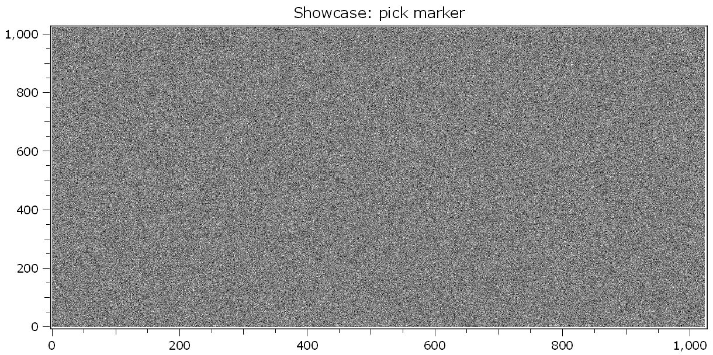
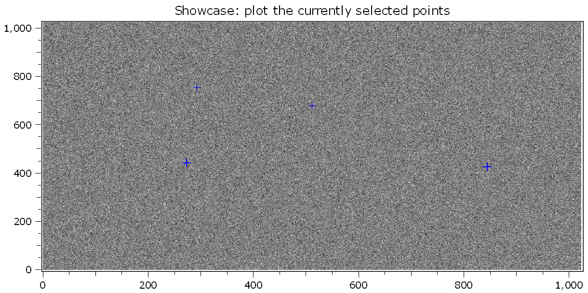

.. DO NOT EDIT.
.. THIS FILE WAS AUTOMATICALLY GENERATED BY SPHINX-GALLERY.
.. TO MAKE CHANGES, EDIT THE SOURCE PYTHON FILE:
.. "11_demos\plots\demo_PickPointsAndMarkers.py"
.. LINE NUMBERS ARE GIVEN BELOW.

.. only:: html

    .. note::
        :class: sphx-glr-download-link-note

        Click :ref:`here <sphx_glr_download_11_demos_plots_demo_PickPointsAndMarkers.py>`
        to download the full example code

.. rst-class:: sphx-glr-example-title

.. _sphx_glr_11_demos_plots_demo_PickPointsAndMarkers.py:

Pick points and markers
======================

This demo shows how you can pick points and markers in the ``itom`` plot.

.. GENERATED FROM PYTHON SOURCE LINES 5-11

.. code-block:: default

    from itom import dataObject
    from itom import plot2
    from itom import plotItem

.. GENERATED FROM PYTHON SOURCE LINES 13-16

**Pick Points demo**

Create a random 2 dimensional ``dataObject`` and plot it.

.. GENERATED FROM PYTHON SOURCE LINES 16-21

.. code-block:: default

    obj = dataObject.randN([1024, 1024], "int16")

    [nr, h] = plot2(obj)
    h["title"] = "Showcase: pick marker"

.. GENERATED FROM PYTHON SOURCE LINES 22-24

.. GENERATED FROM PYTHON SOURCE LINES 26-27

This command let the user pick maximum 4 points (earlier break with space, esc aborts the selection).

.. GENERATED FROM PYTHON SOURCE LINES 27-34

.. code-block:: default

    pickedPoints = dataObject()
    h.pickPoints(pickedPoints, 4)

    print("coordinates of selected points: ")
    for numPoint in range(pickedPoints.shape[1]):
        print("x: {}, y: {}".format(pickedPoints[0, numPoint], pickedPoints[1, numPoint]))

.. rst-class:: sphx-glr-script-out

 Out:

 .. code-block:: none

    coordinates of selected points: 
    x: 592.9566744730679, y: 935.6080402010051
    x: 344.9929742388759, y: 735.1206030150754
    x: 452.8032786885246, y: 514.070351758794
    x: 764.255269320843, y: 532.0628140703518

.. GENERATED FROM PYTHON SOURCE LINES 35-43

Plot the ``dataObject`` again together with the previously selected points as ``marker``.

The second argument of ``plotMarkers`` is a style-string (this may change) ``[color, symbol, size]``:
=======  =====================================
color    {b, g, r, c, m, y, k, w}
symbol   {., o, s, d, >, v, ^, <, x, *, +, h}
size     any integer number
=======  =====================================

.. GENERATED FROM PYTHON SOURCE LINES 43-48

.. code-block:: default

    markers = dataObject([2, 3], "float32", data=[10.1, 20.2, 30.3, 7, 100, 500])
    [nr, h] = plot2(obj)
    h["title"] = "Showcase: plot the currently selected points"
    h.call("plotMarkers", pickedPoints, "b+10", "setName")  # 'setName' is the name for this set of markers (optional)

.. GENERATED FROM PYTHON SOURCE LINES 49-51

.. GENERATED FROM PYTHON SOURCE LINES 53-54

Delete marker set

.. GENERATED FROM PYTHON SOURCE LINES 54-57

.. code-block:: default

    h.call("deleteMarkers", "setName")  # deletes given set
    h.call("deleteMarkers", "")  # deletes all sets

.. GENERATED FROM PYTHON SOURCE LINES 58-61

**Paint geometric shapes**

Create a random 2 dimensional ``dataObject`` and plot it.

.. GENERATED FROM PYTHON SOURCE LINES 61-65

.. code-block:: default

    obj = dataObject.randN([1024, 1024], "int16")
    [nr, h] = plot2(obj)
    h["title"] = "Showcase: paint 4 ellipses"

.. GENERATED FROM PYTHON SOURCE LINES 66-67

This command let the user pick maximum 4 points (earlier break with space, esc aborts the selection).

.. GENERATED FROM PYTHON SOURCE LINES 67-73

.. code-block:: default

    geometricShapes = h.drawAndPickElements(plotItem.PrimitiveEllipse, 4)

    print("selected shapes:")
    for shape in geometricShapes:
        print(shape)

.. rst-class:: sphx-glr-script-out

 Out:

 .. code-block:: none

    selected shapes:
    shape(Ellipse, center (398.898, 732.55), (a=0, b=0), index: 19)
    shape(Ellipse, center (363.56, 488.367), (a=0.598946, b=-2.57035), index: 20)
    shape(Ellipse, center (596.55, 393.264), (a=0, b=0), index: 21)
    shape(Ellipse, center (716.939, 467.804), (a=0.598946, b=17.9925), index: 22)

.. GENERATED FROM PYTHON SOURCE LINES 74-75

Plot the ``dataObject`` again together with the previously painted ellipses ``geometricShapes``.

.. GENERATED FROM PYTHON SOURCE LINES 75-80

.. code-block:: default

    [nr, hDrawInto] = plot2(obj)
    hDrawInto["title"] = "Showcase: plot painted ellipses"
    hDrawInto.call("setGeometricShapes", geometricShapes)  # "b" and "setname" will be ignored anyway
    shapes = hDrawInto["geometricShapes"]

.. GENERATED FROM PYTHON SOURCE LINES 81-83

.. image:: ../_static/demoPickPointsAndMarkers_3.png
   :width: 100%

.. rst-class:: sphx-glr-timing

   **Total running time of the script:** ( 0 minutes  3.399 seconds)

.. _sphx_glr_download_11_demos_plots_demo_PickPointsAndMarkers.py:

.. only:: html

  .. container:: sphx-glr-footer sphx-glr-footer-example

    .. container:: sphx-glr-download sphx-glr-download-python

      :download:`Download Python source code: demo_PickPointsAndMarkers.py <demo_PickPointsAndMarkers.py>`

    .. container:: sphx-glr-download sphx-glr-download-jupyter

      :download:`Download Jupyter notebook: demo_PickPointsAndMarkers.ipynb <demo_PickPointsAndMarkers.ipynb>`

.. only:: html

 .. rst-class:: sphx-glr-signature

    `Gallery generated by Sphinx-Gallery <https://sphinx-gallery.github.io>`_
