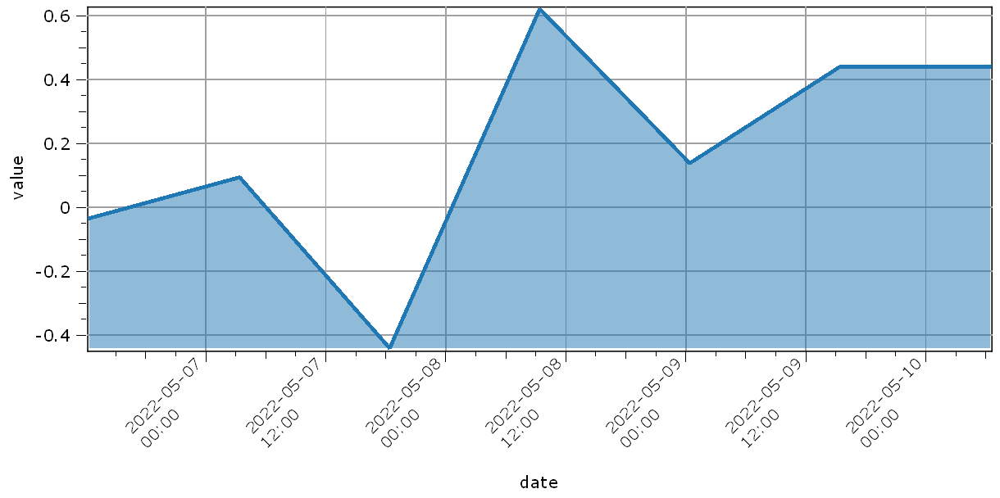
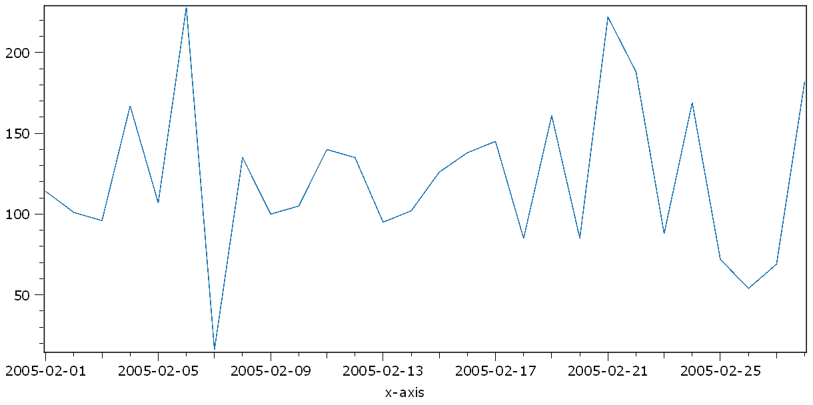

.. DO NOT EDIT.
.. THIS FILE WAS AUTOMATICALLY GENERATED BY SPHINX-GALLERY.
.. TO MAKE CHANGES, EDIT THE SOURCE PYTHON FILE:
.. "11_demos\plots\demo_Plot1DDateTime.py"
.. LINE NUMBERS ARE GIVEN BELOW.

.. only:: html

    .. note::
        :class: sphx-glr-download-link-note

        Click :ref:`here <sphx_glr_download_11_demos_plots_demo_Plot1DDateTime.py>`
        to download the full example code

.. rst-class:: sphx-glr-example-title

.. _sphx_glr_11_demos_plots_demo_Plot1DDateTime.py:

Datetime
============

This demo shows how the x-axis of a 1d plot can be a date time.

.. GENERATED FROM PYTHON SOURCE LINES 5-11

.. code-block:: default

    import numpy as np
    import datetime
    from itom import dataObject
    from itom import plot1

.. GENERATED FROM PYTHON SOURCE LINES 13-14

Start date with a specific timezone.

.. GENERATED FROM PYTHON SOURCE LINES 14-18

.. code-block:: default

    timestamp = datetime.datetime(
        2022, 5, 6, 12, 23, 5, tzinfo=datetime.timezone(datetime.timedelta(0, -7200))
    )

.. GENERATED FROM PYTHON SOURCE LINES 19-20

Create a list of ``datetime.datetime`` objects.

.. GENERATED FROM PYTHON SOURCE LINES 20-28

.. code-block:: default

    numsteps = 100
    dateList = []

    for x in range(0, numsteps, 15):
        dateList.append(
            timestamp + datetime.timedelta(hours=x)
        )

.. GENERATED FROM PYTHON SOURCE LINES 29-30

Create a ``dataObject`` from the list of ``datetime`` objects.

.. GENERATED FROM PYTHON SOURCE LINES 30-36

.. code-block:: default

    dateScale = dataObject([1, len(dateList)], "datetime", data=dateList)

    values = dataObject.randN(dateScale.shape, "float32")

    [i, h] = plot1(values, dateScale)

.. GENERATED FROM PYTHON SOURCE LINES 37-39

.. GENERATED FROM PYTHON SOURCE LINES 39-49

.. code-block:: default

    h["lineWidth"] = 3
    h["axisLabelRotation"] = -45
    h["axisLabelAlignment"] = "AlignLeft"
    h["fillCurve"] = "FillFromBottom"
    h["grid"] = "GridMajorXY"
    h["axisLabel"] = "date"
    h["valueLabel"] = "value"

.. GENERATED FROM PYTHON SOURCE LINES 50-51

Example with ``numpy datetime`` array.

.. GENERATED FROM PYTHON SOURCE LINES 51-55

.. code-block:: default

    dateScale = np.arange('2005-02', '2005-03', dtype='datetime64[D]')
    values = dataObject.randN([1, len(dateScale)], "uint8")
    plot1(values, dateScale)

.. rst-class:: sphx-glr-script-out

 Out:

 .. code-block:: none

    (125, PlotItem(UiItem(class: Itom1DQwtPlot, name: plot0x0)))

.. GENERATED FROM PYTHON SOURCE LINES 56-57

.. rst-class:: sphx-glr-timing

   **Total running time of the script:** ( 0 minutes  0.108 seconds)

.. _sphx_glr_download_11_demos_plots_demo_Plot1DDateTime.py:

.. only:: html

  .. container:: sphx-glr-footer sphx-glr-footer-example

    .. container:: sphx-glr-download sphx-glr-download-python

      :download:`Download Python source code: demo_Plot1DDateTime.py <demo_Plot1DDateTime.py>`

    .. container:: sphx-glr-download sphx-glr-download-jupyter

      :download:`Download Jupyter notebook: demo_Plot1DDateTime.ipynb <demo_Plot1DDateTime.ipynb>`

.. only:: html

 .. rst-class:: sphx-glr-signature

    `Gallery generated by Sphinx-Gallery <https://sphinx-gallery.github.io>`_
