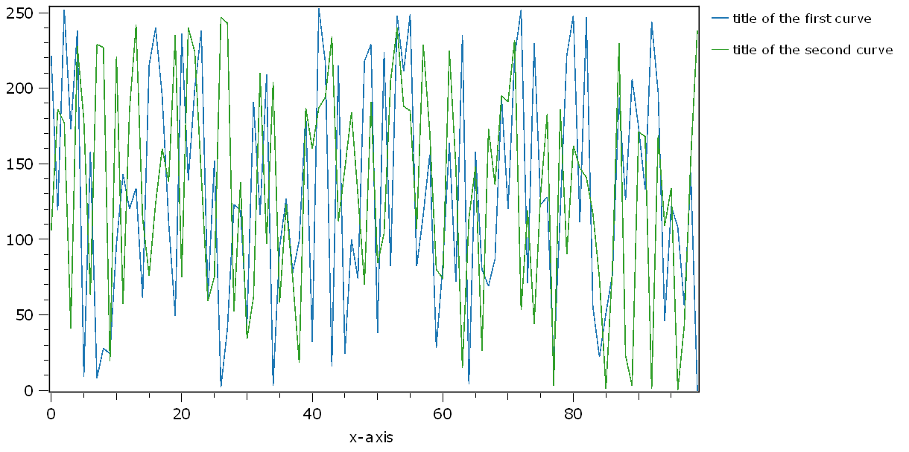

.. DO NOT EDIT.
.. THIS FILE WAS AUTOMATICALLY GENERATED BY SPHINX-GALLERY.
.. TO MAKE CHANGES, EDIT THE SOURCE PYTHON FILE:
.. "11_demos\plots\demo_Plot1DLegendTitles.py"
.. LINE NUMBERS ARE GIVEN BELOW.

.. only:: html

    .. note::
        :class: sphx-glr-download-link-note

        Click :ref:`here <sphx_glr_download_11_demos_plots_demo_Plot1DLegendTitles.py>`
        to download the full example code

.. rst-class:: sphx-glr-example-title

.. _sphx_glr_11_demos_plots_demo_Plot1DLegendTitles.py:

1D Legend title
======================

This demo shows how to define ``dataObject`` tags, which are used 
as ``legendTitles`` in the 1D plot. You have to set the tags ``legendTitle0``
``legendTitle1``, ``legendTitle2``, ..., according to the curve index and
the legend label text. 

.. GENERATED FROM PYTHON SOURCE LINES 8-19

.. code-block:: default

    from itom import dataObject
    from itom import plot1

    dObj = dataObject.rand([2, 100])
    dObj.setTag("legendTitle0", "title of the first curve")
    dObj.setTag("legendTitle1", "title of the second curve")

    print(dObj.tags)
    plot1(dObj, properties={"legendPosition": "Right"})

.. rst-class:: sphx-glr-script-out

 Out:

 .. code-block:: none

    {'legendTitle0': 'title of the first curve', 'legendTitle1': 'title of the second curve'}

    (118, PlotItem(UiItem(class: Itom1DQwtPlot, name: plot0x0)))

.. GENERATED FROM PYTHON SOURCE LINES 21-22

.. rst-class:: sphx-glr-timing

   **Total running time of the script:** ( 0 minutes  0.059 seconds)

.. _sphx_glr_download_11_demos_plots_demo_Plot1DLegendTitles.py:

.. only:: html

  .. container:: sphx-glr-footer sphx-glr-footer-example

    .. container:: sphx-glr-download sphx-glr-download-python

      :download:`Download Python source code: demo_Plot1DLegendTitles.py <demo_Plot1DLegendTitles.py>`

    .. container:: sphx-glr-download sphx-glr-download-jupyter

      :download:`Download Jupyter notebook: demo_Plot1DLegendTitles.ipynb <demo_Plot1DLegendTitles.ipynb>`

.. only:: html

 .. rst-class:: sphx-glr-signature

    `Gallery generated by Sphinx-Gallery <https://sphinx-gallery.github.io>`_
