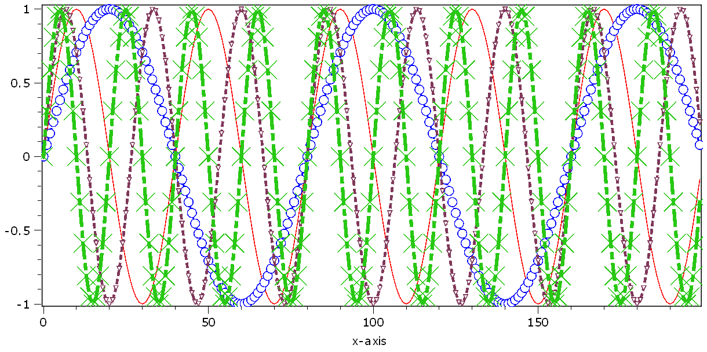

.. DO NOT EDIT.
.. THIS FILE WAS AUTOMATICALLY GENERATED BY SPHINX-GALLERY.
.. TO MAKE CHANGES, EDIT THE SOURCE PYTHON FILE:
.. "11_demos\plots\demo_Plot1DLineProperties.py"
.. LINE NUMBERS ARE GIVEN BELOW.

.. only:: html

    .. note::
        :class: sphx-glr-download-link-note

        Click :ref:`here <sphx_glr_download_11_demos_plots_demo_Plot1DLineProperties.py>`
        to download the full example code

.. rst-class:: sphx-glr-example-title

.. _sphx_glr_11_demos_plots_demo_Plot1DLineProperties.py:

1D Line properties
=======================

This demo shows how to individually set the property of each line.
In most cases, the property can both be set for each line and globally
as property of the plot. If the latter is set, all line properties are reset
to the same global value!

.. GENERATED FROM PYTHON SOURCE LINES 8-15

.. code-block:: default

    import numpy as np
    from itom import plot1
    from itom import dataObject
    from itom import rgba

.. GENERATED FROM PYTHON SOURCE LINES 17-18

Create a 1D sine curve demo data and plot it.

.. GENERATED FROM PYTHON SOURCE LINES 18-30

.. code-block:: default

    sine = np.sin(np.arange(0, 10 * np.pi, (1 / 20) * np.pi))
    sine2 = np.sin(np.arange(0, 5 * np.pi, (1 / 40) * np.pi))
    sine3 = np.sin(np.arange(0, 15 * np.pi, (3 / 40) * np.pi))
    sine4 = np.sin(np.arange(0, 20 * np.pi, (1 / 10) * np.pi))
    foursines = dataObject([4, len(sine)], "float64")
    foursines[0, :] = sine
    foursines[1, :] = sine2
    foursines[2, :] = sine3
    foursines[3, :] = sine4

    [i, h] = plot1(foursines)

.. GENERATED FROM PYTHON SOURCE LINES 31-33

.. GENERATED FROM PYTHON SOURCE LINES 35-36

Get the current properties of the first line.

.. GENERATED FROM PYTHON SOURCE LINES 36-44

.. code-block:: default

    print("lineStyle", h.call("getCurveProperty", 0, "lineStyle"))  # enumeration Qt::PenStyle
    print("lineWidth", h.call("getCurveProperty", 0, "lineWidth"))
    print("lineColor", h.call("getCurveProperty", 0, "lineColor"))
    print("lineJoinStyle", h.call("getCurveProperty", 0, "lineJoinStyle"))  # enumeration Qt::PenJoinStyle
    print("lineCapStyle", h.call("getCurveProperty", 0, "lineCapStyle"))  # enumeration  Qt::PenCapStyle
    print("lineSymbolSize", h.call("getCurveProperty", 0, "lineSymbolSize"))
    print("lineSymbolStyle", h.call("getCurveProperty", 0, "lineSymbolStyle"))  # enumeration Itom1DQwtPlot::Symbol

.. rst-class:: sphx-glr-script-out

 Out:

 .. code-block:: none

    lineStyle 1
    lineWidth 1.0
    lineColor rgba(31,120,180 alpha:255)
    lineJoinStyle 64
    lineCapStyle 16
    lineSymbolSize 0
    lineSymbolStyle 0

.. GENERATED FROM PYTHON SOURCE LINES 45-46

Change some styles.

.. GENERATED FROM PYTHON SOURCE LINES 46-51

.. code-block:: default

    h.call("setCurveProperty", 0, "lineStyle", "SolidLine")
    h.call("setCurveProperty", 1, "lineStyle", "DashLine")
    h.call("setCurveProperty", 2, "lineStyle", "DotLine")
    h.call("setCurveProperty", 3, "lineStyle", "DashDotLine")

.. GENERATED FROM PYTHON SOURCE LINES 52-53

Change some widths.

.. GENERATED FROM PYTHON SOURCE LINES 53-58

.. code-block:: default

    h.call("setCurveProperty", 0, "lineWidth", 1)
    h.call("setCurveProperty", 1, "lineWidth", 2)
    h.call("setCurveProperty", 2, "lineWidth", 3)
    h.call("setCurveProperty", 3, "lineWidth", 4)

.. GENERATED FROM PYTHON SOURCE LINES 59-60

Change some colors.

.. GENERATED FROM PYTHON SOURCE LINES 60-65

.. code-block:: default

    h.call("setCurveProperty", 0, "lineColor", "red")
    h.call("setCurveProperty", 1, "lineColor", "blue")
    h.call("setCurveProperty", 2, "lineColor", rgba(128, 55, 90))
    h.call("setCurveProperty", 3, "lineColor", rgba(40, 200, 20))

.. GENERATED FROM PYTHON SOURCE LINES 66-67

Change some symbols.

.. GENERATED FROM PYTHON SOURCE LINES 67-72

.. code-block:: default

    h.call("setCurveProperty", 0, "lineSymbolStyle", "NoSymbol")
    h.call("setCurveProperty", 1, "lineSymbolStyle", "Ellipse")
    h.call("setCurveProperty", 2, "lineSymbolStyle", "DTriangle")
    h.call("setCurveProperty", 3, "lineSymbolStyle", "XCross")

.. GENERATED FROM PYTHON SOURCE LINES 73-74

Change some cap styles.

.. GENERATED FROM PYTHON SOURCE LINES 74-77

.. code-block:: default

    h.call("setCurveProperty", 1, "lineSymbolSize", 10)
    h.call("setCurveProperty", 2, "lineSymbolSize", 5)
    h.call("setCurveProperty", 3, "lineSymbolSize", 20)

.. rst-class:: sphx-glr-timing

   **Total running time of the script:** ( 0 minutes  0.099 seconds)

.. _sphx_glr_download_11_demos_plots_demo_Plot1DLineProperties.py:

.. only:: html

  .. container:: sphx-glr-footer sphx-glr-footer-example

    .. container:: sphx-glr-download sphx-glr-download-python

      :download:`Download Python source code: demo_Plot1DLineProperties.py <demo_Plot1DLineProperties.py>`

    .. container:: sphx-glr-download sphx-glr-download-jupyter

      :download:`Download Jupyter notebook: demo_Plot1DLineProperties.ipynb <demo_Plot1DLineProperties.ipynb>`

.. only:: html

 .. rst-class:: sphx-glr-signature

    `Gallery generated by Sphinx-Gallery <https://sphinx-gallery.github.io>`_
