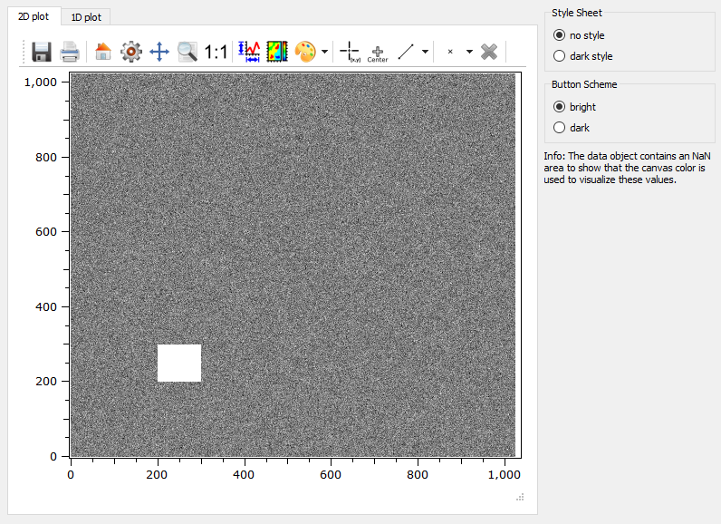
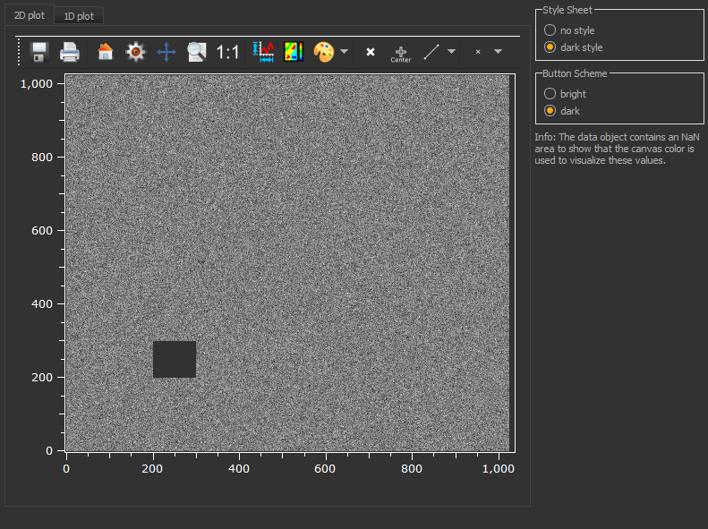

.. DO NOT EDIT.
.. THIS FILE WAS AUTOMATICALLY GENERATED BY SPHINX-GALLERY.
.. TO MAKE CHANGES, EDIT THE SOURCE PYTHON FILE:
.. "11_demos\plots\demo_PlotStyleSheets.py"
.. LINE NUMBERS ARE GIVEN BELOW.

.. only:: html

    .. note::
        :class: sphx-glr-download-link-note

        Click :ref:`here <sphx_glr_download_11_demos_plots_demo_PlotStyleSheets.py>`
        to download the full example code

.. rst-class:: sphx-glr-example-title

.. _sphx_glr_11_demos_plots_demo_PlotStyleSheets.py:

Plot style sheets
==================

This demo shows how you can set and change the theme of your GUI.
The style can not be entirely removed to the windows, mac or plastique style
(usually done by ``setStyle(new QWindowsStyle())``). 
It only resets the style sheet to an empty one, such that the native fallbacks to the
os dependent style is applied. However, ``Qt::WA_StyledBackground`` is still active.

.. GENERATED FROM PYTHON SOURCE LINES 10-74

.. code-block:: default

    from itom import dataObject
    from itom import ui
    from itomUi import ItomUi
    import inspect
    import os.path
    import numpy as np

    class PlotStyleSheets(ItomUi):
        def __init__(self):
            ownFilename = inspect.getfile(inspect.currentframe())
            ownDir = os.path.dirname(ownFilename)
            uiFile = os.path.join(ownDir, "demoPlotStyleSheets.ui")
            uiFile = os.path.abspath(uiFile)
            ItomUi.__init__(self, uiFile, ui.TYPEWINDOW, childOfMainWindow=True)
            obj = dataObject.randN([1024, 1024], "float32")
            obj[200:300, 200:300] = float("nan")
            self.gui.plot2d["source"] = obj
            self.gui.plot1d["source"] = dataObject(np.sin(np.arange(0, 10 * np.pi, (1 / 20) * np.pi)))

        def show(self, modalLevel: int = 0):
            self.gui.show(modalLevel)

        @ItomUi.autoslot("")
        def on_radioNoStyle_clicked(self):
            self.gui["styleSheet"] = ""
            self.gui.plot2d["backgroundColor"] = "#ffffff"
            self.gui.plot2d["axisColor"] = "#000000"
            self.gui.plot2d["textColor"] = "#000000"
            self.gui.plot2d["canvasColor"] = "#ffffff"
            self.gui.plot1d["backgroundColor"] = "#ffffff"
            self.gui.plot1d["axisColor"] = "#000000"
            self.gui.plot1d["textColor"] = "#000000"
            self.gui.plot1d["canvasColor"] = "#ffffff"

        @ItomUi.autoslot("")
        def on_radioDarkStyle_clicked(self):
            with open("darkorange.qss", "rt") as f:
                self.gui["styleSheet"] = f.read()
            self.gui.plot2d["backgroundColor"] = "#323232"
            self.gui.plot2d["axisColor"] = "#ffffff"
            self.gui.plot2d["textColor"] = "#ffffff"
            self.gui.plot2d["canvasColor"] = "#323232"
            self.gui.plot1d["backgroundColor"] = "#323232"
            self.gui.plot1d["axisColor"] = "#ffffff"
            self.gui.plot1d["textColor"] = "#ffffff"
            self.gui.plot1d["canvasColor"] = "#323232"

        @ItomUi.autoslot("")
        def on_radioButtonBright_clicked(self):
            self.gui.plot2d["buttonSet"] = "StyleBright"
            self.gui.plot1d["buttonSet"] = "StyleBright"

        @ItomUi.autoslot("")
        def on_radioButtonDark_clicked(self):
            self.gui.plot2d["buttonSet"] = "StyleDark"
            self.gui.plot1d["buttonSet"] = "StyleDark"

    if __name__ == "__main__":
        instance = PlotStyleSheets()
        instance.show()

.. GENERATED FROM PYTHON SOURCE LINES 76-78

.. GENERATED FROM PYTHON SOURCE LINES 80-82

.. rst-class:: sphx-glr-timing

   **Total running time of the script:** ( 0 minutes  0.073 seconds)

.. _sphx_glr_download_11_demos_plots_demo_PlotStyleSheets.py:

.. only:: html

  .. container:: sphx-glr-footer sphx-glr-footer-example

    .. container:: sphx-glr-download sphx-glr-download-python

      :download:`Download Python source code: demo_PlotStyleSheets.py <demo_PlotStyleSheets.py>`

    .. container:: sphx-glr-download sphx-glr-download-jupyter

      :download:`Download Jupyter notebook: demo_PlotStyleSheets.ipynb <demo_PlotStyleSheets.ipynb>`

.. only:: html

 .. rst-class:: sphx-glr-signature

    `Gallery generated by Sphinx-Gallery <https://sphinx-gallery.github.io>`_
