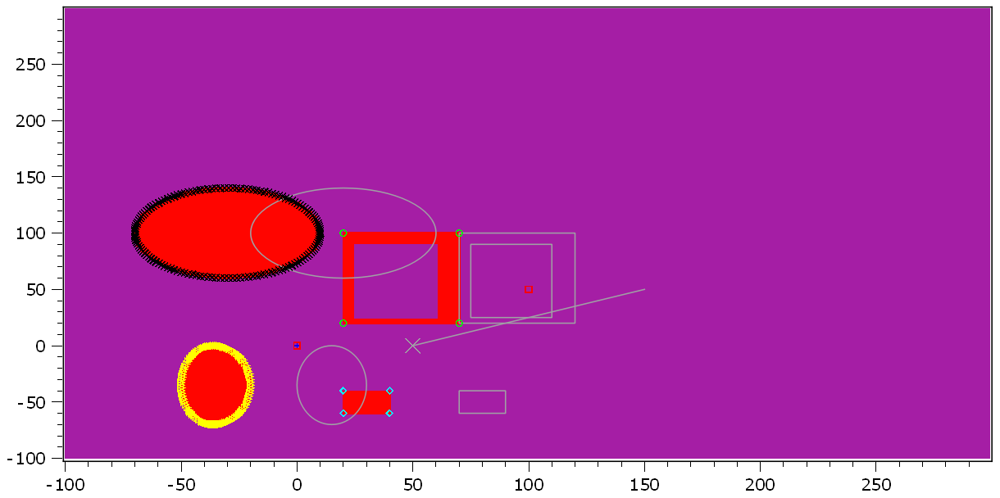

.. DO NOT EDIT.
.. THIS FILE WAS AUTOMATICALLY GENERATED BY SPHINX-GALLERY.
.. TO MAKE CHANGES, EDIT THE SOURCE PYTHON FILE:
.. "11_demos\plots\demo_Shapes.py"
.. LINE NUMBERS ARE GIVEN BELOW.

.. only:: html

    .. note::
        :class: sphx-glr-download-link-note

        Click :ref:`here <sphx_glr_download_11_demos_plots_demo_Shapes.py>`
        to download the full example code

.. rst-class:: sphx-glr-example-title

.. _sphx_glr_11_demos_plots_demo_Shapes.py:

Shapes
======================

This demo shows how you can add different shapes in the ``itom`` plot.

.. GENERATED FROM PYTHON SOURCE LINES 5-11

.. code-block:: default

    from itom import shape
    from itom import region
    from itom import dataObject
    from itom import plot

.. GENERATED FROM PYTHON SOURCE LINES 13-14

Create unrotated ``shapes``.

.. GENERATED FROM PYTHON SOURCE LINES 14-29

.. code-block:: default

    point = shape(shape.Point, (0, 0))
    print(point)
    line = shape(shape.Line, (0, 0), (100, 50))
    print(line)
    rect = shape(shape.Rectangle, (20, 20), (70, 100))
    print(rect)
    innerRect = shape(shape.Rectangle, (25, 25), (60, 90))
    print(innerRect)
    square = shape(shape.Square, (30, -50), 20)
    print(square)
    ellipse = shape(shape.Ellipse, (-50, -70), (-20, 0))
    print(ellipse)
    circle = shape(shape.Circle, (-30, 100), 40)
    print(circle)

.. rst-class:: sphx-glr-script-out

 Out:

 .. code-block:: none

    shape(Point, (0, 0), index: -1)
    shape(Line, (0, 0) - (100, 50), index: -1)
    shape(Rectangle, (20, 20) - (70, 100), index: -1)
    shape(Rectangle, (25, 25) - (60, 90), index: -1)
    shape(Square, center (30, -50), l: 10, index: -1)
    shape(Ellipse, center (-35, -35), (a=15, b=35), index: -1)
    shape(Circle, center (-30, 100), r: 40, index: -1)

.. GENERATED FROM PYTHON SOURCE LINES 30-31

Create a pixel-based ``region`` from all ``shapes`` (union of all ``shapes``).

.. GENERATED FROM PYTHON SOURCE LINES 31-41

.. code-block:: default

    area = region()
    area += point.region()
    area += line.region()
    area += rect.region()
    area -= innerRect.region()
    area += square.region()
    area += ellipse.region()
    area += circle.region()
    mask = area.createMask(region(-100, -100, 300, 300, region.RECTANGLE))

.. GENERATED FROM PYTHON SOURCE LINES 42-43

Create the mask for a ``dataObject`` based on the ``shapes``.

.. GENERATED FROM PYTHON SOURCE LINES 43-58

.. code-block:: default

    image = dataObject.zeros([400, 400], "uint8")
    image.axisOffsets = (100, 100)
    mask = image.createMask(
        [point, line, rect, square, ellipse, circle]
    ) & image.createMask([innerRect], True)

    # plot all contours inside of plot
    area = region()
    contour_point = point.contour()
    contour_line = line.contour()
    contour_rect = rect.contour()
    contour_square = square.contour()
    contour_ellipse = ellipse.contour(tol=0.02)
    contour_circle = circle.contour(tol=0.01)

.. GENERATED FROM PYTHON SOURCE LINES 59-60

Plot mask and contour points

.. GENERATED FROM PYTHON SOURCE LINES 60-92

.. code-block:: default

    [i, h] = plot(mask, "2D", properties={"colorMap": "falseColorIR"})
    h.call("plotMarkers", contour_point, "b+")
    h.call("plotMarkers", contour_line, "rs")
    h.call("plotMarkers", contour_rect, "g.")
    h.call("plotMarkers", contour_square, "cd")
    h.call("plotMarkers", contour_ellipse, "y>")
    h.call("plotMarkers", contour_circle, "kx")

    # plot shapes into plot
    # move them first by 50px each
    for s in [point, line, rect, square, innerRect, ellipse, circle]:
        s.center = [s.center[0] + 50, s.center[1]]

    # don't allow the rectangle to be moved
    rect.flags = shape.MoveLock

    # don't allow the line to be resized
    line.flags = shape.ResizeLock

    # don't allow the line to be resized, moved and rotated
    line.flags = shape.MoveLock | shape.ResizeLock | shape.RotateLock

    h["geometricShapes"] = [
        point,
        line,
        rect,
        innerRect,
        square,
        ellipse,
        circle,
    ]

.. GENERATED FROM PYTHON SOURCE LINES 93-94

.. rst-class:: sphx-glr-timing

   **Total running time of the script:** ( 0 minutes  0.083 seconds)

.. _sphx_glr_download_11_demos_plots_demo_Shapes.py:

.. only:: html

  .. container:: sphx-glr-footer sphx-glr-footer-example

    .. container:: sphx-glr-download sphx-glr-download-python

      :download:`Download Python source code: demo_Shapes.py <demo_Shapes.py>`

    .. container:: sphx-glr-download sphx-glr-download-jupyter

      :download:`Download Jupyter notebook: demo_Shapes.ipynb <demo_Shapes.ipynb>`

.. only:: html

 .. rst-class:: sphx-glr-signature

    `Gallery generated by Sphinx-Gallery <https://sphinx-gallery.github.io>`_
