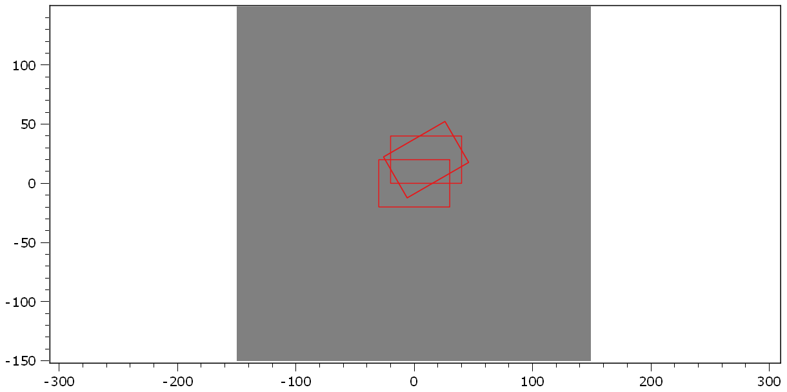

.. DO NOT EDIT.
.. THIS FILE WAS AUTOMATICALLY GENERATED BY SPHINX-GALLERY.
.. TO MAKE CHANGES, EDIT THE SOURCE PYTHON FILE:
.. "11_demos\plots\demo_ShapesTransformation.py"
.. LINE NUMBERS ARE GIVEN BELOW.

.. only:: html

    .. note::
        :class: sphx-glr-download-link-note

        Click :ref:`here <sphx_glr_download_11_demos_plots_demo_ShapesTransformation.py>`
        to download the full example code

.. rst-class:: sphx-glr-example-title

.. _sphx_glr_11_demos_plots_demo_ShapesTransformation.py:

Shape transformation
======================

This demo shows how you can translate and rotate ``itom.shapes`` in the ``itom`` plot.

.. GENERATED FROM PYTHON SOURCE LINES 5-29

.. code-block:: default

    from itom import dataObject
    from itom import plot
    from itom import shape

    d = dataObject.zeros([300, 300])
    d.axisOffsets = (150, 150)
    [i, h] = plot(d, properties={"keepAspectRatio": True})

    rect = shape(shape.Rectangle, (-30, -20), (30, 20))

    rect2 = rect.copy()
    rect2.translate([10, 20])

    rect3 = rect.copy()
    rect3.rotateDeg(30)
    rect3.translate([10, 20])

    rect4 = rect.copy()
    rect4.translate([10, 20])
    rect4.rotateDeg(30)

    h["geometricShapes"] = (rect, rect2, rect3, rect4)

.. GENERATED FROM PYTHON SOURCE LINES 31-33

.. rst-class:: sphx-glr-timing

   **Total running time of the script:** ( 0 minutes  0.055 seconds)

.. _sphx_glr_download_11_demos_plots_demo_ShapesTransformation.py:

.. only:: html

  .. container:: sphx-glr-footer sphx-glr-footer-example

    .. container:: sphx-glr-download sphx-glr-download-python

      :download:`Download Python source code: demo_ShapesTransformation.py <demo_ShapesTransformation.py>`

    .. container:: sphx-glr-download sphx-glr-download-jupyter

      :download:`Download Jupyter notebook: demo_ShapesTransformation.ipynb <demo_ShapesTransformation.ipynb>`

.. only:: html

 .. rst-class:: sphx-glr-signature

    `Gallery generated by Sphinx-Gallery <https://sphinx-gallery.github.io>`_
