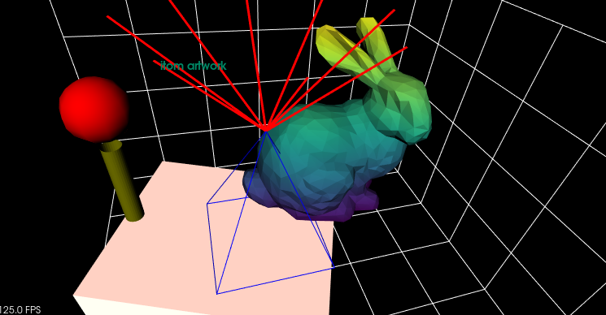

.. DO NOT EDIT.
.. THIS FILE WAS AUTOMATICALLY GENERATED BY SPHINX-GALLERY.
.. TO MAKE CHANGES, EDIT THE SOURCE PYTHON FILE:
.. "11_demos\plots\demo_Vtk3dVisualizer.py"
.. LINE NUMBERS ARE GIVEN BELOW.

.. only:: html

    .. note::
        :class: sphx-glr-download-link-note

        Click :ref:`here <sphx_glr_download_11_demos_plots_demo_Vtk3dVisualizer.py>`
        to download the full example code

.. rst-class:: sphx-glr-example-title

.. _sphx_glr_11_demos_plots_demo_Vtk3dVisualizer.py:

VTK 3D Visualizer
====================

The ``Vtk3dVisualizer`` can be used to visualize the following items:

* pointClouds
* polygonMeshes
* geometric items like cuboids, pyramids, cylinders, spheres
* text at arbitrary 3D positions

.. GENERATED FROM PYTHON SOURCE LINES 11-30

.. code-block:: default

    import numpy as np

    try:
        from itom import pointCloud
    except Exception as ex:
        ui.msgInformation(
            "PointCloud missing",
            "your itom version is compiled without support of pointClouds",
        )
        raise ex

    from itom import polygonMesh
    from itom import dataObject
    from itom import plot25
    from itom import algorithms

.. GENERATED FROM PYTHON SOURCE LINES 32-33

Load a polygonal mesh of a bunny.

.. GENERATED FROM PYTHON SOURCE LINES 33-46

.. code-block:: default

    bunny = polygonMesh()
    algorithms.loadPolygonMesh(bunny, "bunny.obj")
    trafo = dataObject.eye(4, "float64")
    trafo[1, 1] = 0
    trafo[2, 2] = 0
    trafo[1, 2] = 1
    trafo[2, 1] = 1
    trafo[0:3, 3] = (0, 0, -2)
    bunny_transformed_mesh = polygonMesh()
    algorithms.meshTransformAffine(bunny, bunny_transformed_mesh, trafo)

    [i, h] = plot25(bunny_transformed_mesh)

.. GENERATED FROM PYTHON SOURCE LINES 47-48

Configure the mesh (called ``source_mesh``).

.. GENERATED FROM PYTHON SOURCE LINES 48-51

.. code-block:: default

    h.call("setItemProperty", "source_mesh", "ColorMode", "Z")
    h.call("setItemProperty", "source_mesh", "ColorMap", "viridis")

.. GENERATED FROM PYTHON SOURCE LINES 52-54

A cylinder is added to the canvas. The axis of symmetry is given by a start point and an orientation vector.
The length of the orientation vector defines the height of the cylinder, its radius is given by the third parameter.

.. GENERATED FROM PYTHON SOURCE LINES 54-59

.. code-block:: default

    h.call("addCylinder", (10, 0, 0), (0, 0, 5), 0.5, "cylinder")  # arguments: point, orientation, radius, name
    h.call("setItemProperty", "cylinder", "Representation", "Surface")
    h.call("setItemProperty", "cylinder", "LineColor", "#808000")
    h.call("setItemProperty", "cylinder", "Lighting", True)

.. GENERATED FROM PYTHON SOURCE LINES 60-61

A sphere is added on top of the cylinder. Its center is given as first parameter, followed by the radius.

.. GENERATED FROM PYTHON SOURCE LINES 61-65

.. code-block:: default

    h.call("addSphere", (10, 0, 7), 1.5, "sphere")
    h.call("setItemProperty", "sphere", "Interpolation", "Gouraud")
    h.call("setItemProperty", "sphere", "Lighting", True)

.. GENERATED FROM PYTHON SOURCE LINES 66-69

A pyramid is added. It is defined by its five corner points using a ``3 x 5`` ``dataObject``. The first four
columns hereby describe the corner points of the base rectangle, the last column are the ``x, y, z``
coordinates of the tip. Currently, a pyramid only consists of line and no surface representation is possible.

.. GENERATED FROM PYTHON SOURCE LINES 69-73

.. code-block:: default

    pyramid = np.array([[0, 0, 6, 6, 3], [0, 6, 6, 0, 3], [0, 0, 0, 0, 7]])
    h.call("addPyramid", dataObject(pyramid), "pyramid")
    h.call("setItemProperty", "pyramid", "LineColor", "blue")

.. GENERATED FROM PYTHON SOURCE LINES 74-78

Add a cube with a side length of ``(12, 10, 2)`` ``[x, y, z]``. The cube is originally centered at the origin ``(0,0,0)``.
The second parameter however translates it by ``(dx, dy, dz)``. The third vector contains rotations around
the x-, y- and z-axis in rad. As alternative to 'addCube', it is also possible to use ``addCuboid`` that has the
coordinates of the 8 corner points as 3x8 ``dataObject`` (first argument).

.. GENERATED FROM PYTHON SOURCE LINES 78-96

.. code-block:: default

    h.call("addCube", (12, 10, 2), (5, 2, -1.2), (0, 0, -np.pi / 8), "cube")
    h.call("setItemProperty", "cube", "Lighting", True)
    h.call("setItemProperty", "cube", "Representation", "Surface")
    h.call("setItemProperty", "cube", "LineColor", "white")
    h.call("setItemProperty", "cube", "Specular", 0.8)
    h.call("setItemProperty", "cube", "SpecularColor", "#ff6347")

    lines = dataObject([8, 6], "float32")
    lines[:, 0] = 3
    lines[:, 1] = 3
    lines[:, 2] = 7
    for idx in range(8):
        lines[idx, 3] = 3 + 5 * np.sin(2 * idx * np.pi / 8)
        lines[idx, 4] = 3 + 5 * np.cos(2 * idx * np.pi / 8)
    lines[:, 5] = 12
    h.call("addLines", lines, "lines")
    h.call("setItemProperty", "lines", "LineWidth", 3)

.. GENERATED FROM PYTHON SOURCE LINES 97-99

Places a 2D text to the given ``x, y`` coordinates (in screen coordinates). The third number argument
is ``14pt``; the last value is the optional color of the text

.. GENERATED FROM PYTHON SOURCE LINES 99-110

.. code-block:: default

    h.call("addText", "itom artwork", 200, 300, 14, "text", "#008866")

    # general settings of the plot
    h["cubeAxesVisible"] = True
    h["xAxisInterval"] = (-15, 15)  # defines the extend of the cube axes
    h["yAxisInterval"] = (-15, 15)
    h["zAxisInterval"] = (-10, 10)
    h["xDrawGridlines"] = True
    h["yDrawGridlines"] = True
    h["zDrawGridlines"] = True

.. GENERATED FROM PYTHON SOURCE LINES 111-113

.. rst-class:: sphx-glr-timing

   **Total running time of the script:** ( 0 minutes  0.240 seconds)

.. _sphx_glr_download_11_demos_plots_demo_Vtk3dVisualizer.py:

.. only:: html

  .. container:: sphx-glr-footer sphx-glr-footer-example

    .. container:: sphx-glr-download sphx-glr-download-python

      :download:`Download Python source code: demo_Vtk3dVisualizer.py <demo_Vtk3dVisualizer.py>`

    .. container:: sphx-glr-download sphx-glr-download-jupyter

      :download:`Download Jupyter notebook: demo_Vtk3dVisualizer.ipynb <demo_Vtk3dVisualizer.ipynb>`

.. only:: html

 .. rst-class:: sphx-glr-signature

    `Gallery generated by Sphinx-Gallery <https://sphinx-gallery.github.io>`_
