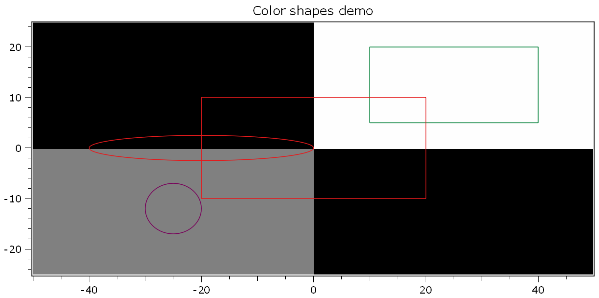

.. DO NOT EDIT.
.. THIS FILE WAS AUTOMATICALLY GENERATED BY SPHINX-GALLERY.
.. TO MAKE CHANGES, EDIT THE SOURCE PYTHON FILE:
.. "11_demos\plots\demo_cloudAndMeshVisualization.py"
.. LINE NUMBERS ARE GIVEN BELOW.

.. only:: html

    .. note::
        :class: sphx-glr-download-link-note

        Click :ref:`here <sphx_glr_download_11_demos_plots_demo_cloudAndMeshVisualization.py>`
        to download the full example code

.. rst-class:: sphx-glr-example-title

.. _sphx_glr_11_demos_plots_demo_cloudAndMeshVisualization.py:

Cloud and mesh visualization
===========================

.. GENERATED FROM PYTHON SOURCE LINES 5-21

.. code-block:: default

    import numpy as np
    from itom import dataObject
    from itom import plot
    from itom import polygonMesh

    try:
        from itom import pointCloud
    except Exception as ex:
        ui.msgInformation(
            "PointCloud missing",
            "your itom version is compiled without support of pointClouds",
        )
        raise ex

.. GENERATED FROM PYTHON SOURCE LINES 23-25

Create a ``dataObject`` with X, Y and Z values of a topography
as well as a 2.5D topography in terms of a ``dataObject``.

.. GENERATED FROM PYTHON SOURCE LINES 25-41

.. code-block:: default

    [X, Y] = np.meshgrid(np.arange(0, 100, 0.25), np.arange(0, 100, 0.25))
    zValues = np.sin(X * 2) + np.cos(Y * 0.5)
    # further intensity
    intensity = np.random.rand(*X.shape)
    # further color information
    colorValues = dataObject.randN([X.shape[0], X.shape[1]], "rgba32")
    topography = dataObject(zValues).astype("float32")
    topography.axisScales = (0.1, 0.1)
    topography[0, 0] = float("nan")

    mesh_quads = polygonMesh.fromTopography(topography)
    mesh_triangles = polygonMesh.fromTopography(topography, triangulationType=1)

    [i, h] = plot(mesh_quads, "vtk3dvisualizer")
    h.call("addMesh", mesh_triangles, "mesh_triangles")

.. GENERATED FROM PYTHON SOURCE LINES 42-44

.. rst-class:: sphx-glr-timing

   **Total running time of the script:** ( 0 minutes  0.281 seconds)

.. _sphx_glr_download_11_demos_plots_demo_cloudAndMeshVisualization.py:

.. only:: html

  .. container:: sphx-glr-footer sphx-glr-footer-example

    .. container:: sphx-glr-download sphx-glr-download-python

      :download:`Download Python source code: demo_cloudAndMeshVisualization.py <demo_cloudAndMeshVisualization.py>`

    .. container:: sphx-glr-download sphx-glr-download-jupyter

      :download:`Download Jupyter notebook: demo_cloudAndMeshVisualization.ipynb <demo_cloudAndMeshVisualization.ipynb>`

.. only:: html

 .. rst-class:: sphx-glr-signature

    `Gallery generated by Sphinx-Gallery <https://sphinx-gallery.github.io>`_
