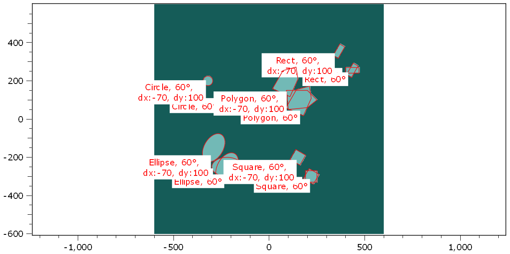

.. DO NOT EDIT.
.. THIS FILE WAS AUTOMATICALLY GENERATED BY SPHINX-GALLERY.
.. TO MAKE CHANGES, EDIT THE SOURCE PYTHON FILE:
.. "11_demos\plots\demo_drawAndTransformShapes.py"
.. LINE NUMBERS ARE GIVEN BELOW.

.. only:: html

    .. note::
        :class: sphx-glr-download-link-note

        Click :ref:`here <sphx_glr_download_11_demos_plots_demo_drawAndTransformShapes.py>`
        to download the full example code

.. rst-class:: sphx-glr-example-title

.. _sphx_glr_11_demos_plots_demo_drawAndTransformShapes.py:

Draw and transform shapes
===========================

In this demo script, multi shapes are created.
These shapes are then rotated and translated by
various angles and distances and displayed in one plot figure.

The overlay image of the plot is finally set to a masked
object, where the masked area ist equal to the union of
all shapes, visible at the canvas.

.. GENERATED FROM PYTHON SOURCE LINES 15-21

.. code-block:: default

    import numpy as np
    from itom import dataObject
    from itom import shape
    from itom import plot

.. GENERATED FROM PYTHON SOURCE LINES 23-24

Define a ``dataObject`` and plot using it as a "background".

.. GENERATED FROM PYTHON SOURCE LINES 24-37

.. code-block:: default

    dObj = dataObject.zeros([1200, 1200], "uint8")
    dObj.axisOffsets = (600, 600)
    [i, h] = plot(
        dObj,
        properties={
            "colorMap": "viridis",
            "geometricShapesLabelsVisible": True,
            "keepAspectRatio": True,
        },
    )

    base_shapes = []

.. GENERATED FROM PYTHON SOURCE LINES 38-39

This is one option to create shapes.

.. GENERATED FROM PYTHON SOURCE LINES 39-51

.. code-block:: default

    rect = shape(shape.Rectangle, (400, 240), (470, 270))
    rect.name = "Rect"
    ellipse = shape(shape.Ellipse, (-300, -300), (-140, -200))
    ellipse.name = "Ellipse"
    square = shape(shape.Square, (220, -300), 60)
    square.name = "Square"
    circle = shape(shape.Circle, (-250, 100), 25)
    circle.name = "Circle"
    polygons = np.array([[100, 200, 250, 200, 90], [50, 60, 100, 150, 150]])
    polygon = shape(shape.Polygon, polygons)
    polygon.name = "Polygon"

.. GENERATED FROM PYTHON SOURCE LINES 52-53

This is another possibility, using static methods

.. GENERATED FROM PYTHON SOURCE LINES 53-66

.. code-block:: default

    rect = shape.createRectangle(corner1=(400, 240), corner2=(470, 270), name="Rect")
    ellipse = shape.createEllipse(corner1=(-300, -300), corner2=(-140, -200), name="Ellipse")
    # rectangle and ellipses can also be created with the arguments center and size:
    ellipse = shape.createEllipse(
        center=(0.5 * (-300 - 140), 0.5 * (-300 - 200)),
        size=(-140 + 300, -200 + 300),
        name="Ellipse",
    )
    square = shape.createSquare(center=(220, -300), sideLength=60, name="Square")
    circle = shape.createCircle(center=(-250, 100), radius=25, name="Circle")
    polygons = np.array([[100, 200, 250, 200, 90], [50, 60, 100, 150, 150]])
    polygon = shape.createPolygon(polygons, name="Polygon")

.. GENERATED FROM PYTHON SOURCE LINES 67-69

Push all base shapes in the tuple base_shapes.
These base shapes can not be moved, rotated or resized (and thus not be selected).

.. GENERATED FROM PYTHON SOURCE LINES 69-76

.. code-block:: default

    base_shapes = [rect, ellipse, square, circle, polygon]

    for b in base_shapes:
        b.flags = shape.MoveLock | shape.RotateLock | shape.ResizeLock

    all_shapes = base_shapes.copy()

.. GENERATED FROM PYTHON SOURCE LINES 77-79

Rotate all base shapes by 60 degree (around its center).
These rotated elements can only be rotated.

.. GENERATED FROM PYTHON SOURCE LINES 79-88

.. code-block:: default

    rotated_shapes = []
    for base_shape in base_shapes:
        temp = base_shape.copy()
        temp.rotateDeg(60)
        temp.flags = shape.MoveLock | shape.ResizeLock
        temp.name += ", 60\xb0"
        rotated_shapes.append(temp)
    all_shapes += rotated_shapes

.. GENERATED FROM PYTHON SOURCE LINES 89-91

Move all rotated shapes by dx = -70, dy = 100.
These objects can be rotated, resized and moved.

.. GENERATED FROM PYTHON SOURCE LINES 91-100

.. code-block:: default

    rotated_translated_shapes = []
    for rotated_shape in rotated_shapes:
        temp = rotated_shape.copy()
        temp.translate([-70, 100])
        temp.flags = 0
        temp.name += ",\n dx:-70, dy:100"
        rotated_translated_shapes.append(temp)
    all_shapes += rotated_translated_shapes

.. GENERATED FROM PYTHON SOURCE LINES 101-102

Display all shapes on the plot figure. 

.. GENERATED FROM PYTHON SOURCE LINES 102-110

.. code-block:: default

    h["geometricShapes"] = all_shapes

    # create a mask object (uint8, masked pixels are set to 255, the rest is 0) from all shapes
    mask = dObj.createMask(all_shapes)

    # display the mask as overlay of the plot
    h["overlayImage"] = mask

.. GENERATED FROM PYTHON SOURCE LINES 111-113

.. rst-class:: sphx-glr-timing

   **Total running time of the script:** ( 0 minutes  0.252 seconds)

.. _sphx_glr_download_11_demos_plots_demo_drawAndTransformShapes.py:

.. only:: html

  .. container:: sphx-glr-footer sphx-glr-footer-example

    .. container:: sphx-glr-download sphx-glr-download-python

      :download:`Download Python source code: demo_drawAndTransformShapes.py <demo_drawAndTransformShapes.py>`

    .. container:: sphx-glr-download sphx-glr-download-jupyter

      :download:`Download Jupyter notebook: demo_drawAndTransformShapes.ipynb <demo_drawAndTransformShapes.ipynb>`

.. only:: html

 .. rst-class:: sphx-glr-signature

    `Gallery generated by Sphinx-Gallery <https://sphinx-gallery.github.io>`_
