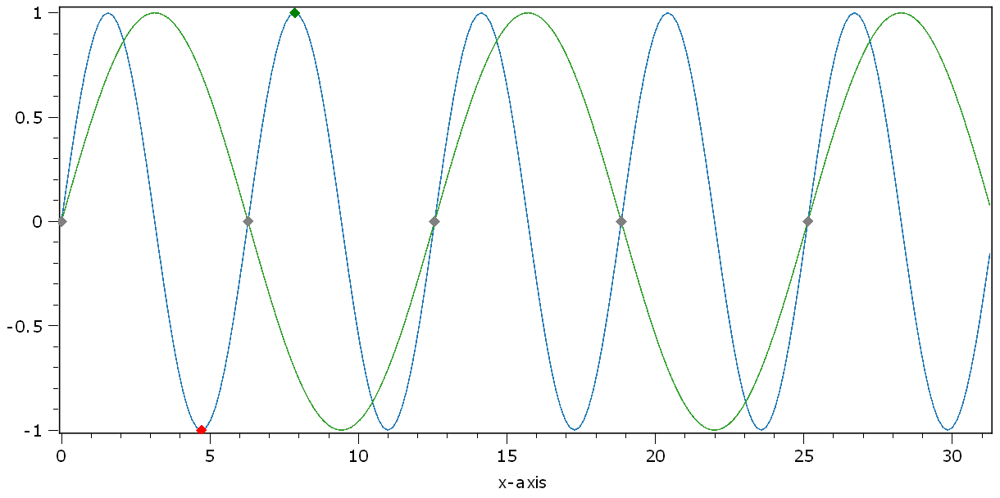

.. DO NOT EDIT.
.. THIS FILE WAS AUTOMATICALLY GENERATED BY SPHINX-GALLERY.
.. TO MAKE CHANGES, EDIT THE SOURCE PYTHON FILE:
.. "11_demos\plots\demo_drawPickersPlot1D.py"
.. LINE NUMBERS ARE GIVEN BELOW.

.. only:: html

    .. note::
        :class: sphx-glr-download-link-note

        Click :ref:`here <sphx_glr_download_11_demos_plots_demo_drawPickersPlot1D.py>`
        to download the full example code

.. rst-class:: sphx-glr-example-title

.. _sphx_glr_11_demos_plots_demo_drawPickersPlot1D.py:

Draw pickers 1D plot
=======================

This demo shows how to programatically set pickers
to the line of a 1D plot.

The most important ``slots`` for these features are implemented
in the designer widget ``itom1dqwtplot``:

.. code-block:: python

    myPlotHandle.call("setPicker", axis-values [, curveIndex = 0, physicalCoordinates=True])
    myPlotHandle.call("appendPicker", axis-values [, curveIndex = 0, physicalCoordinates=True])
    myPlotHandle.call("deletePicker", [index])

``setPicker`` and ``appendPicker`` are used to set a new set of pickers or append further
pickers to the existing set of pickers. ``deletePicker`` is used to clear existing pickers.

For settings pickers, a list or tuple of axis-values has to be given. The corresponding value
is calculated based on the current curve, that is displayed. In order to stick the new picker
to another than the first curve, use another ``curveIndex`` parameter. Usually, the axis-values
are considered to be given in physical coordinates (which are displayed in the coordinate system).

If you want to give the coordinate of a picker in real pixel-coordinates of the ``dataObject``,
set ``physicalCoordinates`` to False.

.. GENERATED FROM PYTHON SOURCE LINES 28-64

.. code-block:: default

    import numpy as np
    from itom import plot 
    from itom import dataObject

    def pickerChangedSlot(pickerIdx, posX, posY, curveIdx):
        print(
            "picker %i changed. New pos: (%.2f, %.2f), curve: %i"
            % (pickerIdx, posX, posY, curveIdx)
        )

    # create demo data
    # 1d sine
    sine = np.sin(np.arange(0, 10 * np.pi, (1 / 20) * np.pi))
    sine2 = np.sin(np.arange(0, 5 * np.pi, (1 / 40) * np.pi))
    twosines = dataObject([2, len(sine)], "float64")
    twosines[0, :] = sine
    twosines[1, :] = sine2

    twosines.axisScales = (1, np.pi / 20)

    [i, h] = plot(twosines, "itom1dqwtplot")

    h.connect("pickerChanged(int,double,double,int)", pickerChangedSlot)

    # increase the maximum number of pickers to 7
    h["pickerLimit"] = 7

    # set two pickers to the first curve
    h.call("setPicker", (1.5 * np.pi, 2.5 * np.pi), 0)

    # set two pickers to the second curve
    h.call("appendPicker", (40, 80, 120, 160, 200), 1, False)

.. GENERATED FROM PYTHON SOURCE LINES 66-67

.. rst-class:: sphx-glr-timing

   **Total running time of the script:** ( 0 minutes  0.054 seconds)

.. _sphx_glr_download_11_demos_plots_demo_drawPickersPlot1D.py:

.. only:: html

  .. container:: sphx-glr-footer sphx-glr-footer-example

    .. container:: sphx-glr-download sphx-glr-download-python

      :download:`Download Python source code: demo_drawPickersPlot1D.py <demo_drawPickersPlot1D.py>`

    .. container:: sphx-glr-download sphx-glr-download-jupyter

      :download:`Download Jupyter notebook: demo_drawPickersPlot1D.ipynb <demo_drawPickersPlot1D.ipynb>`

.. only:: html

 .. rst-class:: sphx-glr-signature

    `Gallery generated by Sphinx-Gallery <https://sphinx-gallery.github.io>`_
