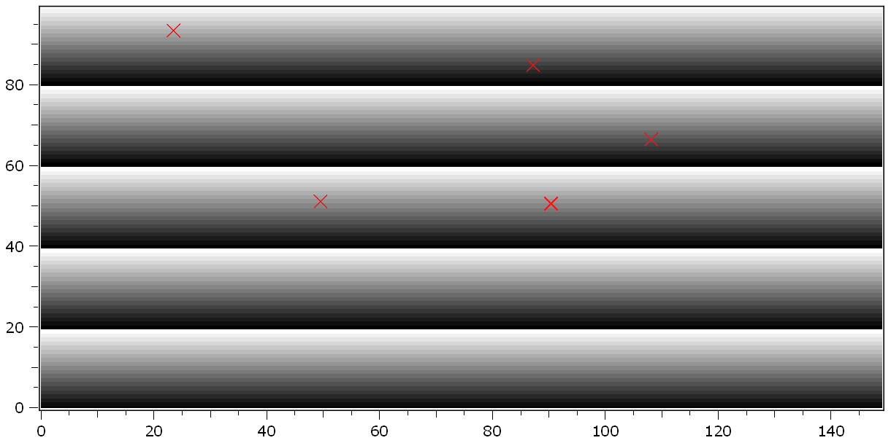
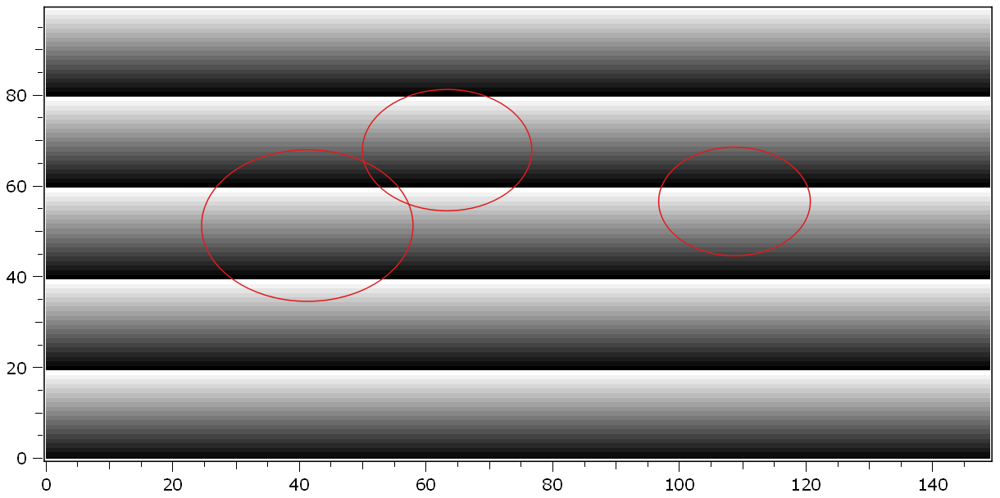
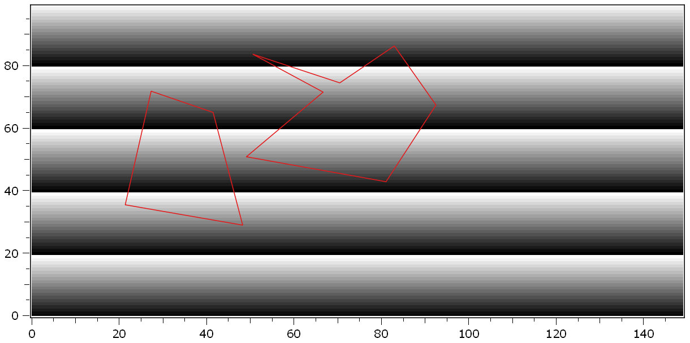
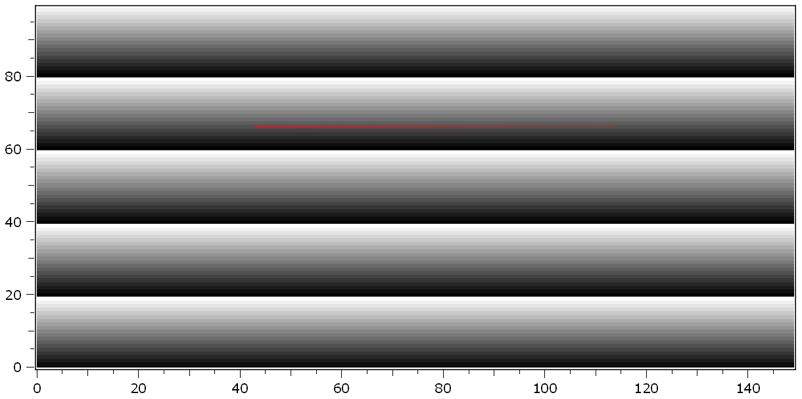

.. DO NOT EDIT.
.. THIS FILE WAS AUTOMATICALLY GENERATED BY SPHINX-GALLERY.
.. TO MAKE CHANGES, EDIT THE SOURCE PYTHON FILE:
.. "11_demos\plots\demo_interactiveShapePicker.py"
.. LINE NUMBERS ARE GIVEN BELOW.

.. only:: html

    .. note::
        :class: sphx-glr-download-link-note

        Click :ref:`here <sphx_glr_download_11_demos_plots_demo_interactiveShapePicker.py>`
        to download the full example code

.. rst-class:: sphx-glr-example-title

.. _sphx_glr_11_demos_plots_demo_interactiveShapePicker.py:

Interactive shape picker
=======================

This demo shows how to let the user select a certain number of shapes in a plot.

The shapes are then returned as list of shapes. This list can also be assigned
to the ``geometricShapes`` property of any other plot to display them in another plot.

The ``plotItem.drawAndPickElements`` method is used for this demo. It accepts
any kind of shape (``plotItem.Primitive`` ...) besides ``plotItem.PrimitiveMultiPointPick``.

Use instead ``PrimitivePoint`` or use the similar method ``plotItem.pickPoints``
if the user should select a arbitrary number of single points.

.. GENERATED FROM PYTHON SOURCE LINES 17-53

.. code-block:: default

    from itom import dataObject
    from itom import plot
    from itom import shape
    from itom import ui
    from itom import plotItem
    from typing import Tuple

    elementList = [
        (plotItem.PrimitivePoint, 5),
        (plotItem.PrimitiveCircle, 3),
        (plotItem.PrimitivePolygon, 2),
        (plotItem.PrimitiveLine, 1)
         ]

    for shapeType, numShapes in elementList:
    
        img = dataObject.zeros([100, 150], "float32")
    
        for r in range(img.shape[0]):
            img[r, :] = (r % 20) * 0.02
    
        [i, h] = plot(img)
    
        try:
            polygons: Tuple[shape] = h.drawAndPickElements(shapeType, numShapes)
        except RuntimeError as ex:
            print(str(ex))
            ui.msgWarning("Abort", "The user interaction has been aborted")
            break
        else:
            print("The following shapes have been selected:\n--------------------")
            for p in polygons:
                print(str(p))
            print("---------------------")

.. rst-class:: sphx-glr-script-out

 Out:

 .. code-block:: none

    The following shapes have been selected:
    --------------------
    shape(Point, (66.3345, 43.2547), index: 4)
    shape(Point, (70.3751, 64.0724), index: 5)
    shape(Point, (99.3333, 65.6916), index: 6)
    shape(Point, (102.195, 46.2617), index: 7)
    shape(Point, (34.1774, 55.9766), index: 8)
    ---------------------
    The following shapes have been selected:
    --------------------
    shape(Circle, center (61.0006, 67.1426), r: 11.5023, index: 9)
    shape(Circle, center (132.658, 65.4624), r: 11.1007, index: 10)
    shape(Circle, center (96.6337, 39.6469), r: 21.8812, index: 11)
    ---------------------
    The following shapes have been selected:
    --------------------
    shape(Polygon, 5 points, index: 12)
    shape(Polygon, 7 points, index: 13)
    ---------------------
    The following shapes have been selected:
    --------------------
    shape(Line, (74.2475, 82.1145) - (99.6701, 27.757), index: 14)
    ---------------------

.. GENERATED FROM PYTHON SOURCE LINES 55-57

.. GENERATED FROM PYTHON SOURCE LINES 59-61

.. GENERATED FROM PYTHON SOURCE LINES 63-65

.. GENERATED FROM PYTHON SOURCE LINES 67-69

.. rst-class:: sphx-glr-timing

   **Total running time of the script:** ( 37 minutes  45.276 seconds)

.. _sphx_glr_download_11_demos_plots_demo_interactiveShapePicker.py:

.. only:: html

  .. container:: sphx-glr-footer sphx-glr-footer-example

    .. container:: sphx-glr-download sphx-glr-download-python

      :download:`Download Python source code: demo_interactiveShapePicker.py <demo_interactiveShapePicker.py>`

    .. container:: sphx-glr-download sphx-glr-download-jupyter

      :download:`Download Jupyter notebook: demo_interactiveShapePicker.ipynb <demo_interactiveShapePicker.ipynb>`

.. only:: html

 .. rst-class:: sphx-glr-signature

    `Gallery generated by Sphinx-Gallery <https://sphinx-gallery.github.io>`_
