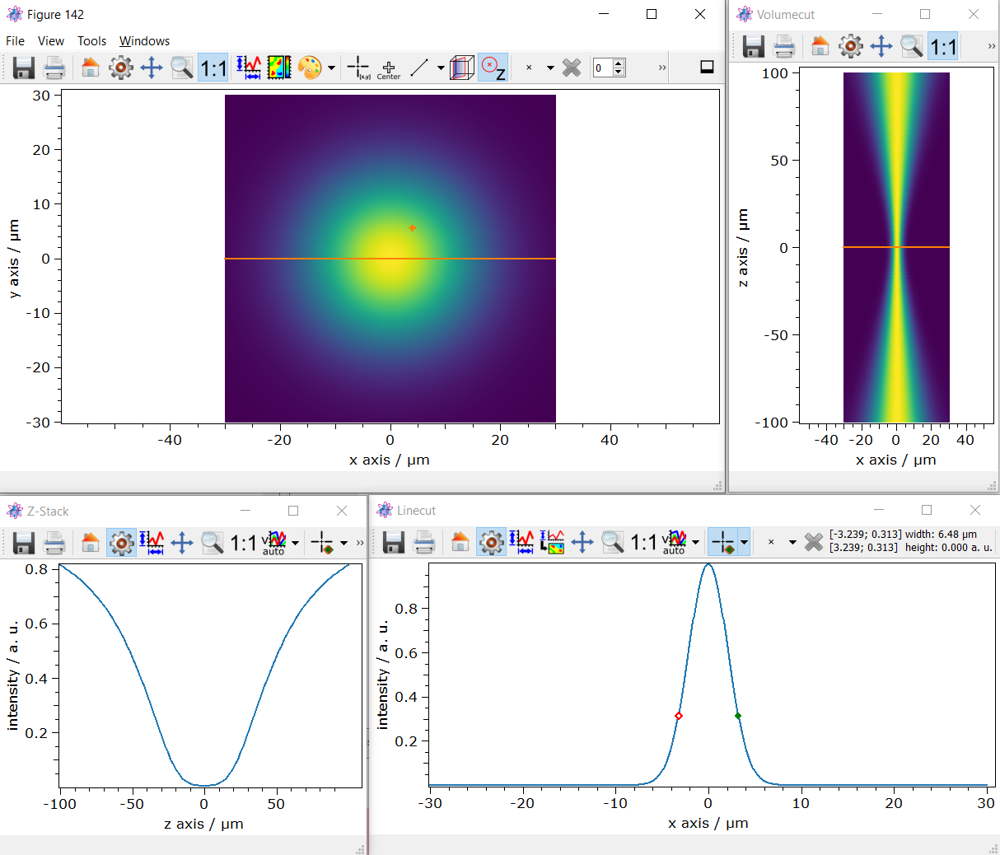

.. DO NOT EDIT.
.. THIS FILE WAS AUTOMATICALLY GENERATED BY SPHINX-GALLERY.
.. TO MAKE CHANGES, EDIT THE SOURCE PYTHON FILE:
.. "11_demos\plots\demo_lineCut_volumeCut.py"
.. LINE NUMBERS ARE GIVEN BELOW.

.. only:: html

    .. note::
        :class: sphx-glr-download-link-note

        Click :ref:`here <sphx_glr_download_11_demos_plots_demo_lineCut_volumeCut.py>`
        to download the full example code

.. rst-class:: sphx-glr-example-title

.. _sphx_glr_11_demos_plots_demo_lineCut_volumeCut.py:

Plot line cut, volume cut, through z-stack
============================

This demo shows how the ``itom.plot`` ``1D line cut``,
``2D volume cut`` and ``through z-stack`` feature are used. First, a 3D ``dataObject``
is created representing a Gaussian 2D profile along the beam waist.

.. GENERATED FROM PYTHON SOURCE LINES 9-16

.. code-block:: default

    from itom import dataObject
    from itom import plot
    import numpy as np

.. GENERATED FROM PYTHON SOURCE LINES 18-19

Function to calculate 2D Gaussian beam profile.

.. GENERATED FROM PYTHON SOURCE LINES 19-38

.. code-block:: default

    def gaussianBeam2D(xValues: float, yValues: float, fwhm: float, centroid: list, amplitude: float) -> np.ndarray:
        """Create 2D Gaussian Beam intensity.

        Args:
            xValues (float): X value vector
            yValues (float): Y value vector
            fwhm (float): Full width half maximum of the Gauss
            centroid (list): Centroid position of the Gauss
            amplitude (float): Amplitude of Gauss

        Returns:
            np.ndarray: 2D Gaussian intensity profile.
        """
        intensity = amplitude * np.exp(
            -4 * np.log(2) * ((xValues - centroid[0]) ** 2 + (yValues - centroid[1]) ** 2) / fwhm**2
        )
        return np.array(intensity)

.. GENERATED FROM PYTHON SOURCE LINES 39-40

Calculate waist vs. z vector.

.. GENERATED FROM PYTHON SOURCE LINES 40-55

.. code-block:: default

    def waistAtZ(w0: float, zValues: np.ndarray, RayleighLength: float) -> np.ndarray:
        """Calculate w0 at z position.

        Args:
            w0 (float): Waist radius.
            zValues (np.ndarray): Z value vector
            RayleighLength (float): Rayleigh length.

        Returns:
            float: Waist vs. z position vector.
        """
        omegaZ = w0 * np.sqrt(1 + ((zValues) / (RayleighLength)) ** 2)
        return omegaZ

.. GENERATED FROM PYTHON SOURCE LINES 56-57

Define some variables.

.. GENERATED FROM PYTHON SOURCE LINES 57-79

.. code-block:: default

    zSampling = 100
    xSampling = 640
    ySampling = 640

    zRange = [-100, 100]
    xRange = [-30, 30]

    # Scaling value is sampline - 1
    zScale = np.abs(zRange[1] - zRange[0]) / (zSampling - 1)
    zOffset = (zSampling - 1) / 2

    xScale = np.abs(xRange[1] - xRange[0]) / (xSampling - 1)
    xOffset = (xSampling - 1) / 2

    zValues = np.linspace(zRange[0], zRange[1], zSampling)
    xValues = np.linspace(xRange[0], xRange[1], xSampling)
    yValues = xValues[:, np.newaxis]

    RayleightL = 20
    centroidPos = [0, 0]
    amplitude = 1

.. GENERATED FROM PYTHON SOURCE LINES 80-81

Calculate Gaussian 2D profile at Z positions as a 3D ``dataObject`` of shape ``[z, y, x]``.

.. GENERATED FROM PYTHON SOURCE LINES 81-87

.. code-block:: default

    widthZ = waistAtZ(5, zValues, RayleightL)
    gauss3D = dataObject([zSampling, ySampling, xSampling], "float64")

    for cnt in range(0, gauss3D.shape[0]):
        gauss3D[cnt, :, :] = gaussianBeam2D(xValues, yValues, widthZ[cnt], centroidPos, amplitude)

.. GENERATED FROM PYTHON SOURCE LINES 88-89

Define the 3D meta information.

.. GENERATED FROM PYTHON SOURCE LINES 89-104

.. code-block:: default

    gauss3D.setAxisDescription(0, "z axis")
    gauss3D.setAxisDescription(1, "y axis")
    gauss3D.setAxisDescription(2, "x axis")
    gauss3D.setAxisUnit(0, "\u00B5m")
    gauss3D.setAxisUnit(2, "\u00B5m")
    gauss3D.setAxisUnit(1, "\u00B5m")
    gauss3D.setAxisScale(0, zScale)
    gauss3D.setAxisScale(1, xScale)
    gauss3D.setAxisScale(2, xScale)
    gauss3D.setAxisOffset(0, zOffset)
    gauss3D.setAxisOffset(1, xOffset)
    gauss3D.setAxisOffset(2, xOffset)
    gauss3D.valueDescription = "intensity"
    gauss3D.valueUnit = "a. u."

.. GENERATED FROM PYTHON SOURCE LINES 105-117

Generate further ``volume``, ``line`` plots from the 3D stack.
---------------------------------------------------------------------------

Per default the ``z=0`` plane is plotted. Above the image there are buttons to cut the 3D stack.

In this 3D stack plot, a sectional view through the volume can now be generated shown in the upper right plot.
Furthermore, a line cut between two pixels can be created form this 2D plot shown in the lower right plot.

In this plot, a distance between two pixels can then be calculated by the ``picker``. In this example, the
Gaussien width is about 6.47 \\u00B5m.

Additionally a line cut ``through z`` can be created shown in the lower left plot.

.. GENERATED FROM PYTHON SOURCE LINES 117-119

.. code-block:: default

    plot(gauss3D, properties={"keepAspectRatio": True, "colorMap": "viridis"})

.. rst-class:: sphx-glr-script-out

 Out:

 .. code-block:: none

    (151, PlotItem(UiItem(class: Itom2dQwtPlot, name: plot0x0)))

.. GENERATED FROM PYTHON SOURCE LINES 120-122

.. rst-class:: sphx-glr-timing

   **Total running time of the script:** ( 0 minutes  0.712 seconds)

.. _sphx_glr_download_11_demos_plots_demo_lineCut_volumeCut.py:

.. only:: html

  .. container:: sphx-glr-footer sphx-glr-footer-example

    .. container:: sphx-glr-download sphx-glr-download-python

      :download:`Download Python source code: demo_lineCut_volumeCut.py <demo_lineCut_volumeCut.py>`

    .. container:: sphx-glr-download sphx-glr-download-jupyter

      :download:`Download Jupyter notebook: demo_lineCut_volumeCut.ipynb <demo_lineCut_volumeCut.ipynb>`

.. only:: html

 .. rst-class:: sphx-glr-signature

    `Gallery generated by Sphinx-Gallery <https://sphinx-gallery.github.io>`_
