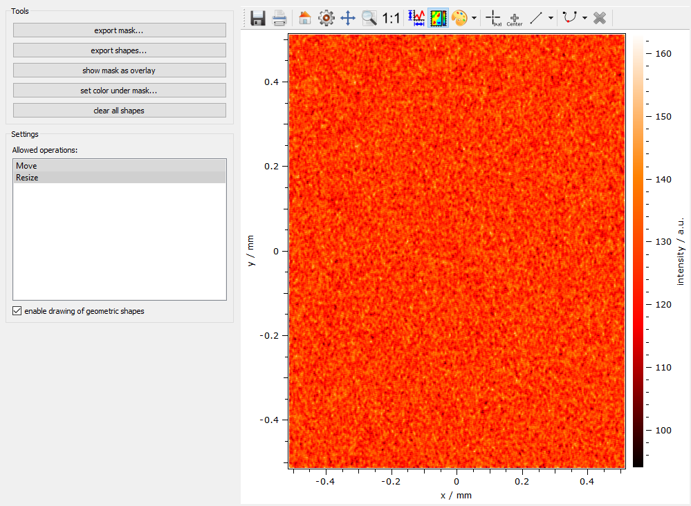

.. DO NOT EDIT.
.. THIS FILE WAS AUTOMATICALLY GENERATED BY SPHINX-GALLERY.
.. TO MAKE CHANGES, EDIT THE SOURCE PYTHON FILE:
.. "11_demos\plots\demo_maskEditor.py"
.. LINE NUMBERS ARE GIVEN BELOW.

.. only:: html

    .. note::
        :class: sphx-glr-download-link-note

        Click :ref:`here <sphx_glr_download_11_demos_plots_demo_maskEditor.py>`
        to download the full example code

.. rst-class:: sphx-glr-example-title

.. _sphx_glr_11_demos_plots_demo_maskEditor.py:

Mask editor
==============

This demo shows a mask editor where a masked ``dataObject`` can be
created from shapes that are drawn on the plot canvas. The result
of such shapes is a list of itom.shape objects. These are sub-pixel
precise geometric shapes. They can then be converted to pixel-precise
masks. For more information about shapes see the shapes demo in the main
folder of the demo scripts.

.. GENERATED FROM PYTHON SOURCE LINES 10-16

.. code-block:: default

    from itom import ui
    from itom import dataObject
    from itom import algorithms
    from itom import shape

.. GENERATED FROM PYTHON SOURCE LINES 18-19

Controls if the user can add or modify shapes by the  actions in the toolbar

.. GENERATED FROM PYTHON SOURCE LINES 19-22

.. code-block:: default

    def checkEnableDrawingClicked(checked: bool):
        gui.plot["geometricShapesDrawingEnabled"] = checked

.. GENERATED FROM PYTHON SOURCE LINES 23-24

Clear all existing shapes by calling the slot ``clearGeometricShapes`` 

.. GENERATED FROM PYTHON SOURCE LINES 24-27

.. code-block:: default

    def clearShapes():
        gui.plot.call("clearGeometricShapes")

.. GENERATED FROM PYTHON SOURCE LINES 28-33

Creates a mask where all values within the mask are set to ``255`` and
all other values to ``0``. The mask has the same size and axes information
than the displayed ``dataObject``.
The mask object is then set to the variable ``mask`` in the global workspace
and displayed in a new plot window.

.. GENERATED FROM PYTHON SOURCE LINES 33-38

.. code-block:: default

    def exportMask():
        mask = gui.plot["source"].createMask(gui.plot["geometricShapes"])
        globals()["mask"] = mask
        plot(mask, properties={"title": "exported mask"})

.. GENERATED FROM PYTHON SOURCE LINES 39-40

Exports all current shapes as a list of itom.shape objects.

.. GENERATED FROM PYTHON SOURCE LINES 40-48

.. code-block:: default

    def exportShapes():
        globals()["shapes"] = gui.plot["geometricShapes"]
        ui.msgInformation(
            "shapes exported",
            "shapes exported to the workspace under the variable 'shapes': \n"
            + str(globals()["shapes"]),
        )

.. GENERATED FROM PYTHON SOURCE LINES 49-50

Show the mask object as overlay image. Use the slider in the toolbox

.. GENERATED FROM PYTHON SOURCE LINES 50-55

.. code-block:: default

     # of the plot to change the transparency of the overlay image.
    def showMaskAsOverlay():
        mask = gui.plot["source"].createMask(gui.plot["geometricShapes"])
        gui.plot["overlayImage"] = mask

.. GENERATED FROM PYTHON SOURCE LINES 56-57

Sets all values within any shapes to a given gray value.

.. GENERATED FROM PYTHON SOURCE LINES 57-72

.. code-block:: default

    def setColorUnderMask():
        [val, ok] = ui.getInt(
            "value", "set the value for all values within the mask:", 128, 0, 255
        )
        if ok:
            mask = gui.plot["source"].createMask(gui.plot["geometricShapes"])
            # the mask can be inverted using ~mask
            gui.plot["source"][
                mask
            ] = val  # this single command can be used to change values in the mask
            gui.plot.call(
                "replot"
            )  # if only the source object is changed, you need to call
            # ``replot`` such that the plot is updated, too.

.. GENERATED FROM PYTHON SOURCE LINES 73-75

This method is always called if any shape is added or modified and displays some
information in the status bar of the window.

.. GENERATED FROM PYTHON SOURCE LINES 75-80

.. code-block:: default

    def shapeModified(index: int, shape: shape):
        gui.call("statusBar").call(
            "showMessage", "Shape %i modified: %s" % (index, str(shape)), 1000
        )

.. GENERATED FROM PYTHON SOURCE LINES 81-82

This method is called if the user changes the selection of allowed operations.

.. GENERATED FROM PYTHON SOURCE LINES 82-91

.. code-block:: default

    def listModificationChanged():
        sel = gui.listModificationTypes.call("selectedRows")
        sel2 = []
        if 0 in sel:
            sel2.append("Move")
        if 1 in sel:
            sel2.append("Resize")
        gui.plot["geometryModificationModes"] = ";".join(sel2)

.. GENERATED FROM PYTHON SOURCE LINES 92-94

Create demo data with axis scales and offsets to
show that the mask will also work in this special case.

.. GENERATED FROM PYTHON SOURCE LINES 94-121

.. code-block:: default

    image = dataObject.randN([1024, 1024])
    image.axisScales = (1e-3, 1e-3)
    image.axisOffsets = (512, 512)
    image.axisUnits = ("mm", "mm")
    image.axisDescriptions = ("y", "x")
    image.valueUnit = "a.u."
    image.valueDescription = "intensity"
    algorithms.lowPassFilter(image, image, 7, 7)

    gui = ui("demo_MaskEditor.ui", ui.TYPEWINDOW)
    # connect signal-slots
    gui.checkEnableDrawing.connect("toggled(bool)", checkEnableDrawingClicked)
    gui.btnExportMask.connect("clicked()", exportMask)
    gui.btnExportShape.connect("clicked()", exportShapes)
    gui.btnShowMaskOverlay.connect("clicked()", showMaskAsOverlay)
    gui.btnSetColorUnderMask.connect("clicked()", setColorUnderMask)
    gui.btnClearShapes.connect("clicked()", clearShapes)
    gui.plot.connect("geometricShapeChanged(int,ito::Shape)", shapeModified)
    gui.listModificationTypes.connect(
        "itemSelectionChanged()", listModificationChanged
    )

    gui.plot["source"] = image
    gui.plot["colorMap"] = "hotIron"
    gui.listModificationTypes.call("selectRows", (0, 1))
    gui.show()

.. GENERATED FROM PYTHON SOURCE LINES 122-124

.. rst-class:: sphx-glr-timing

   **Total running time of the script:** ( 0 minutes  0.057 seconds)

.. _sphx_glr_download_11_demos_plots_demo_maskEditor.py:

.. only:: html

  .. container:: sphx-glr-footer sphx-glr-footer-example

    .. container:: sphx-glr-download sphx-glr-download-python

      :download:`Download Python source code: demo_maskEditor.py <demo_maskEditor.py>`

    .. container:: sphx-glr-download sphx-glr-download-jupyter

      :download:`Download Jupyter notebook: demo_maskEditor.ipynb <demo_maskEditor.ipynb>`

.. only:: html

 .. rst-class:: sphx-glr-signature

    `Gallery generated by Sphinx-Gallery <https://sphinx-gallery.github.io>`_
