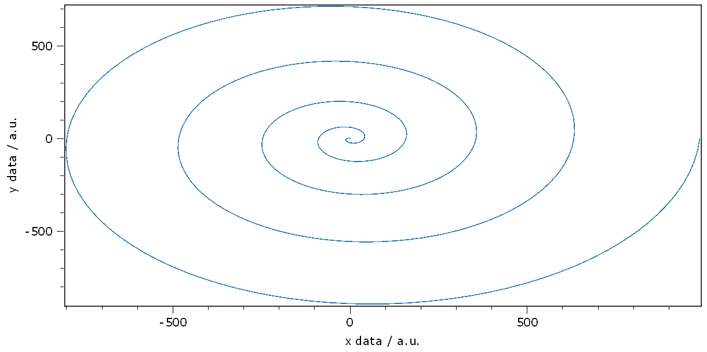
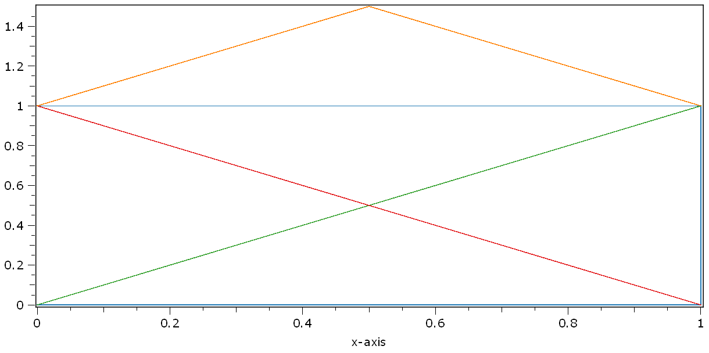
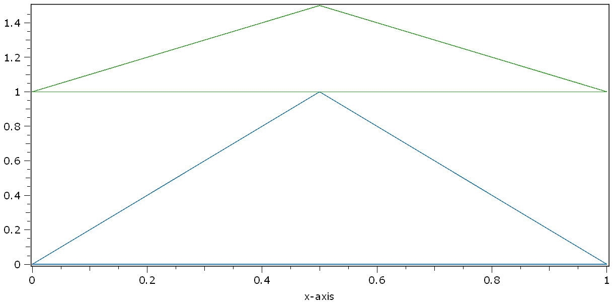

.. DO NOT EDIT.
.. THIS FILE WAS AUTOMATICALLY GENERATED BY SPHINX-GALLERY.
.. TO MAKE CHANGES, EDIT THE SOURCE PYTHON FILE:
.. "11_demos\plots\demo_plotXY.py"
.. LINE NUMBERS ARE GIVEN BELOW.

.. only:: html

    .. note::
        :class: sphx-glr-download-link-note

        Click :ref:`here <sphx_glr_download_11_demos_plots_demo_plotXY.py>`
        to download the full example code

.. rst-class:: sphx-glr-example-title

.. _sphx_glr_11_demos_plots_demo_plotXY.py:

Plot XY
============

This demo shows how to set an optional x-vector to an 1D-plot.

The optional x-vector can be set by passing the optional x-vector as second argument to the ``plot1`` function
or by setting the property ``xData`` of an existing plot. 
If you want to add a x-vector to a plot of an ``N x M dataObject``
your x-vector has to be an ``dataObject`` of shape ``1 x M``.
Once you add an x-vector with a last dimension greater ``M`` the last points will be ignored.

.. GENERATED FROM PYTHON SOURCE LINES 12-18

.. code-block:: default

    import numpy as np
    from itom import plot
    from itom import plot1
    from itom import dataObject

.. GENERATED FROM PYTHON SOURCE LINES 20-21

Create a spirale and plot it.

.. GENERATED FROM PYTHON SOURCE LINES 21-39

.. code-block:: default

    angle = np.linspace(0, 10 * np.pi, num=500)
    x = dataObject([1, angle.shape[0]], dtype="float32")
    y = dataObject([1, angle.shape[0]], dtype="float32")

    # for the axis labels the valueDescription and valueUnit of the two data is used
    x.valueDescription = "x data"
    x.valueUnit = "a.u."

    y.valueDescription = "y data"
    y.valueUnit = "a.u."

    radius = angle**2
    x[:, :] = (radius * np.cos(angle)).astype("float32")
    y[:, :] = (radius * np.sin(angle)).astype("float32")

    # alternative 1: use the itom.plot1 method
    plot1(y, x)

.. rst-class:: sphx-glr-script-out

 Out:

 .. code-block:: none

    (137, PlotItem(UiItem(class: Itom1DQwtPlot, name: plot0x0)))

.. GENERATED FROM PYTHON SOURCE LINES 40-42

.. GENERATED FROM PYTHON SOURCE LINES 44-46

Alternative 2: Create a default line plot and then assign the
x-coordinates to the ``xData`` property.

.. GENERATED FROM PYTHON SOURCE LINES 46-49

.. code-block:: default

    fig = plot(y)
    fig[-1]["xData"] = x

.. GENERATED FROM PYTHON SOURCE LINES 50-51

Alternative 3: like #2 but in one line

.. GENERATED FROM PYTHON SOURCE LINES 51-53

.. code-block:: default

    plot(y, properties={"xData": x})

.. rst-class:: sphx-glr-script-out

 Out:

 .. code-block:: none

    (139, PlotItem(UiItem(class: Itom1DQwtPlot, name: plot0x0)))

.. GENERATED FROM PYTHON SOURCE LINES 54-55

This section shows you how to draw multiple lines of different length.

.. GENERATED FROM PYTHON SOURCE LINES 55-92

.. code-block:: default

    yPoints = dataObject([4, 4], "float32")
    xPoints = dataObject([4, 4], "float32")

    # fill the dataObjects with nans to ignore values which are not needed
    yPoints[:, :] = np.nan
    xPoints[:, :] = np.nan

    # first line
    yPoints[0, 0] = 0
    xPoints[0, 0] = 0
    yPoints[0, 1] = 0
    xPoints[0, 1] = 1
    yPoints[0, 2] = 1
    xPoints[0, 2] = 1
    yPoints[0, 3] = 1
    xPoints[0, 3] = 0

    # second line
    yPoints[1, 0:2] = (0, 1)
    xPoints[1, 0:2] = (0, 1)

    # third line
    yPoints[2, 0] = 1
    xPoints[2, 0] = 0
    yPoints[2, 1] = 0
    xPoints[2, 1] = 1

    # fourth line
    yPoints[3, 0] = 1
    xPoints[3, 0] = 0
    yPoints[3, 1] = 1.5
    xPoints[3, 1] = 0.5
    yPoints[3, 2] = 1
    xPoints[3, 2] = 1

    plot1(yPoints, xPoints)

.. rst-class:: sphx-glr-script-out

 Out:

 .. code-block:: none

    (140, PlotItem(UiItem(class: Itom1DQwtPlot, name: plot0x0)))

.. GENERATED FROM PYTHON SOURCE LINES 93-95

.. GENERATED FROM PYTHON SOURCE LINES 97-98

This section demonstrates how to draw multiple lines with a common array of x-coordinates.

.. GENERATED FROM PYTHON SOURCE LINES 98-108

.. code-block:: default

    multipleY = dataObject([2, 4], "float32")
    # it is also possible to use a too long xData set. The last values will be ignored. 
    singleX = dataObject([1, 9], "float32")  

    singleX[0, 0:4] = (0, 1, 0.5, 0)
    multipleY[0, :] = (0, 0, 1, 0)
    multipleY[1, :] = (1, 1, 1.5, 1)

    plot1(multipleY, singleX)

.. rst-class:: sphx-glr-script-out

 Out:

 .. code-block:: none

    (141, PlotItem(UiItem(class: Itom1DQwtPlot, name: plot0x0)))

.. GENERATED FROM PYTHON SOURCE LINES 109-111

.. rst-class:: sphx-glr-timing

   **Total running time of the script:** ( 0 minutes  0.317 seconds)

.. _sphx_glr_download_11_demos_plots_demo_plotXY.py:

.. only:: html

  .. container:: sphx-glr-footer sphx-glr-footer-example

    .. container:: sphx-glr-download sphx-glr-download-python

      :download:`Download Python source code: demo_plotXY.py <demo_plotXY.py>`

    .. container:: sphx-glr-download sphx-glr-download-jupyter

      :download:`Download Jupyter notebook: demo_plotXY.ipynb <demo_plotXY.ipynb>`

.. only:: html

 .. rst-class:: sphx-glr-signature

    `Gallery generated by Sphinx-Gallery <https://sphinx-gallery.github.io>`_
