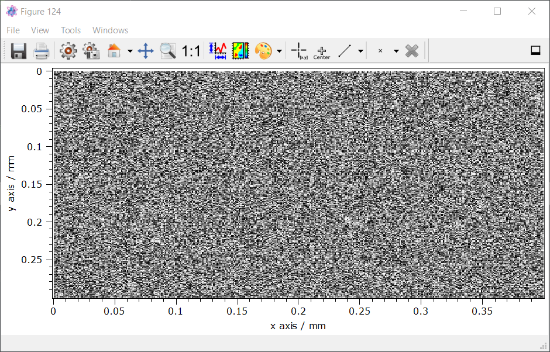
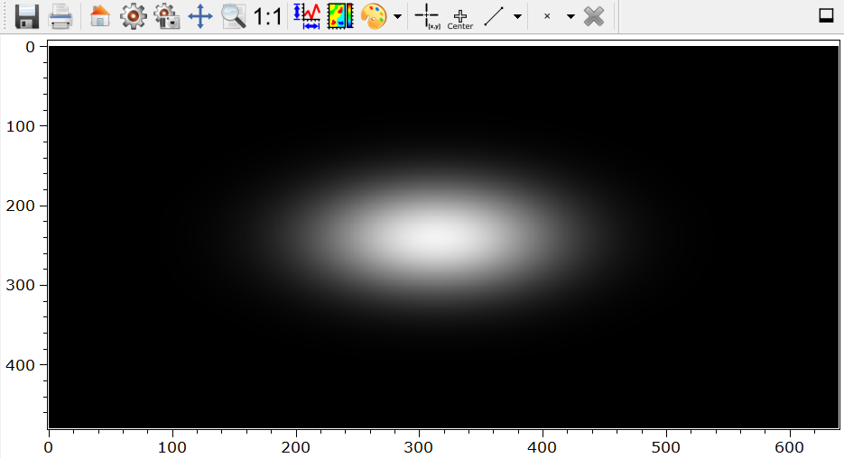

.. DO NOT EDIT.
.. THIS FILE WAS AUTOMATICALLY GENERATED BY SPHINX-GALLERY.
.. TO MAKE CHANGES, EDIT THE SOURCE PYTHON FILE:
.. "11_demos\plugins\demo_DummyGrabber.py"
.. LINE NUMBERS ARE GIVEN BELOW.

.. only:: html

    .. note::
        :class: sphx-glr-download-link-note

        Click :ref:`here <sphx_glr_download_11_demos_plugins_demo_DummyGrabber.py>`
        to download the full example code

.. rst-class:: sphx-glr-example-title

.. _sphx_glr_11_demos_plugins_demo_DummyGrabber.py:

DummyGrabber
================

This demo shows with the example of the ``DummyGrabber``
how grabber and cameras are used in ``itom``.

.. GENERATED FROM PYTHON SOURCE LINES 6-13

.. code-block:: default

    from itom import dataIO
    from itom import dataObject
    from itom import plot
    from itom import liveImage

.. GENERATED FROM PYTHON SOURCE LINES 15-16

Start camera (e.g.: ``DummyGrabber``)

.. GENERATED FROM PYTHON SOURCE LINES 16-20

.. code-block:: default

    camera = dataIO("DummyGrabber")  # noise camera
    cameraGaussian = dataIO("DummyGrabber", imageType="gaussianSpot")  # moving Gaussian spot 
    cameraGaussianArray = dataIO("DummyGrabber", imageType="gaussianSpotArray")  # moving 4 Gaussian spots

.. GENERATED FROM PYTHON SOURCE LINES 21-24

Set region of interest (ROI).
x: [100,499] -> width: 400 (borders are included!)
y: [40, 349] -> height: 310

.. GENERATED FROM PYTHON SOURCE LINES 24-32

.. code-block:: default

    camera.setParam("roi", [100, 40, 400, 300])
    # or:
    # camera.setParam("roi[0]", 100)
    # camera.setParam("roi[2]", 400) #...

    print("width:", camera.getParam("sizex"))
    print("height:", camera.getParam("sizey"))

.. rst-class:: sphx-glr-script-out

 Out:

 .. code-block:: none

    width: 400
    height: 300

.. GENERATED FROM PYTHON SOURCE LINES 33-34

Set bits per pixel (bpp). 

.. GENERATED FROM PYTHON SOURCE LINES 34-43

.. code-block:: default

    camera.setParam("bpp", 8)

    # print available parameters of that device
    print("DummyGrabber has the following parameters:")
    print(camera.getParamList())

    # print detailed information about parameters:
    print(camera.getParamListInfo())

.. rst-class:: sphx-glr-script-out

 Out:

 .. code-block:: none

    DummyGrabber has the following parameters:
    ['binning', 'bpp', 'demoArbitraryString', 'demoEnumString', 'demoEnumStringList', 'demoRegexpString', 'demoWildcardString', 'frame_time', 'gain', 'integration_time', 'name', 'offset', 'roi', 'sizex', 'sizey']
    None

.. GENERATED FROM PYTHON SOURCE LINES 44-45

Read parameters from device.

.. GENERATED FROM PYTHON SOURCE LINES 45-47

.. code-block:: default

    sizex = camera.getParam("sizex")
    sizey = camera.getParam("sizey")

.. GENERATED FROM PYTHON SOURCE LINES 48-49

Start camera.

.. GENERATED FROM PYTHON SOURCE LINES 49-51

.. code-block:: default

    camera.startDevice()

.. GENERATED FROM PYTHON SOURCE LINES 52-53

Acquire single image.

.. GENERATED FROM PYTHON SOURCE LINES 53-62

.. code-block:: default

    camera.acquire()

    # Create empty dataObject for getting the image
    data = dataObject()

    # get a reference to the acquired image
    # the reference is then available by the recently created dataObject
    camera.getVal(data)

.. GENERATED FROM PYTHON SOURCE LINES 63-69

.. warning::
   The method **getVal** returns only a shallow copy of the plugin internal memory.
   Therefore, the content of data will change when the next image is acquired.
   In order to create a deep copy of data, type:
    .. code-block:: python
        camera.copyVal(data)

.. GENERATED FROM PYTHON SOURCE LINES 69-76

.. code-block:: default

    # You can also convert the data afterwards to a deep copy by typing:
    dataCopy = data.copy()

    # plot the acquired image
    plot(data)

.. rst-class:: sphx-glr-script-out

 Out:

 .. code-block:: none

    (152, PlotItem(UiItem(class: Itom2dQwtPlot, name: plot0x0)))

.. GENERATED FROM PYTHON SOURCE LINES 77-78

Stop camera.

.. GENERATED FROM PYTHON SOURCE LINES 78-80

.. code-block:: default

    camera.stopDevice()

.. GENERATED FROM PYTHON SOURCE LINES 81-82

Start a live image.

.. GENERATED FROM PYTHON SOURCE LINES 82-84

.. code-block:: default

    liveImage(camera)

.. rst-class:: sphx-glr-script-out

 Out:

 .. code-block:: none

    (153, PlotItem(UiItem(class: Itom2dQwtPlot, name: plot0x0)))

.. GENERATED FROM PYTHON SOURCE LINES 85-87

.. GENERATED FROM PYTHON SOURCE LINES 87-89

.. code-block:: default

    liveImage(cameraGaussian)

.. rst-class:: sphx-glr-script-out

 Out:

 .. code-block:: none

    (154, PlotItem(UiItem(class: Itom2dQwtPlot, name: plot0x0)))

.. GENERATED FROM PYTHON SOURCE LINES 90-92

.. GENERATED FROM PYTHON SOURCE LINES 92-94

.. code-block:: default

    liveImage(cameraGaussianArray)

.. rst-class:: sphx-glr-script-out

 Out:

 .. code-block:: none

    (155, PlotItem(UiItem(class: Itom2dQwtPlot, name: plot0x0)))

.. GENERATED FROM PYTHON SOURCE LINES 95-97

.. image:: ../_static/demoDummyGrabber_3.png
   :width: 100%

.. GENERATED FROM PYTHON SOURCE LINES 99-100

Acquire an image stack of 10 measurements.

.. GENERATED FROM PYTHON SOURCE LINES 100-121

.. code-block:: default

    num = 100
    camera.startDevice()
    image = dataObject()
    imageStack = dataObject([num, sizey, sizex], "uint8")

    # stop the auto grabbing of the live image
    camera.disableAutoGrabbing()

    for idx in range(num):
        camera.acquire()
        camera.getVal(image)
        imageStack[idx, :, :] = image
        print(idx)

    camera.stopDevice()
    # acquire stack finished

    # plot stack (use arrows in widget to switch between planes)
    plot(imageStack)

    # enable the auto grabbing of the live image
    camera.enableAutoGrabbing()

.. rst-class:: sphx-glr-script-out

 Out:

 .. code-block:: none

    0
    1
    2
    3
    4
    5
    6
    7
    8
    9
    10
    11
    12
    13
    14
    15
    16
    17
    18
    19
    20
    21
    22
    23
    24
    25
    26
    27
    28
    29
    30
    31
    32
    33
    34
    35
    36
    37
    38
    39
    40
    41
    42
    43
    44
    45
    46
    47
    48
    49
    50
    51
    52
    53
    54
    55
    56
    57
    58
    59
    60
    61
    62
    63
    64
    65
    66
    67
    68
    69
    70
    71
    72
    73
    74
    75
    76
    77
    78
    79
    80
    81
    82
    83
    84
    85
    86
    87
    88
    89
    90
    91
    92
    93
    94
    95
    96
    97
    98
    99

.. rst-class:: sphx-glr-timing

   **Total running time of the script:** ( 0 minutes  0.450 seconds)

.. _sphx_glr_download_11_demos_plugins_demo_DummyGrabber.py:

.. only:: html

  .. container:: sphx-glr-footer sphx-glr-footer-example

    .. container:: sphx-glr-download sphx-glr-download-python

      :download:`Download Python source code: demo_DummyGrabber.py <demo_DummyGrabber.py>`

    .. container:: sphx-glr-download sphx-glr-download-jupyter

      :download:`Download Jupyter notebook: demo_DummyGrabber.ipynb <demo_DummyGrabber.ipynb>`

.. only:: html

 .. rst-class:: sphx-glr-signature

    `Gallery generated by Sphinx-Gallery <https://sphinx-gallery.github.io>`_
