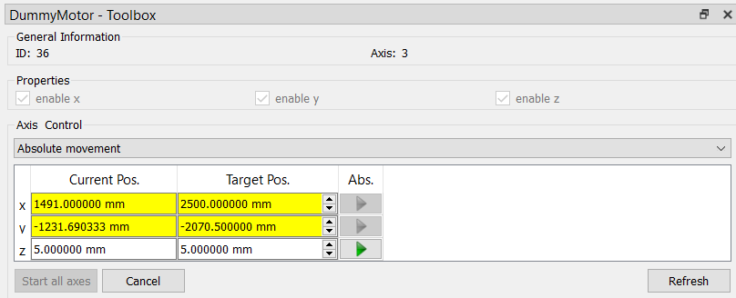

.. DO NOT EDIT.
.. THIS FILE WAS AUTOMATICALLY GENERATED BY SPHINX-GALLERY.
.. TO MAKE CHANGES, EDIT THE SOURCE PYTHON FILE:
.. "11_demos\plugins\demo_DummyMotor.py"
.. LINE NUMBERS ARE GIVEN BELOW.

.. only:: html

    .. note::
        :class: sphx-glr-download-link-note

        Click :ref:`here <sphx_glr_download_11_demos_plugins_demo_DummyMotor.py>`
        to download the full example code

.. rst-class:: sphx-glr-example-title

.. _sphx_glr_11_demos_plugins_demo_DummyMotor.py:

DummyMotor
===========

This demo shows with the example of the ``DummyMotor``
how grabber and cameras are used in ``itom``.

.. GENERATED FROM PYTHON SOURCE LINES 6-10

.. code-block:: default

    import time
    from itom import actuator

.. GENERATED FROM PYTHON SOURCE LINES 12-13

Initialisation of an actuator (e.g: ``DummyMotor``).

.. GENERATED FROM PYTHON SOURCE LINES 13-26

.. code-block:: default

    stage = actuator("DummyMotor", 3)

    # show the toolbox
    stage.showToolbox()

    # Access the DummyStage with variable-name stage

    # Set parameter e.g. speed of the stage to 1000 mm / s
    stage.setParam("speed", 1000)

    # Get the current speed, should be 1000 mm/s
    speed = stage.getParam("speed")

.. GENERATED FROM PYTHON SOURCE LINES 27-29

**Synchronous movement**: 
   The script waits until the movement has been finished!

.. GENERATED FROM PYTHON SOURCE LINES 29-57

.. code-block:: default

    # Set pos of 1. axis (index 0) to the absolute value 10.2 mm
    stage.setPosAbs(0, 10.2)

    # Read the axis position of 1. axis, should be 10 (mm)
    stage.getPos(0)

    # Change the position of 1. axis by -6 mm relative to the current position
    stage.setPosRel(0, -6)

    # Read the axis position of 1. axis, should be 4 (mm)
    stage.getPos(0)

    # Address n-axis
    # Set the position of 1. and 3. axis to 5mm
    stage.setPosAbs(0, 5.0, 2, 5.0)

    # Read the axis position of 1./3. axis, should be 5 (mm) and 5 (mm)
    [x, z] = stage.getPos(0, 2)
    print("x = " + str(x) + " z = " + str(z))

    # Change the position of 1. axis and 2. by 2 mm relative to the current position
    stage.setPosRel(0, 2, 1, 2)

    # Read the axis position of 1./2./3. axis, should be 7 (mm), 2 (mm), 5 (mm)
    [x, y, z] = stage.getPos(0, 1, 2)
    print("x = " + str(x) + " y = " + str(y) + " z = " + str(z))

.. rst-class:: sphx-glr-script-out

 Out:

 .. code-block:: none

    x = 5.0 z = 5.0
    x = 7.0 y = 2.0 z = 5.0

.. GENERATED FROM PYTHON SOURCE LINES 58-63

**Asynchronous movement**: 
   The script continuous its executing during the movement. However,
   the actuator is **blocked** until the end of the movement, since the script
   will wait before the next ``setParam``, ``setPosAbs``, ``setPosRel``,
   ``getPos``, ``getParam``, ``getStatus`` methods until any previous movement is finished.

.. GENERATED FROM PYTHON SOURCE LINES 63-67

.. code-block:: default

    # now switch the motor to an asychronous movement
    stage.setParam("async", 1)

.. GENERATED FROM PYTHON SOURCE LINES 68-70

Control the state of the actuator by the properties:
``currentStatus``, ``currentPositions``, ``targetPositions``.

.. GENERATED FROM PYTHON SOURCE LINES 70-82

.. code-block:: default

    # use the currentStatus, currentPositions or targetPositions properties to control the state of the device
    targetReached = False
    stage.setPosAbs(0, 2500.0, 1, -2070.5)
    while not targetReached:
        state = stage.currentStatus
        if all([s & actuator.actuatorAtTarget for s in state]):
            targetReached = True
        else:
            # print("Current state: %s, current positions: %s" % (state, stage.currentPositions))
            time.sleep(0.1)

.. GENERATED FROM PYTHON SOURCE LINES 83-90

Control the state of the actuator by connecting to the
``actuatorStatusChanged`` (or ``targetChanged``) signals of the actuator.

.. note::
   The corresponding python methods can only be called if the current script
   executing is finished. Therefore, this approach is better suited for GUI applications which are
   mainly based on events.

.. GENERATED FROM PYTHON SOURCE LINES 90-98

.. code-block:: default

    # use an event-driven approach to control the current status and position:
    def statusChanged(state, currentPos):
        print(
            "motor reported a status changed event. state: %s, current position: %s"
            % (str(state), str(currentPos))
        )

.. GENERATED FROM PYTHON SOURCE LINES 99-104

The method ``statusChanged`` can only be called if the script is not executing any more.
Therefore this approach is made for GUI applications
since the ``actuatorStatusChanged`` signal might be emitted very often, a minimum timeout of 100ms will
be added to the connection, such that the ``statusChanged slot`` is only called after 100ms again. All intermediate
calls are ignored (new in itom 3.2)

.. GENERATED FROM PYTHON SOURCE LINES 104-110

.. code-block:: default

    stage.connect(
        "actuatorStatusChanged(QVector<int>,QVector<double>)", statusChanged, 100,
    )

    stage.setPosAbs(0, 0.0, 1, 0.0)

.. GENERATED FROM PYTHON SOURCE LINES 111-114

The DummyMotor Toolbox dockWidget will appear below the Plugins dockWidget.

.. rst-class:: sphx-glr-timing

   **Total running time of the script:** ( 0 minutes  2.702 seconds)

.. _sphx_glr_download_11_demos_plugins_demo_DummyMotor.py:

.. only:: html

  .. container:: sphx-glr-footer sphx-glr-footer-example

    .. container:: sphx-glr-download sphx-glr-download-python

      :download:`Download Python source code: demo_DummyMotor.py <demo_DummyMotor.py>`

    .. container:: sphx-glr-download sphx-glr-download-jupyter

      :download:`Download Jupyter notebook: demo_DummyMotor.ipynb <demo_DummyMotor.ipynb>`

.. only:: html

 .. rst-class:: sphx-glr-signature

    `Gallery generated by Sphinx-Gallery <https://sphinx-gallery.github.io>`_
