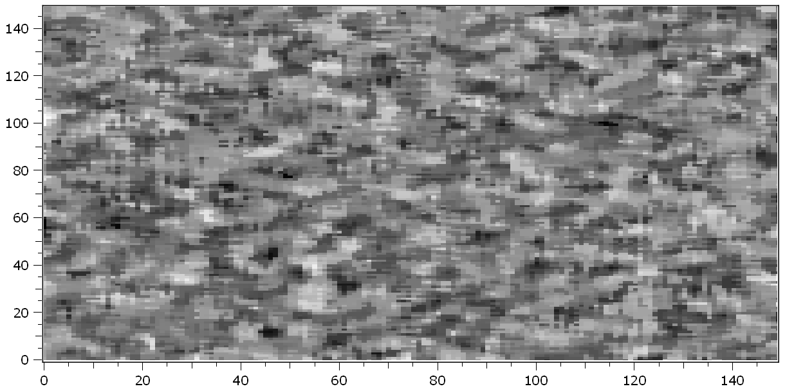

.. DO NOT EDIT.
.. THIS FILE WAS AUTOMATICALLY GENERATED BY SPHINX-GALLERY.
.. TO MAKE CHANGES, EDIT THE SOURCE PYTHON FILE:
.. "11_demos\plugins\demo_OpenCVFilter.py"
.. LINE NUMBERS ARE GIVEN BELOW.

.. only:: html

    .. note::
        :class: sphx-glr-download-link-note

        Click :ref:`here <sphx_glr_download_11_demos_plugins_demo_OpenCVFilter.py>`
        to download the full example code

.. rst-class:: sphx-glr-example-title

.. _sphx_glr_11_demos_plugins_demo_OpenCVFilter.py:

OpenCV filter
===========

This demo shows how OpenCV filters are applied to the ``dataObject``.

.. GENERATED FROM PYTHON SOURCE LINES 5-14

.. code-block:: default

    from itom import dataObject
    from itom import algorithms
    from itom import plot
    from itom import filterHelp

    # create a randomly filled  150x150px dataObject
    dObj = dataObject.rand([150, 150], "float32")

.. GENERATED FROM PYTHON SOURCE LINES 16-18

Get information about the filter and its parameters.
First, no idea about the filters name, therefore get all names containing the keyword ``cv``:

.. GENERATED FROM PYTHON SOURCE LINES 18-30

.. code-block:: default

    filterInfoDict = filterHelp("cv", dictionary=1)

    for key, value in filterInfoDict.items():
        print("{}: {}".format(value["name"], value["description"]))

    # the desired filter is called "cvMedianBlur", now obtain detailed information
    medianBlurDict = filterHelp("cvMedianBlur", dictionary=1)

    print("{}: {}".format(medianBlurDict["cvMedianBlur"]["name"], medianBlurDict["cvMedianBlur"]["description"]))

    # create an empty output image (its content will be filled within the filter-call)
    outputImage = dataObject()

.. rst-class:: sphx-glr-script-out

 Out:

 .. code-block:: none

    calcValidMask: Calculates a binary mask, where valid contrast values have the value 1. The condition for the validation criteria is given by the parameter "contrastThreshold". Contrast values below gets the value 0 in the mask.

    cvBilateralFilter: Resizes an image 

    The function resize resizes the image 'inputObject' down to or up by the specific factors. 

    To shrink an image, it will generally look best with CV_INTER_AREA interpolation, whereas to enlarge an image, 
    it will generally look best with CV_INTER_CUBIC (slow) or CV_INTER_LINEAR (faster but still looks OK). 
    The axisScale properties of the x- and y-axes of the outputObject are divided by fx and fy respectively, while the offset values are multiplied with fx and fy.
    cvBlur: Planewise median blur filter.

    This filter applies the method cv::blur to every plane in the source data object. The function smoothes the images by a simple mean-filter. Theresult is contained in the destination object. It can handle data objects of type uint8, uint16, int16, ito::tInt32, float32 and float64 only. 

    The cv::blur interally calls the cv::boxfilter()-method.

    The itom-wrapping does not work inplace currently. A new dataObject is allocated.

    borderType: This string defines how the filter should hande pixels at the border of the matrix.Allowed is CONSTANT [default], REPLICATE, REFLECT, WRAP, REFLECT_101. In case of a constant border, only pixels inside of the element mask are considered (morphologyDefaultBorderValue)
    Warning: NaN-handling for floats not verified.
    cvCalibrateCamera: Finds the camera intrinsic and extrinsic parameters from several views of a calibration pattern. 

    The function estimates the intrinsic camera parameters and extrinsic parameters for each of the views. The coordinates of 3D object points and their corresponding 2D projections in each view must be specified. 
    That may be achieved by using an object with a known geometry and easily detectable feature points. Such an object is called a calibration rig or calibration pattern, and OpenCV has built-in support for 
    a chessboard as a calibration rig (see cvFindChessboardCorners()). Currently, initialization of intrinsic parameters (when CV_CALIB_USE_INTRINSIC_GUESS is not set) is only implemented for planar 
    calibration patterns (where Z-coordinates of the object points must be all zeros). 3D calibration rigs can also be used as long as initial cameraMatrix is provided.

    The algorithm performs the following steps: 

    1. Compute the initial intrinsic parameters (the option only available for planar calibration patterns) or read them from the input parameters. The distortion coefficients are all set to zeros initially unless some of CV_CALIB_FIX_K? are specified. 
    2. Estimate the initial camera pose as if the intrinsic parameters have been already known. This is done using solvePnP() . 
    3. Run the global Levenberg-Marquardt optimization algorithm to minimize the reprojection error, that is, the total sum of squared distances between the observed feature points imagePoints and the projected (using the current estimates for camera parameters and the poses) object points objectPoints. See projectPoints() for details. 

    If the reprojectionError is NaN, one or both of the matrices objectPoints or imagePoints probabily contains any NaN-value after truncation. Remember that this algorithm truncates objectPoints and imagePoints 
    before using it in the way that for each view, the last rows are cut where either the value in the first column of objectPoints or imagePoints is non-finite.
    cvCannyEdge: Canny Edge detector using cv::DFT.

    It's just Canny's edge filter

    cvComputeCorrespondEpilines: For points in an image of a stereo pair, computes the corresponding epilines in the other image. 

    For every point in one of the two images of a stereo pair, the function finds the equation of the corresponding epipolar line in the other image. 

    From the fundamental matrix definition (see findFundamentalMat()), line l^{(2)}_i in the second image for the point p^{(1)}_i in the first image (when whichImage=1) is computed as: 

    .. math:: l^{(2)}_i = F p^{(1)}_i 

    And vice versa, when whichImage=2, l^{(1)}_i is computed from p^{(2)}_i as: 

    .. math:: l^{(1)}_i = F^T p^{(2)}_i 

    Line coefficients are defined up to a scale. They are normalized so that 

    .. math:: a_i^2+b_i^2=1.
    cvCornerSubPix: Refines the corner locations e.g. from cvFindChessboardCorners.

    This filter is a wrapper for the cv::method cv::cornerSubPix. Check the openCV-doku for more details

    cvCvtColor: Converts an image from one color space to another.
    In case of linear transformations, the range does not matter. But in case of a non-linear transformation,
    an input RGB image should be normalized to the proper value range to get the correct results, for example,
    for RGB -> L*u*v* transformation. For example, if you have a 32-bit floating-point image directly
    converted from an 8-bit image without any scaling, then it will have the 0..255 value range instead of 0..1
    assumed by the function. So, before calling cvtColor , you need first to scale the image down

    The parameter code defines the conversion:

    * RGB <-> GRAY ( CV_BGR2GRAY = 6, CV_RGB2GRAY = 7 , CV_GRAY2BGR = 8, CV_GRAY2RGB = 8)
    * RGB <-> CIE XYZ.Rec 709 with D65 white point ( CV_BGR2XYZ = 32, CV_RGB2XYZ = 33, CV_XYZ2BGR = 34, CV_XYZ2RGB = 35)
    * RGB <-> YCrCb JPEG (or YCC) ( CV_BGR2YCrCb = 36, CV_RGB2YCrCb = 37, CV_YCrCb2BGR = 38, CV_YCrCb2RGB = 39)
    * RGB <-> HSV ( CV_BGR2HSV = 40, CV_RGB2HSV = 41, CV_HSV2BGR = 54, CV_HSV2RGB = 55 )
    * RGB <-> HLS ( CV_BGR2HLS = 52, CV_RGB2HLS = 53, CV_HLS2BGR = 60, CV_HLS2RGB = 61)
    * RGB <-> CIE L*a*b* ( CV_BGR2Lab = 44, CV_RGB2Lab = 45, CV_Lab2BGR = 56, CV_Lab2RGB = 57)
    * RGB <-> CIE L*u*v* ( CV_BGR2Luv = 50, CV_RGB2Luv = 51, CV_Luv2BGR = 58, CV_Luv2RGB = 59)
    * Bayer <-> RGB ( CV_BayerBG2BGR = 46, CV_BayerGB2BGR = 47, CV_BayerRG2BGR = 48, CV_BayerGR2BGR = 49, ...
        CV_BayerBG2RGB = 48, CV_BayerGB2RGB = 49, CV_BayerRG2RGB = 46, CV_BayerGR2RGB = 47)

    For more details see OpenCV documentation.
    cvDilate: Dilates every plane of a data object by using a specific structuring element. 

    This filter applies the dialation method cvDilate of OpenCV to every plane in the source data object. The result is contained in the destination object. It can handle data objects of type uint8, uint16, int16, float32 and float64 only. 

    It is allowed to let the filter work inplace if you give the same input than destination data object, else the output data object is verified if it fits to the size and type of the source data object and if not a new one is allocated. 

    The dilation is executed using a structuring element which is (if not otherwise stated) a 3x3 kernel filled with ones. Else you can give an two-dimensional uint8 data object. Then, the function dilates the source image using the specified structuring element that determines the shape of a pixel neighborhood over which the maximum is taken: 

    dst(x,y) = max_{(x',y'):element(x',y')!=0} src(x+x',y+y') 

    Dilation can be applied several times (parameter 'iterations').
    cvDrawChessboardCorners: Renders the detected chessboard corners.

    The function draws individual chessboard corners detected either as red circles if the board was not found, or as colored corners connected with lines if the board was found.
    cvDrawKeypoints: Draws keypoints.
    cvDrawMatcher: Draw the obtained matches points between two images. 
    This function draws matches of keypoints from two images in the output image. Match is a line connecting two keypoints (circles).
    cvErode: Erodes every plane of a data object by using a specific structuring element. 

    This filter applies the erosion method cvErode of OpenCV to every plane in the source data object. The result is contained in the destination object. It can handle data objects of type uint8, uint16, int16, float32 and float64 only. 

    It is allowed to let the filter work inplace if you give the same input than destination data object, else the output data object is verified if it fits to the size and type of the source data object and if not a new one is allocated. 

    The erosion is executed using a structuring element which is (if not otherwise stated) a 3x3 kernel filled with ones. Else you can give an two-dimensional uint8 data object. Then, the function dilates the source image using the specified structuring element that determines the shape of a pixel neighborhood over which the maximum is taken: 

    dst(x,y) = min_{(x',y'):element(x',y')!=0} src(x+x',y+y') 

    Erosion can be applied several times (parameter 'iterations').
    cvEstimateAffine3DParams: Computes an optimal affine transformation between two 3D point sets 

    The function estimates an optimal 3D affine transformation between two 3D point sets using the RANSAC algorithm. The transformation describes then 
    [destination;1] = output * [source;1] for each point in sources and destinations 3D point set.
    cvFFT1D: 1D-dimentional fourier-transformation using cv::DFT.

    This filter tries to perform an inplace FFT for a given line or 2D-dataObject. The FFT is calculated linewise.The result is a complex-dataObject. The axis-scales and units are invertes and modified.

    This filter internally calls the ito::dObjHelper::calcCVDFT(dObjImages, false, false, true)-function.

    cvFFT2D: 2D-dimentional fourier-transformation using cv::DFT.

    This filter tries to perform an inplace FFT for a given 2D-dataObject. The FFT is calculated planewise.The result is a complex-dataObject. The axis-scales and units are invertes and modified.

    This filter internally calls the ito::dObjHelper::calcCVDFT(dObjImages, false, false, false)-function.

    cvFindChessboardCorners: Finds the positions of internal corners of the chessboard.

    This filter is a wrapper for the cv::method cv::findChessboardCorners. 
    The openCV-function attempts to determine whether the input image is a view of the chessboard pattern and locate the internal chessboard corners. The function returns a non-zero value if all of the corners are found and they are placed in a certain order (row by row, left to right in every row). Otherwise, if the function fails to find all the corners or reorder them, it returns 0. For example, a regular chessboard has 8 x 8 squares and 7 x 7 internal corners, that is, points where the black squares touch each other. The detected coordinates are approximate, and to determine their positions more accurately, the function calls cornerSubPix(). 

    Remark 1: This function gives only a rough estimation of the positions. For a higher resolutions, you should usethe function cornerSubPix() with different parameters if returned coordinates are not accurate enough.This function is wrapped to itom by the filter 'cvCornerSubPix'.

    Remark 2: The outer frame of the dataObject / the image should not be white but have approximately the same gray value than the bright field.

    Remark 3: The bright fields should be free of darker dirt or dust and you should apply a corse shading correction to improve the results. 

    cvFindCircles: Finds circles in a grayscale image using the Hough transform.

    This filter is a wrapper for the OpenCV-function cv::HoughCircles.The function finds circles in a grayscale image using a modification of the Hough transform.Based on this filter, circles are identified and located.The result is a dataObject where the number of rows corresponds to the number of found circles, each row is (x,y,r).

    cvFindFundamentalMat: Calculates a fundamental matrix from the corresponding points in two images. 

    The epipolar geometry is described by the following equation: 

    .. math:: [p_2; 1]^T F [p_1; 1] = 0 

    where F is a fundamental matrix, p_1 and p_2 are corresponding points in the first and the second images, respectively. 

    The function calculates the fundamental matrix using one of four methods listed above and returns the found fundamental matrix. 
    Normally just one matrix is found. But in case of the 7-point algorithm, the function may return up to 3 solutions (9   imes 3 matrix that stores all 3 matrices sequentially).
    cvFindHomography: Finds a perspective transformation between two planes. 

    The functions find and return the perspective transformation H between the source and the destination planes: 

    .. math:: s_i \begin{bmatrix}{x'_i}\\{y'_i}\\{1}\end{bmatrix} \sim H \begin{bmatrix}{x_i}\\{y_i}\\{1}\end{bmatrix} 

    so that the back-projection error 

    .. math:: \sum _i \left(x'_i- \frac{h_{11} x_i + h_{12} y_i + h_{13}}{h_{31} x_i + h_{32} y_i + h_{33}} \right)^2 + \left(y'_i- \frac{h_{21} x_i + h_{22} y_i + h_{23}}{h_{31} x_i + h_{32} y_i + h_{33}} \right)^2 

    is minimized. 

    The function is used to find initial intrinsic and extrinsic matrices. Homography matrix is determined up to a scale. Thus, it is normalized so that h_{33}=1.
    cvFlannBasedMatcher: This function uses the nearest search methods to find the best matching points. Matching methods by means of Flann matcher. 
    This includes some nearest neighbour algorithms to calculate the distance between two points. 

    If desired, this function can also return a filtered list of matches and keypoints (keypoints1 and keypoints2) that only contain matches and keypoints whose matched distances 
    are bounded by max_distance. You only need to indicate parameters belonging to the best-matching process if this max_distance parameter is > 0.0.
    cvFlipLeftRight: This filter flips the image left to right. 

    This filter applies the flip method cvFlip of OpenCV with the flipCode > 0 to a 2D source data object. The result is contained in the destination object

    It is allowed to let the filter work inplace if you give the same input than destination data object, else the output data object is verified if it fits to the size and type of the source data object and if not a new one is allocated
    .
    cvFlipUpDown: This filter flips the image upside down. 

    This filter applies the flip method cvFlip of OpenCV with the flipCode = 0 to a 2D source data object. The result is contained in the destination object.

    It is allowed to let the filter work inplace if you give the same input than destination data object, else the output data object is verified if it fits to the size and type of the source data object and if not a new one is allocated
    .
    cvGetRotationMatrix2D: Calculates an affine matrix of 2D rotation.
    The function calculates the following matrix:

    | alpha beta  (1 - alpha) * center.x - beta * center.y        |
    |- beta alpha beta * center.x        + (1 - alpha) * center.y |

    where
    alpha = scale * cos(angle), beta = scale * sin(angle)
    The transformation maps the rotation center to itself. This is not the target, adjust the shift.
    Thr rotation can be applied by using e. g. the cvWarpAffine filter.

    Note: 
    When you want to use the cvWarpAffine method with this rotation matrix your center coordinates must be in the pixel domain.
    cvIFFT1D: 1D-dimentional inverse fourier-transformation using cv::DFT.

    This filter tries to perform an inplace FFT for a given line or 2D-dataObject. The FFT is calculated linewise.The result is a real-dataObject. The axis-scales and units are invertes and modified.

    This filter internally calls the ito::dObjHelper::calcCVDFT(dObjImages, true, true, true)-function.

    cvIFFT2D: 2D-dimentional inverse fourier-transformation using cv::DFT.

    This filter tries to perform an inplace FFT for a given 2D-dataObject. The FFT is calculated planewise.The result is a real-dataObject. The axis-scales and units are invertes and modified.

    This filter internally calls the ito::dObjHelper::calcCVDFT(dObjImages, true, true, false)-function.

    cvInitUndistortRectifyMap: Computes the undistortion and rectification transformation map.
    cvMedianBlur: Planewise median blur filter.

    The function smoothes an image using the median filter with the kernel-size x kernel-size aperture. Each channel of a multi-channel image is processed independently. It can handle data objects of type uint8, uint16, int16, ito::tInt32, float32 and float64 only. 

    The itom-wrapping does not work inplace currently. A new dataObject is allocated.

    Warning: NaN-handling for floats not verified.
    cvMergeChannels: Reduces a [4x...xMxN] or [3x...xMxN] uint8 data object to a [...xMxN] rgba32 data object where the 
    first dimension is merged into the color type. If the first dimension is equal to 4, the planes are used for the blue, green, red and alpha 
    component, in case of three, the alpha component is set to the optional alpha value.
    cvMorphologyEx: Erodes every plane of a data object by using a specific structuring element. 

    Performs advanced morphological transformations.The function cv::morphologyEx can perform advanced morphological transformations using an erosion and dilation as basic operations.MORPH_ERODE Any of the operations can be done in - place.In case of multi - channel images, each channel is processed independently.).
    cvProjectPoints: Project points from object into image space using the given calibration matrices,
    distortion coefficients rotation and tralsation vector.
    cvRemap: Applies a generic geometrical transformation to an image. 

    The function remap transforms the source image using the specified map: 

    dst(x,y) = src(map_x(x, y), map_y(x, y)) 

    where values of pixels with non-integer coordinates are computed using one of available interpolation methods. map_x and map_y can be encoded as 
    separate floating-point maps in map_1 and map_2 respectively, or interleaved floating-point maps of (x,y) in map_1 , 
    or fixed-point maps created by using convertMaps() . The reason you might want to convert from floating to fixed-point representations of a map is 
    that they can yield much faster (~2x) remapping operations. In the converted case, map_1 contains pairs (cvFloor(x), cvFloor(y)) and map_2 contains 
    indices in a table of interpolation coefficients.
    cvRemoveSpikes: Set single spikes at measurement edges to a new value. 

    This filter creates a binary mask for the input object. The value of mask(y,x) will be 1 if value of input(y,x) is within the specified range and is finite.The mask is eroded and than dilated by kernel size using openCV cv::erode and cv::dilate with a single iteration. In the last step the value of output(y,x) is set to newValue if mask(y,x) is 0.

    It is allowed to let the filter work inplace if you give the same source and destination data object, else the destination data object is verified if it fits to the size and type of the source data object and if not a new one is allocated and the input data is copied to the new object. 

    cvResize: Resizes an image 

    The function resize resizes the image 'inputObject' down to or up by the specific factors. 

    To shrink an image, it will generally look best with CV_INTER_AREA interpolation, whereas to enlarge an image, 
    it will generally look best with CV_INTER_CUBIC (slow) or CV_INTER_LINEAR (faster but still looks OK). 
    The axisScale properties of the x- and y-axes of the outputObject are divided by fx and fy respectively, while the offset values are multiplied with fx and fy.
    cvRotate180: This filter rotates the image by 180?. 

    This filter applies the flip method cvFlip from OpenCV horizontally and vertically to rotate the object. The result is contained in the destination object

    It is allowed to let the filter work inplace if you give the same input than destination data object, else the output data object is verified if it fits to the size and type of the source data object and if not a new one is allocated.

    cvRotateM90: This filter rotates the image by 90? clock wise. 

    This filter applies the flip method cvFlip and the transpose method cvTranspose of OpenCV to rotate the object. The result is contained in the destination object

    It is allowed to let the filter work pseudo inplace if you give the same input than destination data object, else the output data object is verified if it fits to the size and type of the source data object and if not a new one is allocated.

    cvRotateP90: This filter rotates the image by 90? count clock wise. 

    This filter applies the flip method cvFlip and the transpose method cvTranspose of OpenCV to rotate the object. The result is contained in the destination object

    It is allowed to let the filter work pseudo inplace if you give the same input than destination data object, else the output data object is verified if it fits to the size and type of the source data object and if not a new one is allocated.

    cvSplitChannels: Converts a rgba32 data object (with four channels blue, green, red, alpha) into 
    an output data object of type 'uint8' and a shape that has one dimension more than the input object and the first dimension is equal to 4. 
    The four color components are then distributed into the 4 planes of the first dimension. 

    For instance a 4x5x3, rgba32 data objects leads to a 4x4x5x3 uint8 data object.
    cvThreshold: Applies a fixed-level threshold to each array element.. 

    The function applies fixed-level thresholding to a multiple-channel array. 
    The function is typically used to get a bi-level (binary) image out of a grayscale image (compare could be also used for this purpose)
    or for removing a noise, that is, filtering out pixels with too small or too large values. 
    There are several types of thresholding supported by the function. They are determined by type parameter.

    Also, the special values THRESH_OTSU or THRESH_TRIANGLE may be combined with one of the above values. 
    In these cases, the function determines the optimal threshold value using the Otsu's or Triangle algorithm and uses it instead of the specified thresh.

    Note: 
    Currently, the Otsu's and Triangle methods are implemented only for 8-bit single-channel images.
    cvUndistort: Transforms an image to compensate for lens distortion. 

    The function transforms an image to compensate radial and tangential lens distortion. 
    The function is simply a combination of cvInitUndistortRectifyMap() (with unity R) and cvRemap() (with bilinear interpolation). 
    See the former function for details of the transformation being performed. 

    Those pixels in the destination image, for which there is no correspondent pixels in the source image, are filled with zeros (black color).
    cvUndistortPoints: Computes the ideal point coordinates from the observed point coordinates. 

    The function is similar to cvUndistort() and cvInitUndistortRectifyMap() but it operates on a sparse set of points instead of a raster image. Also the function performs a reverse transformation to cvProjectPoints() . 
    In case of a 3D object, it does not reconstruct its 3D coordinates, but for a planar object, it does, up to a translation vector, if the proper R is specified.
    cvWarpAffine: Applies an affine transformation onto a 2D dataObject.
    The function warpAffine transforms the source dataObject using the specified matrix:

    dst(x,y)=src(M11x+M12y+M13,M21x+M22y+M23):

    When the flag WARP_INVERSE_MAP is set.
    Otherwise, the transformation is first inverted with invertAffineTransform
    and then put in the formula above instead of M.

    Note: 
    The rotation matrix of the cvGetRotationMatrix2D filter can be used.
    The matrix must correspond to the pixel domain.

    No metaInformation is set to the destinationObj because the physical units 
    of the target object differ from each other depending on the algorithm parameter.
    cvWarpPerspective: Applies a perspective transformation to an image 

    The function warpPerspective transforms the source image using the specified matrix H
    cvMedianBlur: Planewise median blur filter.

    The function smoothes an image using the median filter with the kernel-size x kernel-size aperture. Each channel of a multi-channel image is processed independently. It can handle data objects of type uint8, uint16, int16, ito::tInt32, float32 and float64 only. 

    The itom-wrapping does not work inplace currently. A new dataObject is allocated.

    Warning: NaN-handling for floats not verified.

.. GENERATED FROM PYTHON SOURCE LINES 31-39

Call the filter. The parameters after the filter name are the
``mandatory`` parameters followed by the ``optional`` ones (if desired):

1. parameter (mand): input image

2. parameter (mand): output image

3. kernellength (opt): size of squared filter kernel (default: 3)

.. GENERATED FROM PYTHON SOURCE LINES 39-44

.. code-block:: default

    algorithms.cvMedianBlur(dObj, outputImage, 5)

    plot(dObj)  # plot original image
    plot(outputImage)  # plot filtered image

.. rst-class:: sphx-glr-script-out

 Out:

 .. code-block:: none

    (151, PlotItem(UiItem(class: Itom2dQwtPlot, name: plot0x0)))

.. GENERATED FROM PYTHON SOURCE LINES 45-46

.. rst-class:: sphx-glr-timing

   **Total running time of the script:** ( 0 minutes  0.148 seconds)

.. _sphx_glr_download_11_demos_plugins_demo_OpenCVFilter.py:

.. only:: html

  .. container:: sphx-glr-footer sphx-glr-footer-example

    .. container:: sphx-glr-download sphx-glr-download-python

      :download:`Download Python source code: demo_OpenCVFilter.py <demo_OpenCVFilter.py>`

    .. container:: sphx-glr-download sphx-glr-download-jupyter

      :download:`Download Jupyter notebook: demo_OpenCVFilter.ipynb <demo_OpenCVFilter.ipynb>`

.. only:: html

 .. rst-class:: sphx-glr-signature

    `Gallery generated by Sphinx-Gallery <https://sphinx-gallery.github.io>`_
