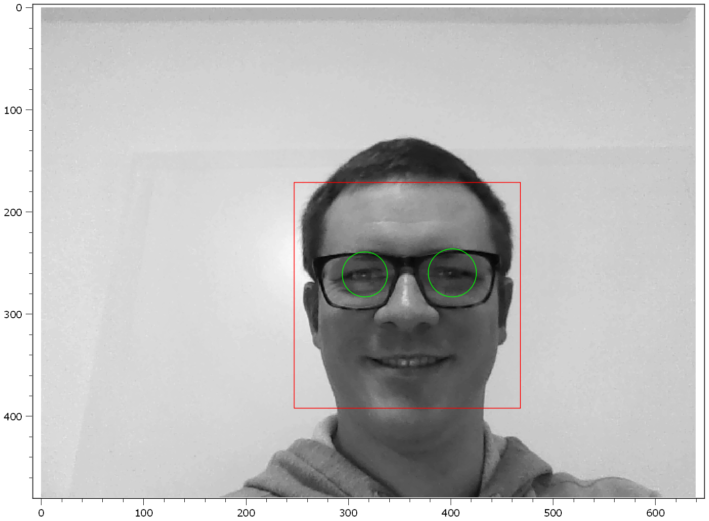

.. DO NOT EDIT.
.. THIS FILE WAS AUTOMATICALLY GENERATED BY SPHINX-GALLERY.
.. TO MAKE CHANGES, EDIT THE SOURCE PYTHON FILE:
.. "11_demos\plugins\demofaceDetection.py"
.. LINE NUMBERS ARE GIVEN BELOW.

.. only:: html

    .. note::
        :class: sphx-glr-download-link-note

        Click :ref:`here <sphx_glr_download_11_demos_plugins_demofaceDetection.py>`
        to download the full example code

.. rst-class:: sphx-glr-example-title

.. _sphx_glr_11_demos_plugins_demofaceDetection.py:

Face Detection
======================

This demo shows how a simple image processing example can be demonstrated.
The ``itom`` grabber ``OpenCVGrabber`` captures your webcam.
Then live your face and eyes are detected and marked in the live plot.

.. GENERATED FROM PYTHON SOURCE LINES 8-17

.. code-block:: default

    from itom import dataObject
    from itom import dataIO
    from itom import ui
    import cv2
    import numpy as np
    import gc

.. GENERATED FROM PYTHON SOURCE LINES 19-20

Face detection method.

.. GENERATED FROM PYTHON SOURCE LINES 20-28

.. code-block:: default

    def detectFace(img, cascade):
        rects = cascade.detectMultiScale(img, scaleFactor=1.3, minNeighbors=4)
        if len(rects) == 0:
            return []
        rects[:, 2:] += rects[:, :2]
        return rects

.. GENERATED FROM PYTHON SOURCE LINES 29-30

Eye detection method.

.. GENERATED FROM PYTHON SOURCE LINES 30-41

.. code-block:: default

    def detectEyes(img, cascade):
        eyes = cascade.detectMultiScale(img)
        if len(eyes) == 0:
            return []

        if eyes.shape[0] > 2:
            eyes = eyes[0:1, :]

        return eyes

.. GENERATED FROM PYTHON SOURCE LINES 42-43

Draw detected rectangle method. 

.. GENERATED FROM PYTHON SOURCE LINES 43-49

.. code-block:: default

    def drawRects(img, faces, color):
        for x1, y1, x2, y2 in faces:
            rect = shape.createRectangle((x1, y1), (x2, y2), index=11)
            rect.color = color
            win.plot.call("updateGeometricShape", rect)

.. GENERATED FROM PYTHON SOURCE LINES 50-51

Draw detected eyes method.

.. GENERATED FROM PYTHON SOURCE LINES 51-62

.. code-block:: default

    def drawEyes(img, eyes, color):
        cnt = 21
        for x, y, w, h in eyes:
            eye = shape.createEllipse((x, y + h), (x + w, y), index=cnt)
            eye.color = color
            try:
                win.plot.call("updateGeometricShape", eye)
            except AttributeError:
                break
            cnt = cnt + 1

.. GENERATED FROM PYTHON SOURCE LINES 63-64

Acquire an image from the webcam.

.. GENERATED FROM PYTHON SOURCE LINES 64-86

.. code-block:: default

    def snap():
        # image acquisition
        if "cam" in globals():
            d = dataObject()
            cam.disableAutoGrabbing()
            cam.acquire()
            cam.getVal(d)
        else:
            return

        img = np.array(d)

        win.plot["source"] = img

        # detect face and eyes
        faces = detectFace(img, faceCascade)
        eyes = detectEyes(img, eyeCascade)

        # overlay rect and eyes
        drawRects(img, faces, rgba(255, 0, 0, 255))  # in color red
        drawEyes(img, eyes, rgba(0, 255, 0, 255))  # in color green

.. GENERATED FROM PYTHON SOURCE LINES 87-88

Close GUI and stop webcam. 

.. GENERATED FROM PYTHON SOURCE LINES 88-95

.. code-block:: default

    def guiClosed():
        tDetect.stop()
        global cam, win
        del win
        del cam
        gc.collect()

.. GENERATED FROM PYTHON SOURCE LINES 96-97

Open a simple ``GUI``, connect the webcam and starte the live face detection. 

.. GENERATED FROM PYTHON SOURCE LINES 97-121

.. code-block:: default

    win = ui(
        "FaceDetect.ui",
        ui.TYPEWINDOW,
        childOfMainWindow=True,
        deleteOnClose=True,
    )

    faceCascade = cv2.CascadeClassifier()
    eyeCascade = cv2.CascadeClassifier()

    faceCascade.load("haarcascades/haarcascade_frontalface_alt.xml")
    eyeCascade.load("haarcascades/haarcascade_eye_tree_eyeglasses.xml")

    cam = dataIO("OpenCVGrabber", 0, "gray")
    cam.startDevice()
    cam.disableAutoGrabbing()

    tDetect = timer(100, snap)

    win.connect("destroyed()", guiClosed)

    # start GUI
    win.show(0)

.. GENERATED FROM PYTHON SOURCE LINES 122-123

.. _sphx_glr_download_11_demos_plugins_demofaceDetection.py:

.. only:: html

  .. container:: sphx-glr-footer sphx-glr-footer-example

    .. container:: sphx-glr-download sphx-glr-download-python

      :download:`Download Python source code: demofaceDetection.py <demofaceDetection.py>`

    .. container:: sphx-glr-download sphx-glr-download-jupyter

      :download:`Download Jupyter notebook: demofaceDetection.ipynb <demofaceDetection.ipynb>`

.. only:: html

 .. rst-class:: sphx-glr-signature

    `Gallery generated by Sphinx-Gallery <https://sphinx-gallery.github.io>`_
