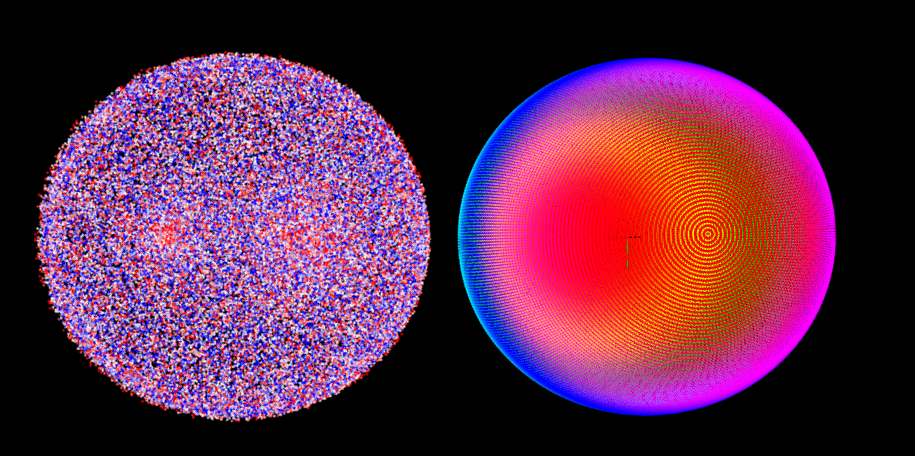

.. DO NOT EDIT.
.. THIS FILE WAS AUTOMATICALLY GENERATED BY SPHINX-GALLERY.
.. TO MAKE CHANGES, EDIT THE SOURCE PYTHON FILE:
.. "11_demos\pointClouds\demo_cloud.py"
.. LINE NUMBERS ARE GIVEN BELOW.

.. only:: html

    .. note::
        :class: sphx-glr-download-link-note

        Click :ref:`here <sphx_glr_download_11_demos_pointClouds_demo_cloud.py>`
        to download the full example code

.. rst-class:: sphx-glr-example-title

.. _sphx_glr_11_demos_pointClouds_demo_cloud.py:

Cloud
========

.. GENERATED FROM PYTHON SOURCE LINES 5-18

.. code-block:: default

    import numpy as np
    from itom import plot

    try:
        from itom import pointCloud
    except Exception as ex:
        ui.msgInformation(
            "PointCloud missing",
            "your itom version is compiled without support of pointClouds",
        )
        raise ex

.. GENERATED FROM PYTHON SOURCE LINES 20-21

Create a sphere

.. GENERATED FROM PYTHON SOURCE LINES 21-30

.. code-block:: default

    polarRad = np.radians(np.arange(0, 360, 1))
    azimuthRad = np.radians(np.arange(0, 180, 1))
    nominalRadius = 5
    polars, azimuths = np.meshgrid(azimuthRad, polarRad)

    X = nominalRadius * np.cos(polars) * np.cos(azimuths)
    Y = nominalRadius * np.sin(polars) * np.cos(azimuths)
    Z = nominalRadius * np.sin(azimuths)

.. GENERATED FROM PYTHON SOURCE LINES 31-32

Flatten all X,Y,Z coordinates

.. GENERATED FROM PYTHON SOURCE LINES 32-36

.. code-block:: default

    X = X.flatten()
    Y = Y.flatten()
    Z = Z.flatten()

.. GENERATED FROM PYTHON SOURCE LINES 37-38

Create random noise in X, Y and Z direction

.. GENERATED FROM PYTHON SOURCE LINES 38-44

.. code-block:: default

    level = 0.3
    Xnoise = (np.random.rand(len(X)) - 0.5) * level
    Ynoise = (np.random.rand(len(Y)) - 0.5) * level
    Znoise = (np.random.rand(len(Z)) - 0.5) * level
    dist = np.sqrt(Xnoise ** 2 + Ynoise ** 2 + Znoise ** 2)

.. GENERATED FROM PYTHON SOURCE LINES 45-46

Cloud 1: perfect sphere, no intensity values

.. GENERATED FROM PYTHON SOURCE LINES 46-48

.. code-block:: default

    cloud1 = pointCloud.fromXYZ(X, Y, Z)

.. GENERATED FROM PYTHON SOURCE LINES 49-50

Cloud 2: noisy sphere, noise deviation as intensity, shift it a little bit in X direction

.. GENERATED FROM PYTHON SOURCE LINES 50-73

.. code-block:: default

    Xshift = nominalRadius * 2.2
    cloud2 = pointCloud.fromXYZI(
        X + Xnoise + Xshift, Y + Ynoise, Z + Znoise, dist
    )

    # Plot the first cloud --> this cloud has the default name 'source_cloud_normal'
    index, handle = plot(cloud1, "vtk3dvisualizer")

    # parametrize cloud1
    handle.call("setItemProperty", "source_cloud_normal", "ColorMode", "Z")
    handle.call("setItemProperty", "source_cloud_normal", "ColorMap", "hsv")

    # plot the second sphere and shift it a little bit
    handle.call(
        "addPointCloud", cloud2, "cloud2"
    )  # visualize cloud2 under the name 'cloud2'
    handle.call(
        "setItemProperty", "cloud2", "PointSize", 2
    )  # change the property PointSize of this point
    handle.call("setItemProperty", "cloud2", "ColorMode", "Intensity")
    handle.call("setItemProperty", "cloud2", "ColorMap", "blue2red")
    handle.call("setItemProperty", "cloud2", "ColorValueRange", (0.1, 0.2))

.. GENERATED FROM PYTHON SOURCE LINES 74-75

.. rst-class:: sphx-glr-timing

   **Total running time of the script:** ( 0 minutes  0.188 seconds)

.. _sphx_glr_download_11_demos_pointClouds_demo_cloud.py:

.. only:: html

  .. container:: sphx-glr-footer sphx-glr-footer-example

    .. container:: sphx-glr-download sphx-glr-download-python

      :download:`Download Python source code: demo_cloud.py <demo_cloud.py>`

    .. container:: sphx-glr-download sphx-glr-download-jupyter

      :download:`Download Jupyter notebook: demo_cloud.ipynb <demo_cloud.ipynb>`

.. only:: html

 .. rst-class:: sphx-glr-signature

    `Gallery generated by Sphinx-Gallery <https://sphinx-gallery.github.io>`_
