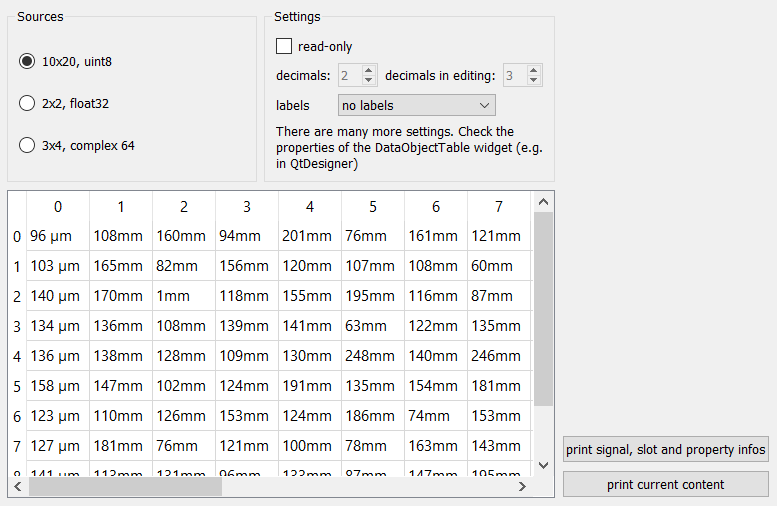

.. DO NOT EDIT.
.. THIS FILE WAS AUTOMATICALLY GENERATED BY SPHINX-GALLERY.
.. TO MAKE CHANGES, EDIT THE SOURCE PYTHON FILE:
.. "11_demos\ui\demo_dataObjectTable.py"
.. LINE NUMBERS ARE GIVEN BELOW.

.. only:: html

    .. note::
        :class: sphx-glr-download-link-note

        Click :ref:`here <sphx_glr_download_11_demos_ui_demo_dataObjectTable.py>`
        to download the full example code

.. rst-class:: sphx-glr-example-title

.. _sphx_glr_11_demos_ui_demo_dataObjectTable.py:

Dataobject table
================

.. GENERATED FROM PYTHON SOURCE LINES 6-96

.. code-block:: default

    from itom import ui
    from itom import dataObject

    def printContent():
        gui.table["data"].data()

    def printInfo():
        gui.table.info()

    def cellClicked(row, column):
        # see statusbar example for details about accessing the statusBar of a QMainWindow
        gui.call("statusBar").call(
            "showMessage",
            "cell clicked. row:" + str(row) + ", col:" + str(column),
            1000,
        )

    def radioUInt8Clicked():
        gui.table["data"] = dataObject.randN([10, 20], "uint8")
        gui.spinDecimals["enabled"] = False
        gui.spinDecimalsEditing["enabled"] = False
        gui.table["horizontalResizeMode"] = "ResizeToContents"

    def radioFloat32Clicked():
        gui.table["data"] = dataObject.randN([2, 2], "float32")
        gui.spinDecimals["enabled"] = True
        gui.spinDecimalsEditing["enabled"] = True
        gui.table["horizontalResizeMode"] = "Stretch"

    def radioComplex64Clicked():
        gui.table["data"] = dataObject.randN([3, 4], "complex64")
        gui.spinDecimals["enabled"] = True
        gui.spinDecimalsEditing["enabled"] = True
        gui.table["horizontalResizeMode"] = "Stretch"

    def spinDecimalsChanged(val):
        gui.table["decimals"] = val

    def spinDecimalsEditingChanged(val):
        gui.table["editorDecimals"] = val

    def checkReadonlyChanged(val):
        gui.table["readOnly"] = val

    def comboLabelsChanged(idx):
        if idx == 0:
            gui.table["suffixes"] = ()
            gui.table["horizontalLabels"] = ()
            gui.table["verticalLabels"] = ()
            gui.table["horizontalHeaderVisible"] = True
            gui.table["verticalHeaderVisible"] = True
        elif idx == 1:
            gui.table["suffixes"] = (" mm",)
            gui.table["horizontalLabels"] = ("row 1", "row 2", "row 3")
            gui.table["verticalLabels"] = ("col 1", "col 2", "col 3", "col 4")
            gui.table["horizontalHeaderVisible"] = True
            gui.table["verticalHeaderVisible"] = True
        elif idx == 2:
            gui.table["suffixes"] = (" mm", u" \xb0", "")
            gui.table["horizontalHeaderVisible"] = False
            gui.table["verticalHeaderVisible"] = False

    gui = ui("dataObjectTableDemo.ui", ui.TYPEWINDOW, deleteOnClose=True)
    radioUInt8Clicked()
    gui.spinDecimals["value"] = gui.table["decimals"]
    gui.spinDecimalsEditing["value"] = gui.table["editorDecimals"]

    gui.cmdPrint.connect("clicked()", printContent)
    gui.cmdPrintInfo.connect("clicked()", printInfo)
    gui.radioUInt8.connect("clicked()", radioUInt8Clicked)
    gui.radioFloat32.connect("clicked()", radioFloat32Clicked)
    gui.radioComplex64.connect("clicked()", radioComplex64Clicked)
    gui.spinDecimals.connect("valueChanged(int)", spinDecimalsChanged)
    gui.spinDecimalsEditing.connect("valueChanged(int)", spinDecimalsEditingChanged)
    gui.checkReadonly.connect("toggled(bool)", checkReadonlyChanged)
    gui.comboLabels.connect("currentIndexChanged(int)", comboLabelsChanged)
    gui.table.connect("clicked(int,int)", cellClicked)

    gui.show()

.. GENERATED FROM PYTHON SOURCE LINES 98-99

.. rst-class:: sphx-glr-timing

   **Total running time of the script:** ( 0 minutes  0.148 seconds)

.. _sphx_glr_download_11_demos_ui_demo_dataObjectTable.py:

.. only:: html

  .. container:: sphx-glr-footer sphx-glr-footer-example

    .. container:: sphx-glr-download sphx-glr-download-python

      :download:`Download Python source code: demo_dataObjectTable.py <demo_dataObjectTable.py>`

    .. container:: sphx-glr-download sphx-glr-download-jupyter

      :download:`Download Jupyter notebook: demo_dataObjectTable.ipynb <demo_dataObjectTable.ipynb>`

.. only:: html

 .. rst-class:: sphx-glr-signature

    `Gallery generated by Sphinx-Gallery <https://sphinx-gallery.github.io>`_
