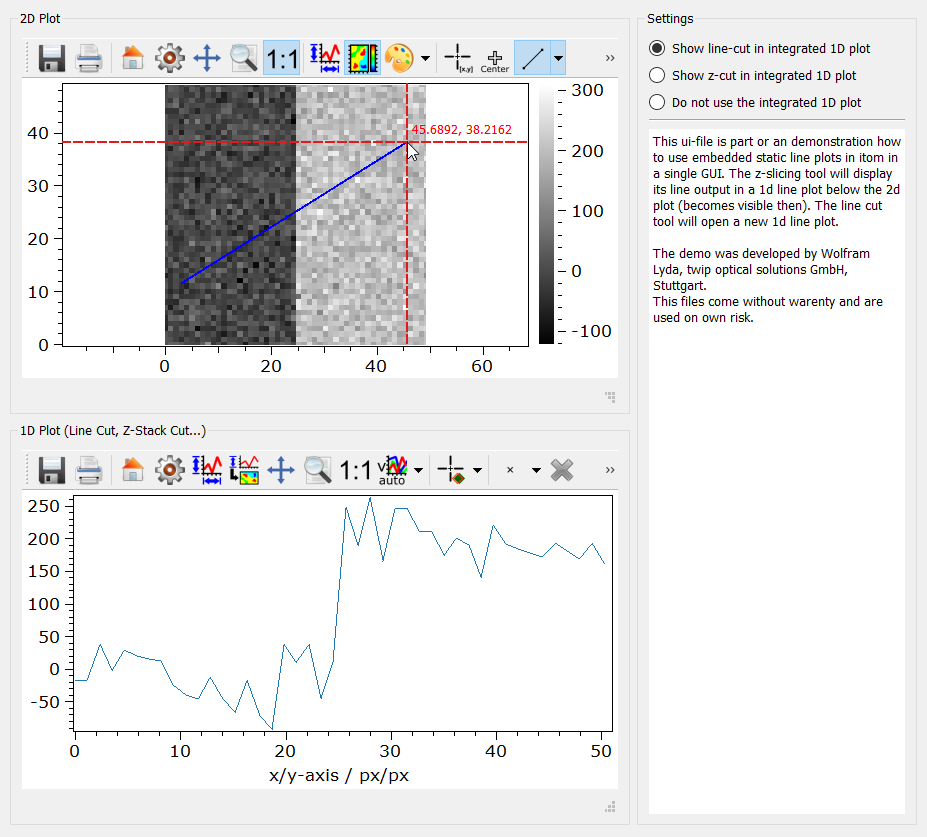

.. DO NOT EDIT.
.. THIS FILE WAS AUTOMATICALLY GENERATED BY SPHINX-GALLERY.
.. TO MAKE CHANGES, EDIT THE SOURCE PYTHON FILE:
.. "11_demos\ui\demo_embedded2DLinePlot.py"
.. LINE NUMBERS ARE GIVEN BELOW.

.. only:: html

    .. note::
        :class: sphx-glr-download-link-note

        Click :ref:`here <sphx_glr_download_11_demos_ui_demo_embedded2DLinePlot.py>`
        to download the full example code

.. rst-class:: sphx-glr-example-title

.. _sphx_glr_11_demos_ui_demo_embedded2DLinePlot.py:

Embedded plots
==============

This script shows how to use embedded static line plots in ``itom`` in a single GUI.
The z-slicing tool will display its line output in a ``1D`` line plot below the ``2D``
plot (becomes visible then). The line cut tool will open a new ``1D`` line plot.

The demo was developed by Wolfram Lyda, twip optical solutions GmbH, Stuttgart.
This files come without warenty and are used on own risk.

.. GENERATED FROM PYTHON SOURCE LINES 11-73

.. code-block:: default

    from itom import dataObject
    from itomUi import ItomUi
    from itom import ui

    class EmbeddedPlots(ItomUi):
        def __init__(self, dataObj: dataObject):

            uiFile = r"embedded2DwLinePlot.ui"
            ItomUi.__init__(
                self,
                uiFile,
                ui.TYPEWINDOW,
                childOfMainWindow=True,
                deleteOnClose=True,
            )

            self.gui.plot2D["source"] = dataObj

        def show(self, modalLevel=0):
            self.gui.show(modalLevel)

        @ItomUi.autoslot("bool")
        def on_radioNothing_toggled(self, checked: bool):
            if checked:
                self.gui.plot2D["lineCutPlotItem"] = None
                self.gui.plot2D["zSlicePlotItem"] = None
                self.gui.group1D["enabled"] = False
                self.gui.plot1D["source"] = dataObject()

        @ItomUi.autoslot("bool")
        def on_radioZCut_toggled(self, checked: bool):
            if checked:
                self.gui.plot2D["lineCutPlotItem"] = None
                self.gui.plot2D["zSlicePlotItem"] = self.gui.plot1D
                self.gui.group1D["enabled"] = True

        @ItomUi.autoslot("bool")
        def on_radioLineCut_toggled(self, checked: bool):
            if checked:
                # if the same plot is used for different sub-plots, invalidate one type at first
                # before you assign the new one
                self.gui.plot2D["zSlicePlotItem"] = None  # invalidating
                self.gui.plot2D["lineCutPlotItem"] = self.gui.plot1D  # assigning new one
                self.gui.group1D["enabled"] = True

    def createSampleObject():
        tempData = dataObject.randN([10, 50, 50], "float32") * 100
        for i in range(0, tempData.shape[0]):
            # tempData[i, :, :] += i - tempData.shape[0] / 20
            tempData[i, :, 25:50] += 200

        return tempData

    if __name__ == "__main__":
        modeID = 1  # use 0 for lateral slice example or 1 for zSlice example
        win = EmbeddedPlots(createSampleObject())
        win.show()

.. GENERATED FROM PYTHON SOURCE LINES 75-77

.. rst-class:: sphx-glr-timing

   **Total running time of the script:** ( 0 minutes  0.168 seconds)

.. _sphx_glr_download_11_demos_ui_demo_embedded2DLinePlot.py:

.. only:: html

  .. container:: sphx-glr-footer sphx-glr-footer-example

    .. container:: sphx-glr-download sphx-glr-download-python

      :download:`Download Python source code: demo_embedded2DLinePlot.py <demo_embedded2DLinePlot.py>`

    .. container:: sphx-glr-download sphx-glr-download-jupyter

      :download:`Download Jupyter notebook: demo_embedded2DLinePlot.ipynb <demo_embedded2DLinePlot.ipynb>`

.. only:: html

 .. rst-class:: sphx-glr-signature

    `Gallery generated by Sphinx-Gallery <https://sphinx-gallery.github.io>`_
