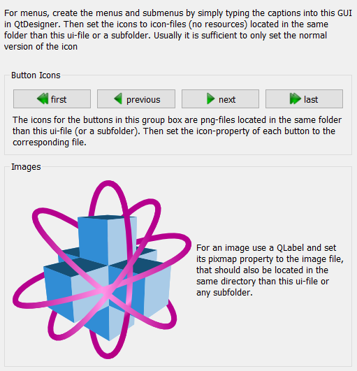

.. DO NOT EDIT.
.. THIS FILE WAS AUTOMATICALLY GENERATED BY SPHINX-GALLERY.
.. TO MAKE CHANGES, EDIT THE SOURCE PYTHON FILE:
.. "11_demos\ui\demo_gui_icons_images.py"
.. LINE NUMBERS ARE GIVEN BELOW.

.. only:: html

    .. note::
        :class: sphx-glr-download-link-note

        Click :ref:`here <sphx_glr_download_11_demos_ui_demo_gui_icons_images.py>`
        to download the full example code

.. rst-class:: sphx-glr-example-title

.. _sphx_glr_11_demos_ui_demo_gui_icons_images.py:

GUI icons as images
===============

In this example, all icons are loaded in the UI file
as relative path to the icons in this or the icons subfolder.

.. GENERATED FROM PYTHON SOURCE LINES 7-19

.. code-block:: default

    from itom import ui

    def closeGui():
        gui.hide()

    gui = ui("gui_icons_images.ui", type=ui.TYPEWINDOW)
    gui.actionClose.connect("triggered()", closeGui)
    gui.show()

.. GENERATED FROM PYTHON SOURCE LINES 21-23

.. rst-class:: sphx-glr-timing

   **Total running time of the script:** ( 0 minutes  0.016 seconds)

.. _sphx_glr_download_11_demos_ui_demo_gui_icons_images.py:

.. only:: html

  .. container:: sphx-glr-footer sphx-glr-footer-example

    .. container:: sphx-glr-download sphx-glr-download-python

      :download:`Download Python source code: demo_gui_icons_images.py <demo_gui_icons_images.py>`

    .. container:: sphx-glr-download sphx-glr-download-jupyter

      :download:`Download Jupyter notebook: demo_gui_icons_images.ipynb <demo_gui_icons_images.ipynb>`

.. only:: html

 .. rst-class:: sphx-glr-signature

    `Gallery generated by Sphinx-Gallery <https://sphinx-gallery.github.io>`_
