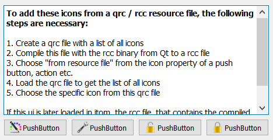

.. DO NOT EDIT.
.. THIS FILE WAS AUTOMATICALLY GENERATED BY SPHINX-GALLERY.
.. TO MAKE CHANGES, EDIT THE SOURCE PYTHON FILE:
.. "11_demos\ui\demo_gui_with_icons_from_resource.py"
.. LINE NUMBERS ARE GIVEN BELOW.

.. only:: html

    .. note::
        :class: sphx-glr-download-link-note

        Click :ref:`here <sphx_glr_download_11_demos_ui_demo_gui_with_icons_from_resource.py>`
        to download the full example code

.. rst-class:: sphx-glr-example-title

.. _sphx_glr_11_demos_ui_demo_gui_with_icons_from_resource.py:

GUI icons from resources
===================

Demostration to show a ui file, that contains icons from a qrc / rcc
resource file.

To create the ui file, you need at first the icons and the index
file qrc, that lists all the icons and gives them a unique path.

This qrc file then must be compiled together with the contained
icons to a rcc resource file using the rcc binary (shipped with itom).

For instance, to compile the qrc file in the icons subfolder to
a rcc file in this folder, navigate a command line to the icons
subfolder and apply

..code-block:: bat

    rcc -binary myIconResource.qrc -o ../myIconResource.rcc

Then, the resource file must be loaded first into itom before opening
the ui.

.. GENERATED FROM PYTHON SOURCE LINES 24-38

.. code-block:: default

    import itom
    from itom import ui

    # load the resource file, such that the contained icons can be used in future UIs
    itom.registerResource("myIconResource.rcc")

    # load the UI (open the UI in QtDesigner to see how the icons are assigned there)
    gui = ui("gui_with_icons_from_resource.ui", type=ui.TYPEWINDOW)

    # show the UI (no functionality at all)
    gui.show()

.. GENERATED FROM PYTHON SOURCE LINES 40-42

.. rst-class:: sphx-glr-timing

   **Total running time of the script:** ( 0 minutes  0.015 seconds)

.. _sphx_glr_download_11_demos_ui_demo_gui_with_icons_from_resource.py:

.. only:: html

  .. container:: sphx-glr-footer sphx-glr-footer-example

    .. container:: sphx-glr-download sphx-glr-download-python

      :download:`Download Python source code: demo_gui_with_icons_from_resource.py <demo_gui_with_icons_from_resource.py>`

    .. container:: sphx-glr-download sphx-glr-download-jupyter

      :download:`Download Jupyter notebook: demo_gui_with_icons_from_resource.ipynb <demo_gui_with_icons_from_resource.ipynb>`

.. only:: html

 .. rst-class:: sphx-glr-signature

    `Gallery generated by Sphinx-Gallery <https://sphinx-gallery.github.io>`_
