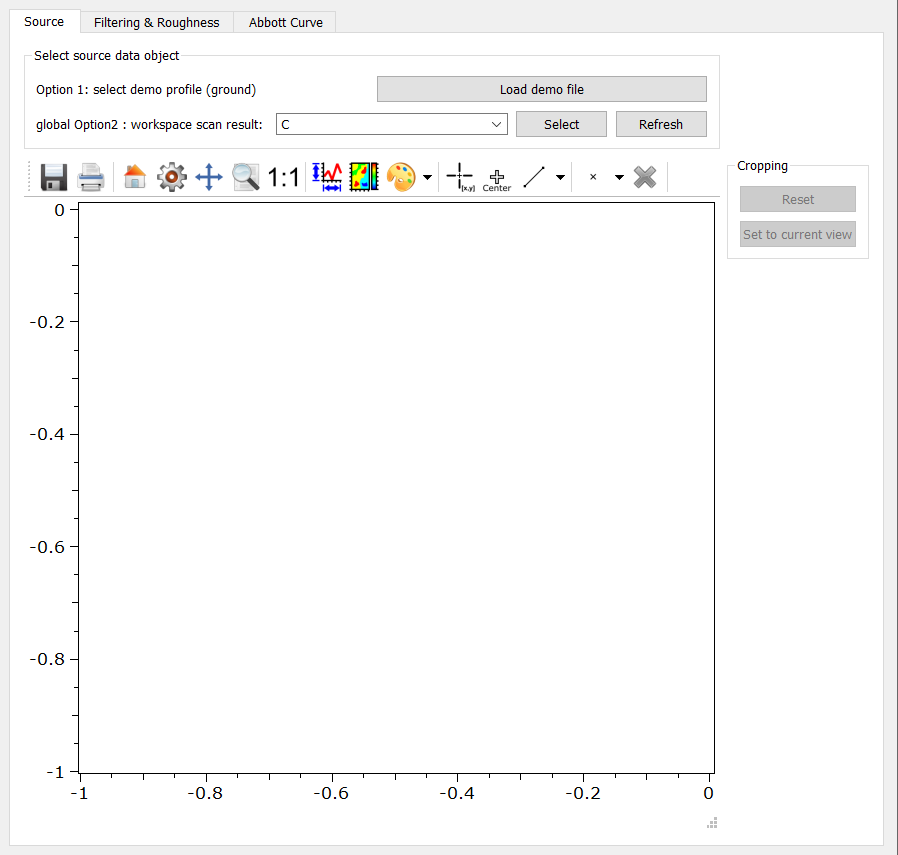

.. DO NOT EDIT.
.. THIS FILE WAS AUTOMATICALLY GENERATED BY SPHINX-GALLERY.
.. TO MAKE CHANGES, EDIT THE SOURCE PYTHON FILE:
.. "11_demos\ui\demo_roughnessEvaluator.py"
.. LINE NUMBERS ARE GIVEN BELOW.

.. only:: html

    .. note::
        :class: sphx-glr-download-link-note

        Click :ref:`here <sphx_glr_download_11_demos_ui_demo_roughnessEvaluator.py>`
        to download the full example code

.. rst-class:: sphx-glr-example-title

.. _sphx_glr_11_demos_ui_demo_roughnessEvaluator.py:

Roughness evaluation
================

This demo opens the Roughness Evaluator app.

This app is contained in the apps.roughnessEvaluator module
of the itom-packages folder of ``itom``. 
The usage of this demo requires the algorithm plugin ``Roughness``.

.. GENERATED FROM PYTHON SOURCE LINES 10-22

.. code-block:: default

    from apps.roughnessEvaluator import profile_roughness  # from itom-packages
    from itom import pluginLoaded

    if pluginLoaded("Roughness") == False:
        raise RuntimeError("The algorithm plugin 'Roughness' is not available")

    profile_roughness = profile_roughness.ProfileRoughness()
    profile_roughness.show()

.. GENERATED FROM PYTHON SOURCE LINES 24-25

.. rst-class:: sphx-glr-timing

   **Total running time of the script:** ( 0 minutes  0.134 seconds)

.. _sphx_glr_download_11_demos_ui_demo_roughnessEvaluator.py:

.. only:: html

  .. container:: sphx-glr-footer sphx-glr-footer-example

    .. container:: sphx-glr-download sphx-glr-download-python

      :download:`Download Python source code: demo_roughnessEvaluator.py <demo_roughnessEvaluator.py>`

    .. container:: sphx-glr-download sphx-glr-download-jupyter

      :download:`Download Jupyter notebook: demo_roughnessEvaluator.ipynb <demo_roughnessEvaluator.ipynb>`

.. only:: html

 .. rst-class:: sphx-glr-signature

    `Gallery generated by Sphinx-Gallery <https://sphinx-gallery.github.io>`_
