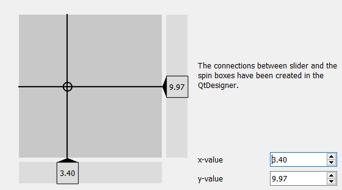

.. DO NOT EDIT.
.. THIS FILE WAS AUTOMATICALLY GENERATED BY SPHINX-GALLERY.
.. TO MAKE CHANGES, EDIT THE SOURCE PYTHON FILE:
.. "11_demos\ui\demo_slider2D.py"
.. LINE NUMBERS ARE GIVEN BELOW.

.. only:: html

    .. note::
        :class: sphx-glr-download-link-note

        Click :ref:`here <sphx_glr_download_11_demos_ui_demo_slider2D.py>`
        to download the full example code

.. rst-class:: sphx-glr-example-title

.. _sphx_glr_11_demos_ui_demo_slider2D.py:

Slider 2D
============

.. GENERATED FROM PYTHON SOURCE LINES 5-11

.. code-block:: default

    from itom import ui

    gui = ui("slider2DDemo.ui", ui.TYPEWINDOW, deleteOnClose = True)

    gui.show()

.. GENERATED FROM PYTHON SOURCE LINES 13-15

.. rst-class:: sphx-glr-timing

   **Total running time of the script:** ( 0 minutes  0.017 seconds)

.. _sphx_glr_download_11_demos_ui_demo_slider2D.py:

.. only:: html

  .. container:: sphx-glr-footer sphx-glr-footer-example

    .. container:: sphx-glr-download sphx-glr-download-python

      :download:`Download Python source code: demo_slider2D.py <demo_slider2D.py>`

    .. container:: sphx-glr-download sphx-glr-download-jupyter

      :download:`Download Jupyter notebook: demo_slider2D.ipynb <demo_slider2D.ipynb>`

.. only:: html

 .. rst-class:: sphx-glr-signature

    `Gallery generated by Sphinx-Gallery <https://sphinx-gallery.github.io>`_
