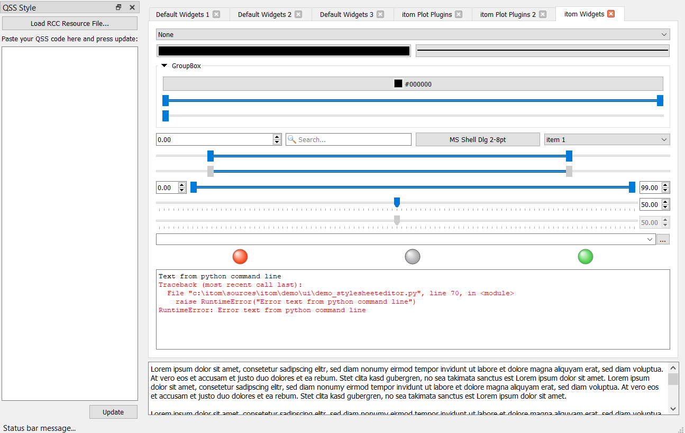

.. DO NOT EDIT.
.. THIS FILE WAS AUTOMATICALLY GENERATED BY SPHINX-GALLERY.
.. TO MAKE CHANGES, EDIT THE SOURCE PYTHON FILE:
.. "11_demos\ui\demo_stylesheetEditor.py"
.. LINE NUMBERS ARE GIVEN BELOW.

.. only:: html

    .. note::
        :class: sphx-glr-download-link-note

        Click :ref:`here <sphx_glr_download_11_demos_ui_demo_stylesheetEditor.py>`
        to download the full example code

.. rst-class:: sphx-glr-example-title

.. _sphx_glr_11_demos_ui_demo_stylesheetEditor.py:

Stylesheet editor
=============

GUI for live coding of a Qt stylesheet document.

This GUI can be used to live adjust a ``qss`` stylesheet
and directly see the changes for many widgets (Qt and itom
specific).

Usage:

Execute this script to load the demo GUI. This GUI consists
of a stylesheet editor widget in a left toolbar and many
widgets, that are often used within ``itom``.

If you stylesheet depends on icons within a rcc resource file,
click the "load resources" button to load icons from a rcc
resource file, first. Then paste your desired stylesheet into
the editor. Whenever you want to update the GUI click the update button.

.. GENERATED FROM PYTHON SOURCE LINES 21-74

.. code-block:: default

    from itomUi import (
        ItomUi,
    )  # import the base class ItomUi from the module itomUi in the itom-packages subfolder
    from itom import ui
    from itom import dataObject

    class StyleSheetEditor(ItomUi):  # StyleCreator is inherited from ItomUi
        def __init__(self):  # constructor

            # call constructor of ItomUi like it would be the constructor of the class itom.ui:
            ItomUi.__init__(self, "stylesheetEditor.ui", ui.TYPEWINDOW)

            # initialize some plots
            self.gui.itom1DQwtPlot["source"] = dataObject.rand([4, 500], "uint16")

            self.gui.itom2dQwtPlot["source"] = dataObject.randN([100, 512, 768], "uint8")
            self.gui.itom2dQwtPlot["overlayImage"] = dataObject.rand([512, 768], "float32")
            self.gui.itom2dQwtPlot_2["source"] = dataObject.randN([100, 512, 768], "uint8")
            self.gui.itom2dQwtPlot_2["overlayImage"] = dataObject.randN([512, 768], "float32")

            self.gui.call("statusBar").call("showMessage", "Status bar message...")

        @ItomUi.autoslot("")  # the signal is clicked()
        def on_btnUpdate_clicked(self):
            # apply the current content of the text field to the stylesheet
            self.gui["styleSheet"] = self.gui.txtStyle["plainText"]

        @ItomUi.autoslot("")
        def on_btnLoadRcc_clicked(self):
            rccFile = ui.getOpenFileName(
                "RCC Resource File",
                filters="RCC Resource File (*.rcc)",
                parent=self.gui,
            )

            if rccFile is not None:
                unregisterResource(rccFile)

                if not registerResource(rccFile):
                    ui.msgCritical("Error", f"Could not load resource file '{rccFile}'")

    hmi = StyleSheetEditor()
    hmi.gui.show()

    # print("Text from python command line")
    # raise RuntimeError("Error text from python command line")
    # itom.clc()

.. GENERATED FROM PYTHON SOURCE LINES 76-78

.. rst-class:: sphx-glr-timing

   **Total running time of the script:** ( 0 minutes  0.427 seconds)

.. _sphx_glr_download_11_demos_ui_demo_stylesheetEditor.py:

.. only:: html

  .. container:: sphx-glr-footer sphx-glr-footer-example

    .. container:: sphx-glr-download sphx-glr-download-python

      :download:`Download Python source code: demo_stylesheetEditor.py <demo_stylesheetEditor.py>`

    .. container:: sphx-glr-download sphx-glr-download-jupyter

      :download:`Download Jupyter notebook: demo_stylesheetEditor.ipynb <demo_stylesheetEditor.ipynb>`

.. only:: html

 .. rst-class:: sphx-glr-signature

    `Gallery generated by Sphinx-Gallery <https://sphinx-gallery.github.io>`_
