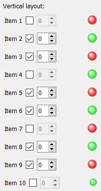

.. DO NOT EDIT.
.. THIS FILE WAS AUTOMATICALLY GENERATED BY SPHINX-GALLERY.
.. TO MAKE CHANGES, EDIT THE SOURCE PYTHON FILE:
.. "11_demos\ui_dynamicLayout\demo_mainForm.py"
.. LINE NUMBERS ARE GIVEN BELOW.

.. only:: html

    .. note::
        :class: sphx-glr-download-link-note

        Click :ref:`here <sphx_glr_download_11_demos_ui_dynamicLayout_demo_mainForm.py>`
        to download the full example code

.. rst-class:: sphx-glr-example-title

.. _sphx_glr_11_demos_ui_dynamicLayout_demo_mainForm.py:

Main form
==========

.. GENERATED FROM PYTHON SOURCE LINES 5-45

.. code-block:: default

    from itom import ui
    from itom import uiItem

    gui: ui = ui("mainForm.ui", type=ui.TYPEWINDOW)
    vlayout: uiItem = gui.vlayout

    # add 10 items from item.ui
    for i in range(0, 10):
        # all object names of the added widget including
        # its child widgets and layouts are modified by
        # the following suffix:
        objNameSuffix: str = f"_{i}"
    
        # ctrlItem is the reference to the newly added outer widget
        ctrlItem: uiItem = vlayout.call("addItemFromUiFile", "item.ui", objNameSuffix)
    
        # print the name of all newly added child widgets
        print(ctrlItem.children())
    
        # access the newly added label
        lbl: uiItem = ctrlItem.getChild("label" + objNameSuffix)
        lbl["text"] = f"Item {i+1}"
    
        # alternate the check state of the LedStatus
        led: uiItem = ctrlItem.getChild("led" + objNameSuffix)
        led["checked"] = i % 2
    
        # change the checkstate of some checkboxes
        # the enable state of the corresponding spinboxes
        # is automatically changed due to the signal/slot 
        # connection, created in QtDesigner.
        checkbox: uiItem = ctrlItem.getChild("checkBox" + objNameSuffix)
        checkbox["checked"] = i % 3

    # show the gui
    gui.show()

.. rst-class:: sphx-glr-script-out

 Out:

 .. code-block:: none

    {'horizontalLayout_0': 'QHBoxLayout', 'label_0': 'QLabel', 'checkBox_0': 'QCheckBox', 'spinBox_0': 'QSpinBox', 'led_0': 'StatusLed'}
    {'horizontalLayout_1': 'QHBoxLayout', 'label_1': 'QLabel', 'checkBox_1': 'QCheckBox', 'spinBox_1': 'QSpinBox', 'led_1': 'StatusLed'}
    {'horizontalLayout_2': 'QHBoxLayout', 'label_2': 'QLabel', 'checkBox_2': 'QCheckBox', 'spinBox_2': 'QSpinBox', 'led_2': 'StatusLed'}
    {'horizontalLayout_3': 'QHBoxLayout', 'label_3': 'QLabel', 'checkBox_3': 'QCheckBox', 'spinBox_3': 'QSpinBox', 'led_3': 'StatusLed'}
    {'horizontalLayout_4': 'QHBoxLayout', 'label_4': 'QLabel', 'checkBox_4': 'QCheckBox', 'spinBox_4': 'QSpinBox', 'led_4': 'StatusLed'}
    {'horizontalLayout_5': 'QHBoxLayout', 'label_5': 'QLabel', 'checkBox_5': 'QCheckBox', 'spinBox_5': 'QSpinBox', 'led_5': 'StatusLed'}
    {'horizontalLayout_6': 'QHBoxLayout', 'label_6': 'QLabel', 'checkBox_6': 'QCheckBox', 'spinBox_6': 'QSpinBox', 'led_6': 'StatusLed'}
    {'horizontalLayout_7': 'QHBoxLayout', 'label_7': 'QLabel', 'checkBox_7': 'QCheckBox', 'spinBox_7': 'QSpinBox', 'led_7': 'StatusLed'}
    {'horizontalLayout_8': 'QHBoxLayout', 'label_8': 'QLabel', 'checkBox_8': 'QCheckBox', 'spinBox_8': 'QSpinBox', 'led_8': 'StatusLed'}
    {'horizontalLayout_9': 'QHBoxLayout', 'label_9': 'QLabel', 'checkBox_9': 'QCheckBox', 'spinBox_9': 'QSpinBox', 'led_9': 'StatusLed'}

.. GENERATED FROM PYTHON SOURCE LINES 47-48

.. rst-class:: sphx-glr-timing

   **Total running time of the script:** ( 0 minutes  0.016 seconds)

.. _sphx_glr_download_11_demos_ui_dynamicLayout_demo_mainForm.py:

.. only:: html

  .. container:: sphx-glr-footer sphx-glr-footer-example

    .. container:: sphx-glr-download sphx-glr-download-python

      :download:`Download Python source code: demo_mainForm.py <demo_mainForm.py>`

    .. container:: sphx-glr-download sphx-glr-download-jupyter

      :download:`Download Jupyter notebook: demo_mainForm.ipynb <demo_mainForm.ipynb>`

.. only:: html

 .. rst-class:: sphx-glr-signature

    `Gallery generated by Sphinx-Gallery <https://sphinx-gallery.github.io>`_
