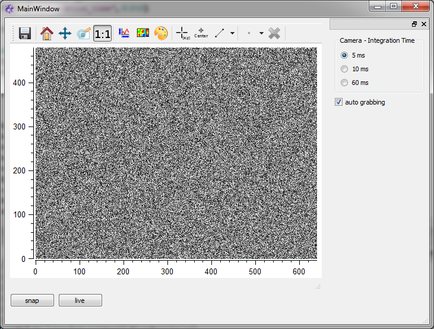

.. include:: /include/global.inc

.. _demoCameraWindow:

Discussion of cameraWindow.py
###################################

This section provides additional explanation to the demo script *cameraWindow.py* provided with |itom|.
The demo script shows integrated use of basic grabber functionality. Additional informations on how to use grabbers is found in :ref:`getStartGrabber`.

Purpose
********
*cameraWindow.py*, along with the ui file *cameraWindow.ui* defines a set of functions, connects them to GUI buttons and hereby provides the functionality to view live images, change integration times, toggle autograbbing and take snapshots.

Some sections are discussed in more detail than others. However, the complete python code is printed on the bottom of this page.

GUI overview
***************

The GUI is build in *QT designer*. It basically consist of an *Itom2dQwtPlot* widget, two *QPushButtons* for showing live images or taking snapshots, three QRadioButtons for different integration times and a QCheckBox for toggling autograbbing.

Script overview
***************
Init grabber
============
The script uses a *dummyGrabber*, assigned to handle *cam*. Every other 2D grabber may be used instead.

.. code-block:: python
    :lineno-start: 2
    
    cam = dataIO("DummyGrabber")

Create GUI instance
===================
Next, an GUI instance named *win* is opend using the file *cameraWindow.ui*. As ui type, *ui.TYPEWINDOW* is chosen, which is the simplest type. Keyword *childOfMainWindow = True* sets the GUI to be a child of our main GUI.

.. code-block:: python
    :lineno-start: 4
    
    win = ui("cameraWindow.ui", ui.TYPEWINDOW, childOfMainWindow = True)

Define functions
================
Now, four functions are defined, which will later be connected to GUI items and provide their functionality.
    
Change integration time
~~~~~~~~~~~~~~~~~~~~~~~
The funtion *integrationTime_changed* checks the current state of the 3 radio buttons indicating the desired integration time and sets the correspondent value using the the plugin parameter *integration_time*.
It will later be connected to click-events of the radio buttons.

.. code-block:: python
    :lineno-start: 6

    def integrationTime_changed():
        if(win.radioInt1["checked"]):
            cam.setParam("integration_time", 0.005)
        elif(win.radioInt2["checked"]):
            cam.setParam("integration_time", 0.010)
        else:
            cam.setParam("integration_time", 0.060)

Toggle autograbbing
~~~~~~~~~~~~~~~~~~~
*autoGrabbing_changed* is to be connected to change events of the checkbox. It toggles autograbbing according the check status.

.. code-block:: python
    :lineno-start: 14
    
    def autoGrabbing_changed(checked):
        if(checked):
            cam.enableAutoGrabbing()
        else:
            cam.disableAutoGrabbing()

Take a snapshot
~~~~~~~~~~~~~~~
The function *snap* will be connected to the snap push button, It triggers and displays a snapshot. 
This requires multiple steps:

* Create a dataObject
* Start the grabber
* Acquire image
* Require image
* Provide snapshot for display
* Stop the grabber

Additionally, this function checks whether autograbbing is disabled or not, pauses it if neccessary and restores the initial status after taking the snapshot.

.. code-block:: python
    :lineno-start: 20
    
    def snap():
        d = dataObject()
        cam.startDevice()
        autoGrabbingStatus = cam.getAutoGrabbing()
        cam.disableAutoGrabbing()
        cam.acquire()
        cam.getVal(d)
        win.plot["source"] = d
        if(autoGrabbingStatus):
            cam.enableAutoGrabbing()
        cam.stopDevice()

Live plot
~~~~~~~~~
*live* provides a live image of the grabber for the plot window. It will be called by pressing the live push button.
 
.. code-block:: python
    :lineno-start: 32
    
    def live():
        win.plot["camera"] = cam
        

Wire the GUI
============
Now that all functions are defined, the signals of the GUI items have to be wired to their respectice function's slots: 
* Clicking on one the radio buttons will call *integrationTime_changed*
* Clicking the snapshot button will clal *snap*
* Clicking the live button will call *live*
* Clicking the autograbbing check box will call *autoGrabbing_changed* and submit the actual check status

.. code-block:: python
    :lineno-start: 36
    
    win.radioInt1.connect("clicked()", integrationTime_changed)
    win.radioInt2.connect("clicked()", integrationTime_changed)
    win.radioInt3.connect("clicked()", integrationTime_changed)

    win.btnSnap.connect("clicked()", snap)
    win.btnLive.connect("clicked()", live)

    win.checkAutoGrabbing.connect("clicked(bool)", autoGrabbing_changed)
    

Init values for GUI elements
============================
As init values, we check for the current autograbbing status and select the 0.005s radio button.

.. code-block:: python
    :lineno-start: 46
    
    win.checkAutoGrabbing["checked"] = cam.getAutoGrabbing()
    win.radioInt1["checked"] = True
    
Let the show begin
==================
Now, all we have left to do is make the GUI visible. Parameter 0 indicates, that our GUI will be modal.

.. code-block:: python
    :lineno-start: 49
    
    win.show(0)

Complete script
***************
.. code-block:: python
    :linenos:
    
    #open dummy camera
    cam = dataIO("DummyGrabber")

    win = ui("cameraWindow.ui", ui.TYPEWINDOW, childOfMainWindow = True)

    def integrationTime_changed():
        if(win.radioInt1["checked"]):
            cam.setParam("integration_time", 0.005)
        elif(win.radioInt2["checked"]):
            cam.setParam("integration_time", 0.010)
        else:
            cam.setParam("integration_time", 0.060)

    def autoGrabbing_changed(checked):
        if(checked):
            cam.enableAutoGrabbing()
        else:
            cam.disableAutoGrabbing()

    def snap():
        d = dataObject()
        cam.startDevice()
        autoGrabbingStatus = cam.getAutoGrabbing()
        cam.disableAutoGrabbing()
        cam.acquire()
        cam.getVal(d)
        win.plot["source"] = d
        if(autoGrabbingStatus):
            cam.enableAutoGrabbing()
        cam.stopDevice()

    def live():
        win.plot["camera"] = cam

    #initialize all signal/slots
    win.radioInt1.connect("clicked()", integrationTime_changed)
    win.radioInt2.connect("clicked()", integrationTime_changed)
    win.radioInt3.connect("clicked()", integrationTime_changed)

    win.btnSnap.connect("clicked()", snap)
    win.btnLive.connect("clicked()", live)

    win.checkAutoGrabbing.connect("clicked(bool)", autoGrabbing_changed)

    #initialize gui elements
    win.checkAutoGrabbing["checked"] = cam.getAutoGrabbing()
    win.radioInt1["checked"] = True

    win.show(0)
    
    