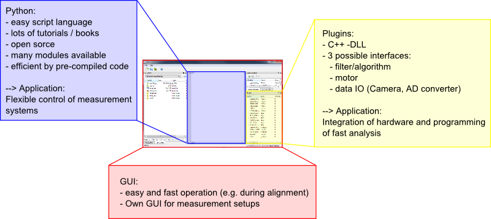

.. include:: ../include/global.inc

About itom
****************

What is |itom|?
===================

|itom| is a lab automation and measurement software developed and provided by ITO (Institut for Technical Optics, University Stuttgart, Germany).
This software has been designed with an emphasis on developping and running optical systems, however it can be used for other systems, too.
|itom| should be a versatile tool for building the control software for any measurement setup which should be highly adaptible to different
environments and settings. Therefore it is necessary to have a powerful and fast core-program, to integrate a scripting language in order to
easily modify and transfer code blocks from one part of the program to another and to provide a simple and unitary interface for controlling
external hardware components. Nevertheless, |itom| should not only be used for controlling hardware components, butcan also use it for analysing 
or processing your acquired data. Finally, |itom| must be considered as an open source lab automation software whose functionality lie somewhere
in the middle between commercial software packages like Matlab or Labview.

The following table shows in which way base requirements to such a software system have influenced the choice of components during the designing
process:

+---------------------------------------------------------------+---------------------------+
| What we wanted                                                | How we did it             |
+===============================================================+===========================+
| fast software, development of fast algorithms                 | C++                       |
+---------------------------------------------------------------+---------------------------+
| modern multi-platform GUI                                     | Qt-Framework              |
+---------------------------------------------------------------+---------------------------+
| easy integration of different hardware (camera, actuator,...) | Plugin system             |
+---------------------------------------------------------------+---------------------------+
| fast, robust and easy-to-learn scriptingnguage                | Python                    |
+---------------------------------------------------------------+---------------------------+

In the figure below you can see the three columns on which |itom| is based:

1. Python
2. Plugins
3. GUI

Based on this three columns you can control measurement applications, basic setups or scripted image processing.

To learn more about how to control |itom| via script language or the GUI proceed with :ref:`gettingStarted`.

**TODO**: Add the basic idea and structure of ITOM and explain it in more detail than this above

About us
===================

| Institut für Technische Optik
| Universität Stuttgart
| Pfaffenwaldring 9
| 70569 Stuttgart
|
| **Report issues at:**
| https://bitbucket.org/itom/itom/issues

This help has been built for itom-version |version| (SVN/Git-revision |release|).

Licensing
===================

itom Licensing
~~~~~~~~~~~~~~~

The core components and the main application of |itom| is covered by **GNU Library General Public Licence** (GNU LGPL). All components belonging to
the SDK of |itom| (e.g. *dataObject*, *pointCloud*, *addInInterface*,...) are additionally covered by **itom exception**. The main idea of this exception is
to allow other libraries (e.g. plugins) to include and link agains components of |itom| SDK independent on the specific license model of each "other" library.
All files belonging to the |itom| SDK are included in the folder **SDK** that is shipped with any setup or included in the build directory (when build from sources).

The full text license of **LGPL** and **itom exception** is also included as file *COPYING* in the source distributions and setups.

All plugins and designer-plugins that can be integrated in |itom| can have their own licensing. Therefore the user is referred to the specific licensing documents or
statements of each external library (plugin).

itom Exception
~~~~~~~~~~~~~~

All components (source files) which are part of |itom| SDK are not only covered by the LPGL license but also by the *itom Exception*, that provides further grants and rights
for using these components::

    ITO LGPL Exception version 1.0
    ------------------------------

    Additional rights granted beyond the LGPL (the "Exception").

    As a special exception to the terms and conditions of version 2.0 of the LGPL,
    ITO hereby grants you the rights described below, provided you agree to
    the terms and conditions in this Exception, including its obligations and
    restrictions on use.

    Nothing in this Exception gives you or anyone else the right to change the
    licensing terms of the itom Software.

    Below, "Licensed Software" shall refer to the software licensed under the LGPL
    and this exception.

    1) The right to use Open Source Licenses not compatible with the GNU
    Library General Public License: Your software (hereafter referred to as "Your
    Software") may import the Licensed Software and/or distribute binaries of Your
    Software that imports the Licensed Software.

    2) The right to link non-Open Source applications with pre-installed versions of
    the Licensed Software: You may link applications with binary pre-installed
    versions of the Licensed Software.

    3) The right to subclass from classes of the licensed software: Classes that are 
    subclassed from classes of the licensed software are not considered to be
    constituting derivative work and therefore the author of such classes does 
    not need to provide source code for this classes.

Package Licences
~~~~~~~~~~~~~~~~~~~~~

A standard distribution of |itom| links to the following third-party library (shared linkage):

- `OpenCV <http://opencv.willowgarage.com/wiki/>`_ by Willow Garage under BSD-license

- `Point Cload Library <http://www.pointclouds.org/>`_ by Willow Garage under BSD-license

- `QT-Framework <http://qt.nokia.com/>`_ by Nokia under LGPL.

- `QScintilla <http://www.riverbankcomputing.co.uk/software/qscintilla/intro>`_ in by Riverbank Computed Limited under GPL with additional exceptions.

- QScintilla is a port to Qt of Neil Hodgson's `Scintilla <http://www.scintilla.org/>`_ C++ editor control.

- `Python <http://www.python.org/>`_ by Python Software Foundation unter Python-License (similar to BSD license).

- Python-package `NumPy <http://numpy.scipy.org/>`_ under BSD compatible license.

- Some classes concerning the interaction between |Qt| and |python| have been inspired by `PythonQt <http://pythonqt.sourceforge.net/>`_ under LGPL license.

Additionally, the following third-party libraries are also used by common plugins or common configurations of |itom|:

- `SciPy <http://www.scipy.org/>`_ under BSD compatible license.

- `MatplotLib <http://matplotlib.sourceforge.net/>`_ under BSD compatible license.

- `QwtPlot <http://qwt.sourceforge.net/>`_ by Uwe Rathmann and Josef Wilgen under LGPL with additional `exceptions <http://qwt.sourceforge.net/qwtlicense.html>`_.

- QPropertyEditor under LGPL

- Google test framework by Google under New BSD-license

Other plugins may also contain further third party packages, e.g.:

- NVidia CUDA SDK by NVidia under NVidia CUDA SDK License

- `OpenMP <http://openmp.org/wp/>`_

- Hardware dependent third party drivers and SDKs with different license models or terms of conditions than the main itom-programm. So please check the specific plugin-license. 