.. include:: ../include/global.inc

Installation using the setup.exe
=================================

For your convenience you can download an installer package from **\\\\Obelix\\software\\m\\ITOM\\Setup**. 

After the installation you should copy the folders **lib** and **plugins** in the installation directory for having the standard plugins available.

In the course of the setup, the following parts will be installed along with |itom|:

1. Microsoft Visual C++ 2010 Runtime Libraries (x86)
2. Python 3.2.1
3. numpy
4. ScyPy

In the following we will guide you through the installation setup with a couple of screenshots (German system):

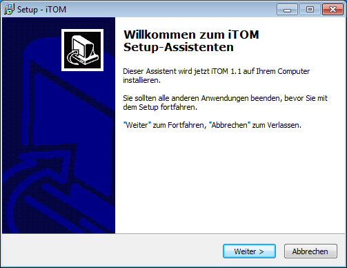
    
    Start screen

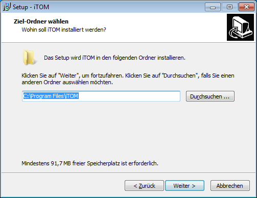
    
    Choose where to install |itom|

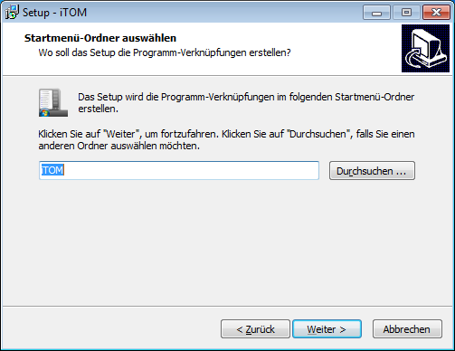
    
    Name the start menu entry

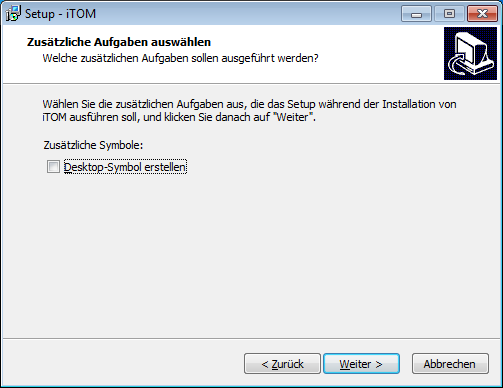
    
    Tick the box if you want a fancy |itom| shortcut on your desktop

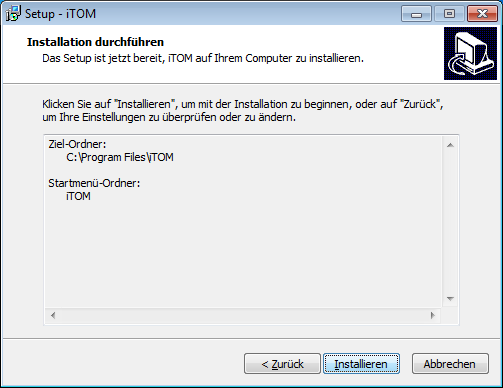
    
    Start the installation

.. figure:: images/itom_install/install06.png
    :alt: alternate text
    
    Install the Microsoft Visual C++ 2010 Runtime Libraries.

.. figure:: images/itom_install/install07.png
    :alt: alternate text
    
    You successfully installed the Runtime Libraries. Continue.

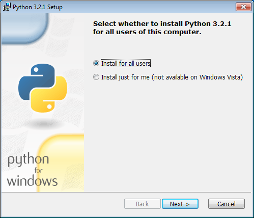
    
    Install Python 3.2.1 for the actual user or for all users.

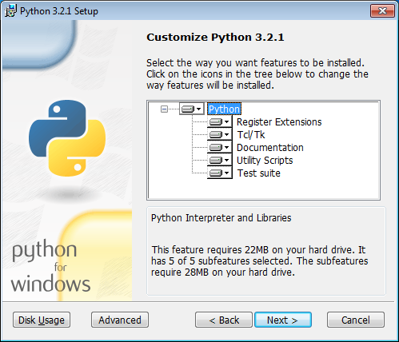
    
    Customize your Python installation. We recommend leaving everything as is.

.. figure:: images/itom_install/install11.png
    :alt: alternate text
    
    You've completed the Python installation as well. We're getting getting closer.

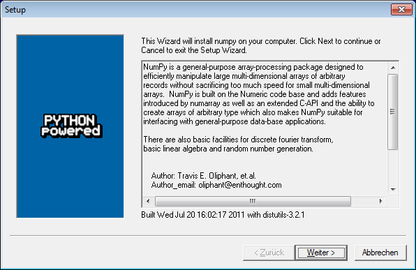
    
    Continue with the installation of NumPy.

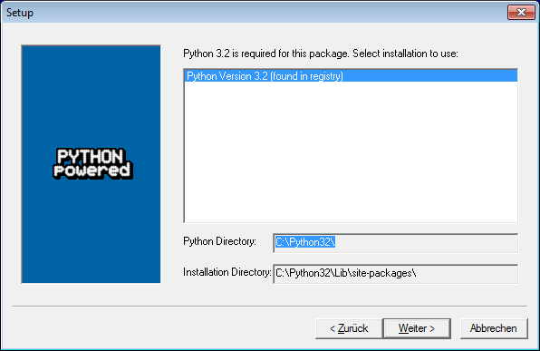
    
    If you haven't messed up anything so far you should be able to continue right away.

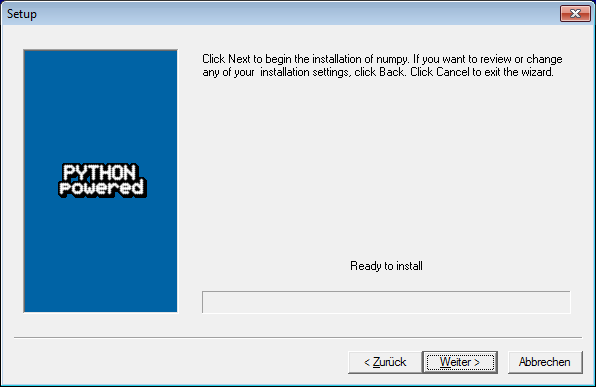
    
    One more click to start the NumPy installation.

.. figure:: images/itom_install/install15.png
    :alt: alternate text
    
    Confirm that NumPy was successfully installed.

.. figure:: images/itom_install/install16.png
    :alt: alternate text
    
    Eventually, we have to install ScyPy, press "Next" to continue

    
    Continue.

    
    Yes, we are ready to install. Proceed please.

.. figure:: images/itom_install/install19.png
    :alt: alternate text
    
    Another confirmation, now ScyPy has been installed successfully.

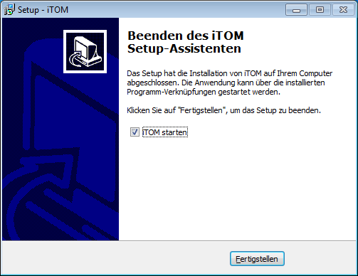
    
    Nice, the installation is completed. By now you should be so excited to finally use |itom| that you should check the box in this dialog.

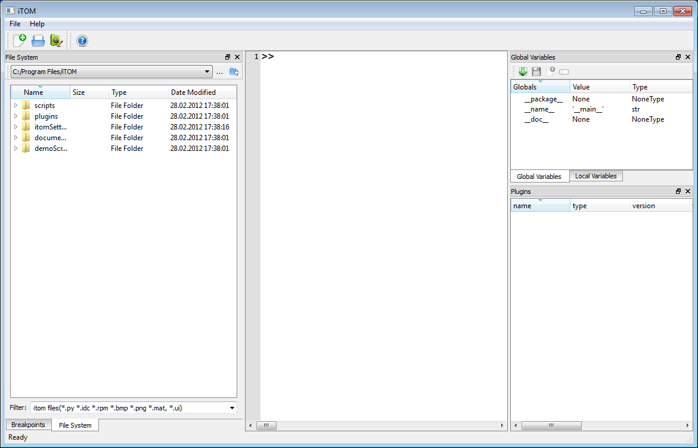
	
    This is |itom|!

