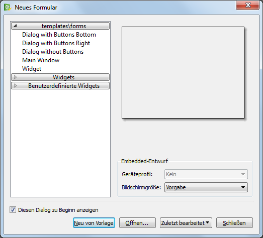
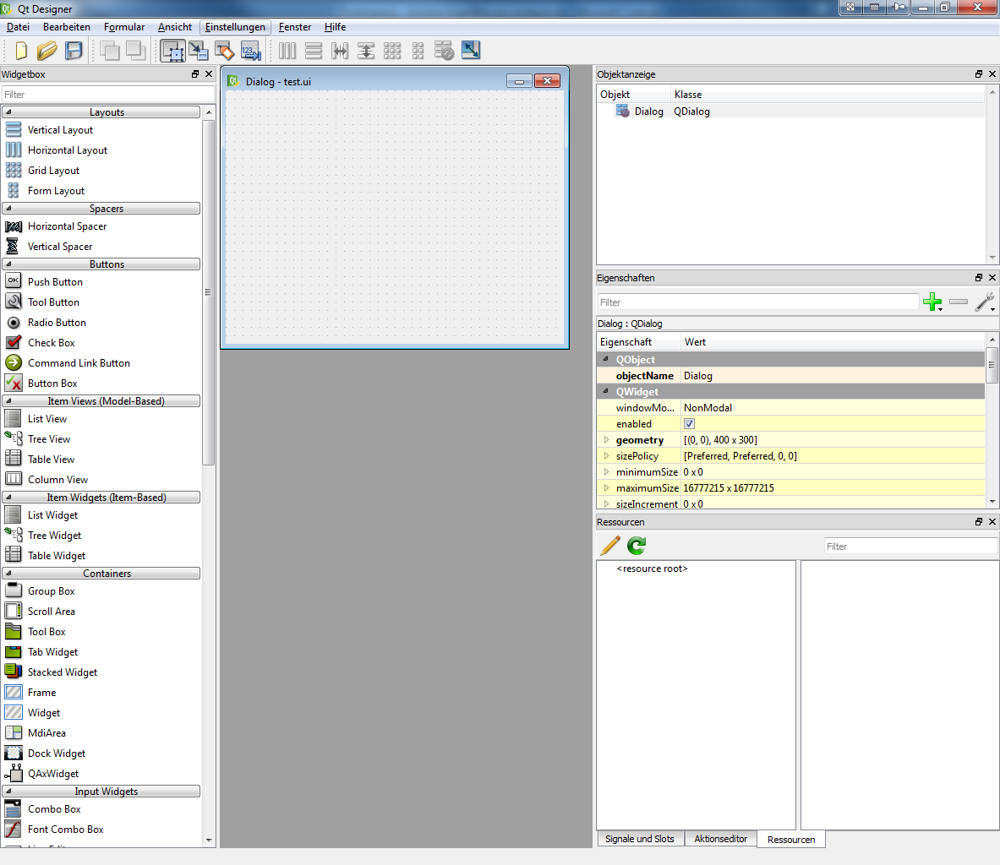
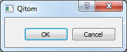
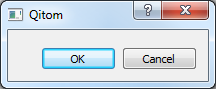
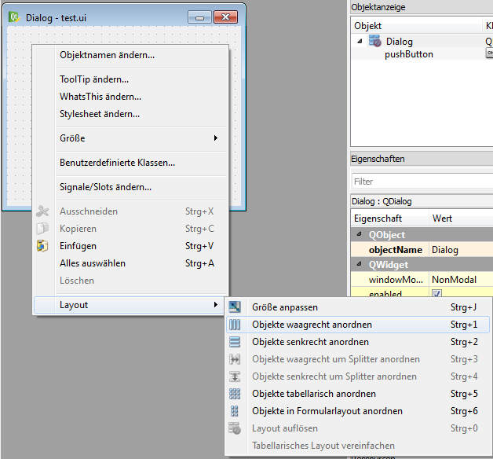
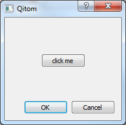
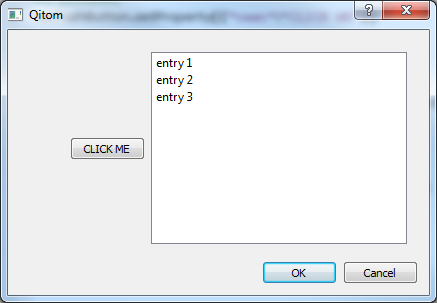
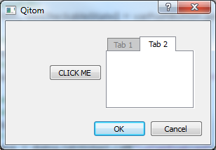

.. include:: ../include/global.inc

Creating advanced dialogs and windows  
*************************************

With |itom| it is not only possible to add menus and toolbar elements to the main GUI of |itom| or to use the default set of input and message boxes, but
it is also possible to create own user interfaces. These interfaces are designed by help of a WYSIWYG ("what you see is what you get") design tool (Qt Designer).
The logic behind the surfaces is then scripted using |python|. Therefore it is possible to change the appearance of control elements at runtime or to connect
a signal, emitted when for instance clicking on a button, with a user-defined python method.

In this chaper, the creation of such user interfaces is explained.

Qt Designer
==============

| The Qt Designer can be used to create a GUI for interaction with the |itom| software.
| For details see the Qt Designer documentation under http://qt-project.org/doc/qt-4.8/designer-manual.html

In order to start the **Qt Designer**, click on the corresponding icon in the toolbar of |itom|:

.. figure:: images_userGUI/mainsymbols2.png

or double-click on a corresponding **ui**-file in the file system widget of |itom|. In the first case, **Qt Designer** shows an initialization dialog, where you
can choose the base type of the user interface you want to create.

In principle you have the possibility to choose between three different base layouts:

1. **Dialog**. A Dialog is usually displayed on top of the main window and only has got one close-button in its title bar. Often, dialogs are used for configuration dialogs where the
user finally closes the dialog using one of the standard buttons (OK, Cancel, Apply...) in order to confirm or reject the current changes in the dialog. A dialog cannot have its
own toolbar, menu or status bar.
2. **Main Window**. A main window is a fully equipped main window, which can be minimized, maximized, can have toolbars, menus and a status bar. Therefore it is recommended to use this
type of user interface for the main window of your measurement system. Like a dialog, it is possible to show the main window on top of |itom| (as sub-window of |itom|) or as independent
window, which has its own icon in the windows tray.
3. **Widget**. A widget is the base class for all control elements provided by |Qt|. Therefore a widget does not have any title bar or windows frame. Nevertheless you can choose a widget
for your user interface, since |itom| provides the possibility to stack this widget into a default dialog which can optionally show some default buttons on the right side or at the
bottom of the dialog. This is the easiest way the generate a configuration dialog in |itom|, since you do not need to script the necessary methods handling clicks on one of these buttons.
In this case, |itom| automatically gets full information about the close status and type of closing of the dialog (accepted, rejected...).

After having chosen one of these base layouts (types), your surface is displayed in the middle of the **Qt Designer** and you can start to drag elements from the widget library
on your surface. If the **Qt Designer** is started from |itom| you will even find a section **ITOM Plugins** in the library list, which contains all loadable designer plugins that are
provided by |itom| and can also be placed on your surface. The choice of these plugins depend on the designer plugins that are currently available in your installation of |itom|.

.. figure:: images_userGUI/qtdesigner1.png

After having placed one widget on the canvas, you will see its properties in the property toolbox of **Qt Designer**. Every widget has the common property **objectName**. If you assign
a unique object name to any of your control elements, it is possible to access and manipulate this widget from a |python| script in |itom| using this name, too. In general many of the
properties that are visible in the property toolbox can afterwards be read or changed by an appropriate script (depending on the data type of the property).

The alignment of control elements on the surface is mainly controlled by so-called layout elements. These layouts together with size policies that can be assigned to every widget 
control the appearance of the entire user interface and provide the feature that the dialog can be changed in size whereas all widgets are dynamically repositioned. For more information
about layouting your user interface, see http://qt-project.org/doc/qt-4.8/designer-layouts.html.

Finally, save your user interface under a convenient filename with the suffix **.ui**.

Widget Library
---------------

In principle, you are allowed to place every widget on your user interface that is available in the widget library (widget box) of **Qt Designer**. Later, you will learn how you can
access properties of any widget (read and/or write) and how you can call specific functions provided by any widget. However, you will also learn that you do not have access using |python|
to all functions a widget has and you are not able to sub-class any widget, like you can it using a native **C++** program. Therefore, it is not recommended to place any widget from the
group **Item Views (Model-based)** on your user interface since only few functions of these widgets are accessible by a |python| script. If you need a list box, use the item-based list
widget.

Loading user interface in |itom|
=================================

At startup of **Qt Designer**, a dialog 

After building a GUI it can be opened in |itom| by usage of the following code (for details see the example in the following section):

.. code-block:: python
    :linenos:
	
	dialog=ui("*.ui")
	dialog.show(0) # for non modal version of the GUI window
	dialog.show(1) # for modal version of the GUI window
	
If the dialog is shown in modal version the python code is stopped and will be continued after ending the dialog by clicking on **OK** or **CANCEL** or any other button which ends the dialog. To get the information which button was used for ending the dialog use

.. code-block:: python
    :linenos:
	
	code = dialog.show(1)
	print("Dialog has been terminated with code: ", code)

	
Example of GUI
===============
In the following you will see a simple example of how the Qt Designer in combination with the |itom| software can be used to create a GUI.

Empty GUI and standard dialog buttons
--------------------------------------
First we start the Qt Designer and create a new, empty widget without any buttons. Usually, it is recommended to create a widget and no dialog or main window, 
since |itom| puts your widget in a self-created dialog, which already has the necessary base functionalities, e.g. for closing the dialog and sending the close-status to |itom|.

If we now save the GUI as *test.ui* and open it with the above commands, we see that the Dialog has two standard Buttons: **OK** and **CANCEL**.

These buttons are standard dialog buttons placed by |itom| and therefore don't have to be designed in the Qt Designer. It's possible to define which standard buttons 
should be included in the GUI and where to put them. The full **ui** function call is

.. code-block:: python
    :linenos:
	
	dialog = ui("test.ui", type = ui.TYPEDIALOG, dialogButtons = ui.BUTTONBAR_VERTICAL, dialogButtons = {"AcceptRole":"OK", "RejectRole":"Cancel","ApplyRole":"Apply"}, childOfMainWindow = True, deleteOnClose = False)

with the following parameters:

+-----------------------------------+----------------------------------------------------------------------------------+----------------------------------------------+
| Parameter                         | Description                                                                      | Default                                      |
+===================================+==================================================================================+==============================================+
| filename [string]                 | path to user interface file relative to the current path (\*.ui)                 |   nothing                                    |
+-----------------------------------+----------------------------------------------------------------------------------+----------------------------------------------+
| type                              | ui.TYPEDIALOG: your ui-file can be a widget, mainWindow or dialog.               |                                              |
+-----------------------------------+----------------------------------------------------------------------------------+----------------------------------------------+
| showDialogButtons [bool]          | indicates whether dialog buttons should automatically be added                   | True                                         |
+-----------------------------------+----------------------------------------------------------------------------------+----------------------------------------------+
| dialogButtonsOrientation [int]    | 0: horizontal above ui-widget, 1: vertical on the right side of ui-widget        |   0                                          |
+-----------------------------------+----------------------------------------------------------------------------------+----------------------------------------------+
| dialogButtons [dict]              | every dictionary-entry is one button. key is the role, value is the button text. | {"AcceptRole":"OK", "RejectRole":"Cancel"}   |
+-----------------------------------+----------------------------------------------------------------------------------+----------------------------------------------+

The key-role names correspond to the enumeration names of the enumeration QDialogButtonBox::ButtonRole of the |Qt|-library.

.. |pushbuttonsymbol| image:: images_userGUI/qtdesigner/bushbuttonsymbol.png  

Layout and pushButton
----------------------
After having the standard dialog buttons to end the interaction, we want to define a user-defined button, called PushButton. Therefore we add a PushButton in the Qt Designer to our GUI by drag and drop of |pushbuttonsymbol| from the widgetbox to the dialog.

.. figure:: images_userGUI/qtdesigner/pushbuttondesign.png

It's recommended to specify all properties of this button in the Qt Designer, even if it is possible to change these properties in |itom| as well. So we set the text of the button to "click me".

If we now started the GUI in |itom| we would get something like this

|
| This is because we didn't set up a layout for our dialog. Therefore we need some layouts and spacers from the Widgetbox in the Qt Designer. With the Layout-Widget it's possible to arrange all objects in the dialog and the spacer can be used for empty spaces. In the following a horizontal layout is used to separate the dialog in 3 horizontal parts. The part in the middle contains the button and in the left and right part a horizontal spacer is placed. In addition a vertical layout and two vertical spacers are added in the middle part, so that it is possible to place the button in the middle of the GUI.
| For adding a layout you can right-click on the element for which he wants to add a layout and choose an appropriate layout or just drag and drop a new layout from the widgetbox.

Step 1: Add a horizontal layout to the dialog by right-clicking on it.

Step 2: Add two horizontal spacer to the left and right of the button.

.. figure:: images_userGUI/qtdesigner/qtdesignerhorizontalspacer.png

Step 3: Add another vertical layout in the middle and two vertical spacers, so that you get the following design.

.. figure:: images_userGUI/qtdesigner/qtdesignerlayoutspacers.png

|
| If you now start the GUI in iTOM you will get a GUI with the pushButton in the middle of it, but without any function.
| In the next step, we add a function to the pushButton. This is done by linking the button to a function. This linking is done in iTOM. We want to link the button to a simple function which is called after clicking on the button. As function we choose
|

.. code-block:: python
    :linenos:
	
	def pushfunction(clicked):
	    print("Button clicked.")
		
which just prints the message "Button clicked" in the command window. To link the function to the button you have to connect the signal which is sent by the button with the function

.. code-block:: python
    :linenos:
	
	dialog.pushButton.connect("clicked(bool)",pushfunction)
	
To find out which signals a GUI element can send you have to check the Qt Designer reference. In this case search for "QPushButton" and look for signals (here: mostly defined in inherited class QAbstractButton). Choose one appropriate signal (here: clicked, 1 argument of type bool). The python function we want to link has to have the same number of arguments than the signal (here: 1 - *clicked*). 

With the following code

.. code-block:: python
    :linenos:
	
    dialog=uiDialog("test.ui")
    def pushfunction(clicked):
        print("Button clicked")
    dialog.pushButton.connect("clicked(bool)", pushfunction)
    dialog.show()
	
we get this GUI

If you want to disconnect the button use

.. code-block:: python
    :linenos:
	
	dialog.pushButton.disconnect("clicked(bool)", pushfunction)
	

Setting and Getting properties
-------------------------------
As mentioned above it's recommended that as many element properties as possible are defined in the Qt Designer. But of course it is also possible to set or to get properties in iTOM as well.

First we define a variable for the pushButton

.. code-block:: python
    :linenos:
	
	varPushButton=dialog.pushButton
	
| This step is not necessary, but it's a little bit faster than typing every time *dialog.pushButton*.
| After this, there are 2 ways of setting a property
|

.. code-block:: python
    :linenos:
	
	#1. possibility
	varPushButton["text"] = "CLICK ME"
	#2. possibility
	varPushButton.setProperty({"text":"CLICK ME"})
	
and two ways of getting properties

.. code-block:: python
    :linenos:
	
	#1. possibility
	btnText = varPushButton["text"]
	#2. possibility
	[btnText, btnCheckableState] = varPushButton.getProperty(["text","checkable"])
	
If **checkable property** of the button is changed to true by

.. code-block:: python
    :linenos:
	
	varPushButton["checkable"] = True
	
the button is changed to a checkable button, which gets (un)checked whenever it is clicked. The current status is given by the *clicked* function (True or False) and can be therefore printed by changing the pushfunction to

.. code-block:: python
    :linenos:

	def pushfunction(clicked):
	    print("Button clicked. Checked:", clicked)
		
It's also possible to **hide** buttons by

.. code-block:: python
    :linenos:
	
	varPushButton.call("hide")

		
Further GUI elements
=====================
After we have explained the basic steps to get a GUI for your iTOM programm (basically it is just a button, which can start functions), we now want to show some more elements of the Qt Designer and their functionality.

List Widget |qtlistwidgetsymbol|
-----------------------------------
.. |qtlistwidgetsymbol| image:: images_userGUI/qtdesigner/qtdesignerlistwidgetsymbol.png  

With the list widget you can create lists in your GUI. We place a list widget right to the button from the previous example.

.. figure:: images_userGUI/qtdesigner/qtdesignerlistwidget.png

For creating entries of the list you can either double click on the list in the Qt Designer or add the entries in the iTOM software. For doing this the following code is used

.. code-block:: python
    :linenos:
	
	dialog.listWidget.call("addItem","entry 1")
	dialog.listWidget.call("addItems",["entry 2","entry 3"])
	
or for deleting the entries

.. code-block:: python
    :linenos:

	dialog.listWidget.call("clear")
	
Using the list widget our GUI in iTOM looks like

Tab Widget |qttabwidgetsymbol|
-------------------------------
.. |qttabwidgetsymbol| image:: images_userGUI/qtdesigner/qtdesignertabwidgetsymbol.png  

The tab widget can be used to organize several GUI elements in different tabs. We place a tab widget with the list widget in the first tab and an empty second tab.

.. figure:: images_userGUI/qtdesigner/qtdesignertabwidget.png

Like for the pushButton it is also possible to change properties from the tab widget.

.. code-block:: python
    :linenos:
	
	# disable first tab of tabWidget
	dialog.tabWidget.call("setTabEnabled",0,False)
	# get enable-status of first tab of tabWidget
	retValue = dialog.tabWidget.call("isTabEnabled",0)
	print("first tab is enabled? ", retValue)

This **disables** the firtst tab and results in the following iTOM GUI

	
